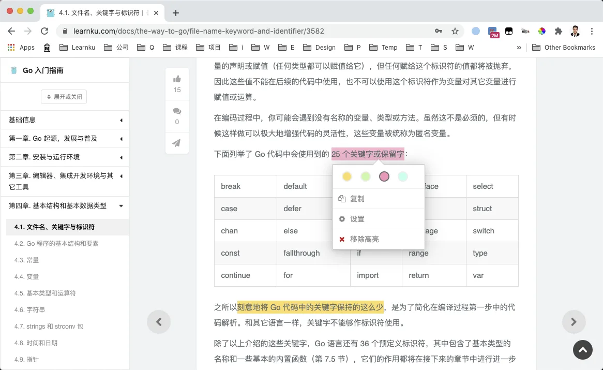

# 1.2. 如何阅读本书？ 免费

原文链接：https://learnku.com/courses/go-api/1.19/how-to-read-this-book/13466

## 代码注释

这个课程里附带了大量的代码。代码单独拎出来讲，很容易出现断层，所以能在代码里注释的情况下，我会多写注释。

当然，一些无法通过注释说明的，例如说登录流程的讲解，我也会挑出来单独讲解。

阅读本课程时，请重点关注注释。

## 行文篇幅

本课程属于 Go 的 Web 开发进阶教程。Go 语言特性，基础开发知识我们不会做太多讲解。在前面一本 G01 课程中，已经覆盖了这些基础知识，如果你觉得这方面有欠缺，应该先学习那个课程。

这个课程行文会比较快，因为我们有大量的代码需要学习。很多新的知识点，我们也会尽量把对一些技术话题的讲解做到 点到为止，只暴露出来刚刚好的知识，让你能跟上整书的行文线路，而不会深陷技术话题的沼泽。

我们希望新手能理解这个设计，在第一遍的学习中，遇到本书提到的一些技术话题时， 不必做到力求甚解。

要明白，当人的大脑暴露在大量新的概念面前时，很容易陷入焦虑。所以请跟着本书的线路走，一步步前进，慢慢地脑子里对这些新话题有了基本的印象，等最终学习完本书后，再去对本书提到的技术话题进行深度学习。告诉自己：

>

随后你会有很多机会来学习它们。现在最重要的是保持『训练』的连贯性。

同时你也可利用 [划词高亮](https://learnku.com/docs/guide/highlight-words/8826) 对一些需要复习的关键词和语句进行标注，方便后续进行深度学习：

## 动手实践

>

编程是技能，不是知识，技能只有在不断练习下才会有进步。

本书是一本用来动手练习的书，不是一本用来 阅读 的书。你的编码学习之路，只能从你敲打下第一行代码开始。

>

这个有点像学打篮球，看再多的 NBA 视频，你都无法成为篮球高手。你的球技，只有当你站着球场上，真真实实地拍打篮球，才能有提高。

本书的线索性很强，节节相扣，读者可以轻松的照着一步一步完成一个完整的 Web 项目，这也是本书的魅力所在。编程是一门技能，是一门需要 刻意练习 的技能，我们要求读者在短时间内，仔细揣摩、分解其中提到的技术话题，尽量手打代码，做上 5 遍，方能尽得此书精华。

刻意练习需要有反馈，在重复练习时，挑战自己：

- 从头到尾做一遍需要花多长时间？

- 能不能在完全不看书的情况下，构建书中的示例项目？

另外我们也会在每章后安排练习题，请尽量独立完成这些课题。
