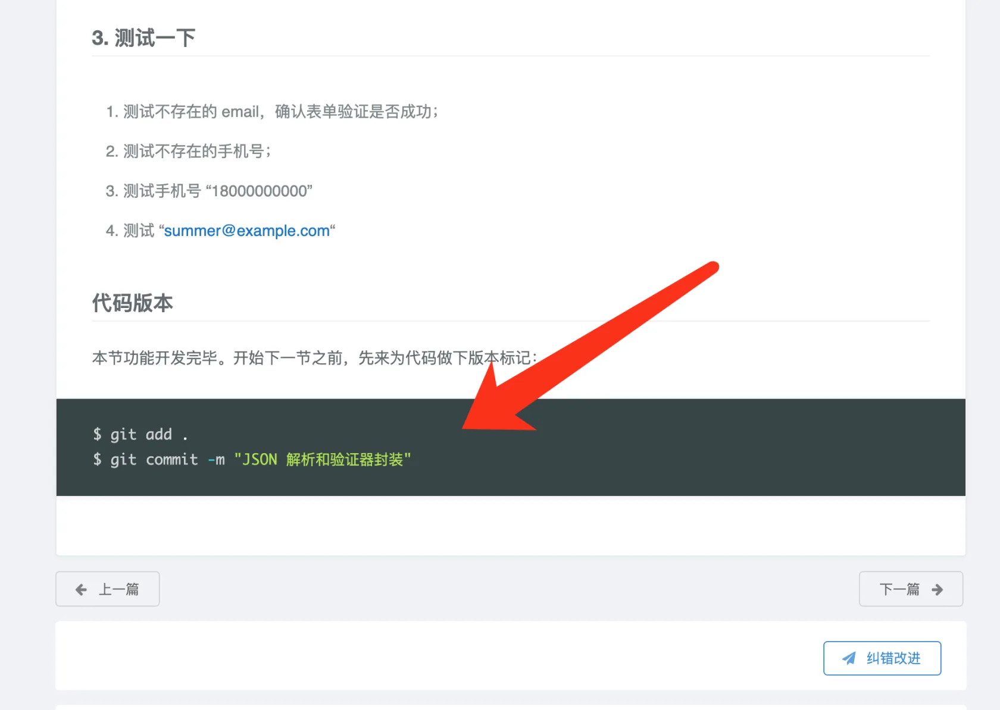
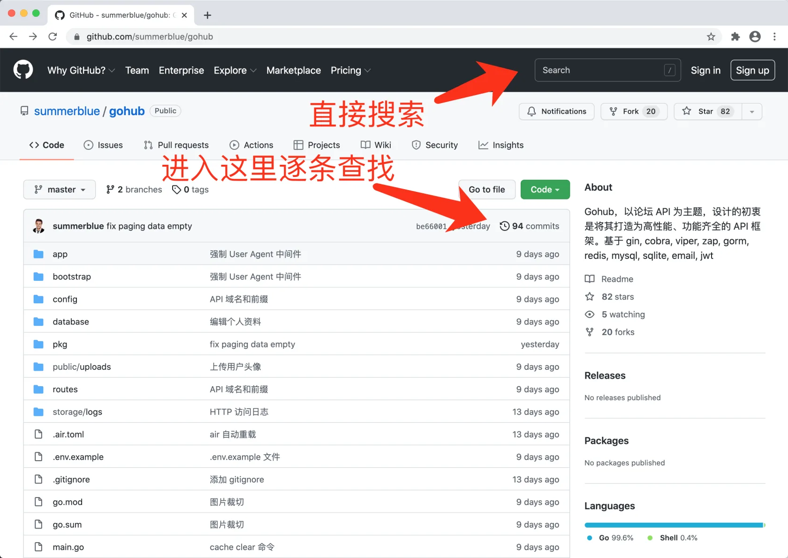
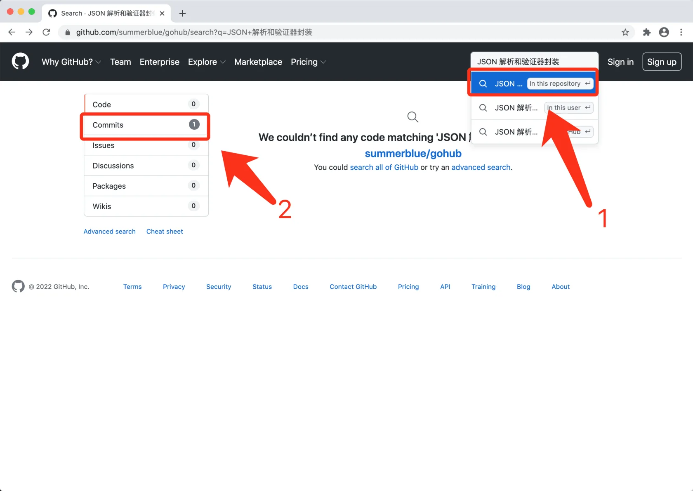
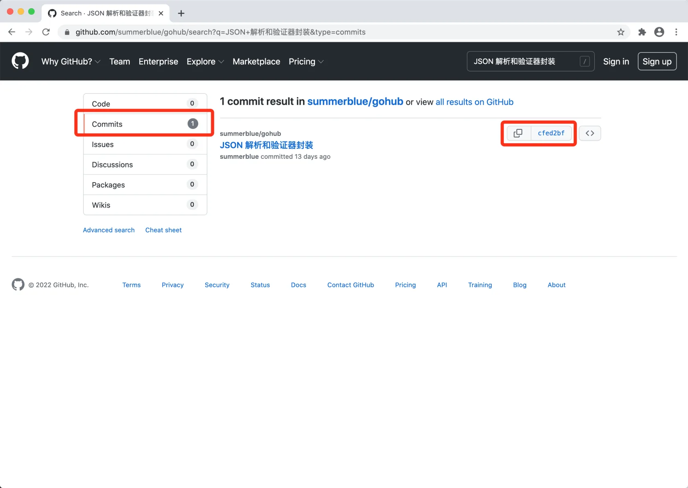

# 1.7. 利用源码来排错 免费

原文链接：https://learnku.com/courses/go-api/1.19/use-the-source-code-to-troubleshoot/13471

## 说明

Go 开发中遇到莫名的 Panic 是好事。因为任何一名称职的 Go 程序员都是从这些 Panic 中成长起来的。遇到的 Panic 越多，成长的养分越多。

然而新人在学习本课程时，因为知识储备不足，遇到无法解决的 Panic 时会很苦恼 —— 耽误了学习的流畅性，且会对课程的准确性产生质疑，最终放弃学习。

这里介绍一种方法，帮我们快速跳过问题，以确保学习的流畅性。

## 原理

本课程的每个小节，凡是涉及代码修改的，都会有对应的 git commit。

源码里 commit 消息，对应每篇文章底部的 代码版本 。

因此只需要将本教程的源码下载下来，并检出对应的 commit ，即可获取到同步当前学习进度的一份代码。

## 具体操作

### 1. 下载源码

项目的代码仓库 [github.com/summerblue/gohub](https://github.com/summerblue/gohub) 。

首先确定要检出代码存放的目录，可以是 gohub 项目的父目录，也就是 gohub 根目录下使用：

```
$ cd ../
```

clone 源码，并命名为 `gohub-online`

```
$ git clone https://github.com/summerblue/gohub.git gohub-online
```

### 2. 定位 commit hash

Git 的每一次提交，都生成一个代码版本的标示（commit hash）。接下来我们来定位这个标示。

首先在遇到问题的文章底部 代码版本 里，找到提交信息（commit message），例如：



浏览器打开 [github.com/summerblue/gohub](https://github.com/summerblue/gohub) ，有两种方法，一种是进入 commit log ，一种是利用 GitHub 提供的顶部搜索：



建议使用第二种：



进入 Commits 搜索结果页面，如下图右边红框内就是我们要的 commit hash 了，复制这个哈希值：



### 3. 检出对应代码

回到我们的命令行，进入刚刚 Clone 下来的源码目录：

```
$  cd gohub-online
```

检出哈希值对应的源码（将下面的 commit hash 替换成上一步复制的）：

```
$ git checkout cfedxxxxx
```

这时候 gothub-online 里的代码，就与出问题章节的代码对应上了。

## 后续的操作

源码检出来以后，可以先运行一下，确保一切工作正常。

然后对比下自己那份有问题的代码，尝试着能否找到错误。

如果长时间无法定位问题，可以直接基于这份 gohub-online ，可工作的源码来学习后面的课程。保持课程学习的连贯性优先级高一点。

原来有问题的代码不要删除，等课程做完一遍（或者多做几遍），找到感觉后，再来尝试解决他。
