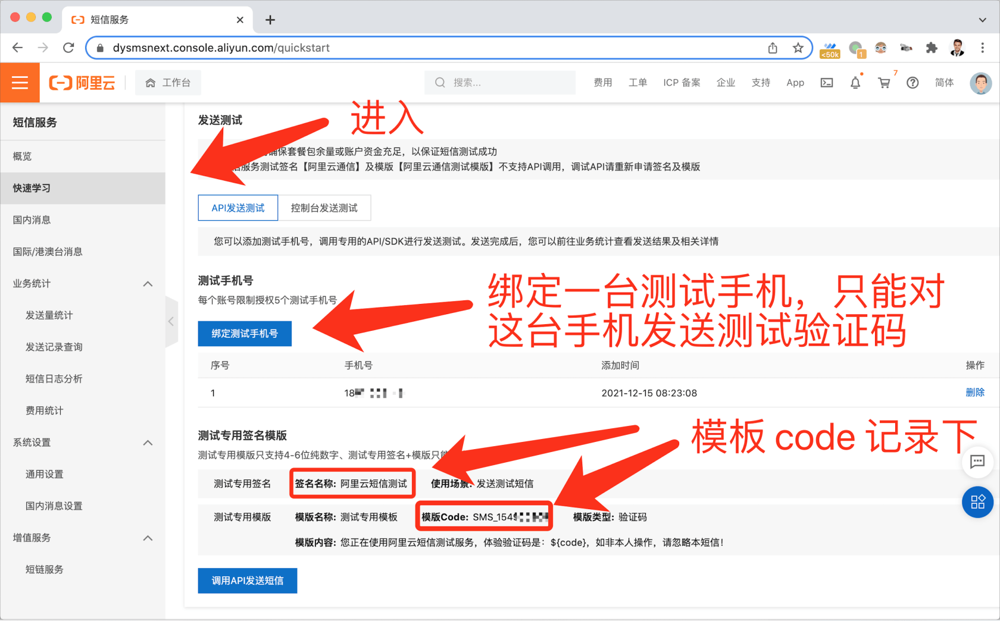
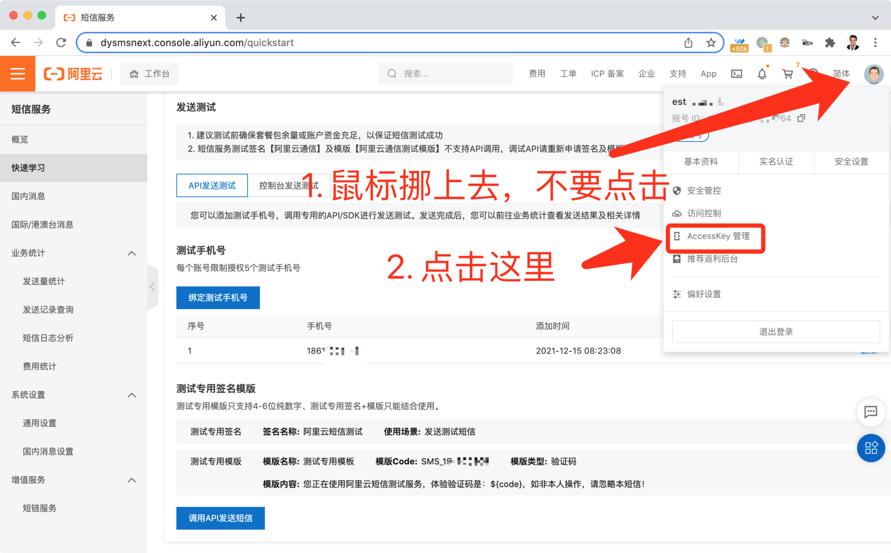
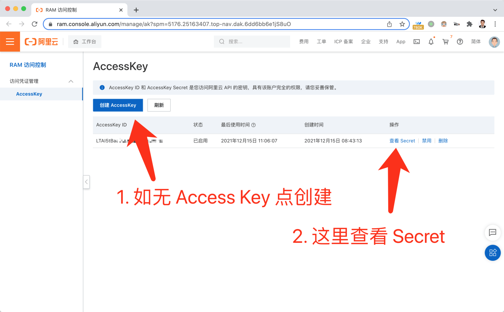
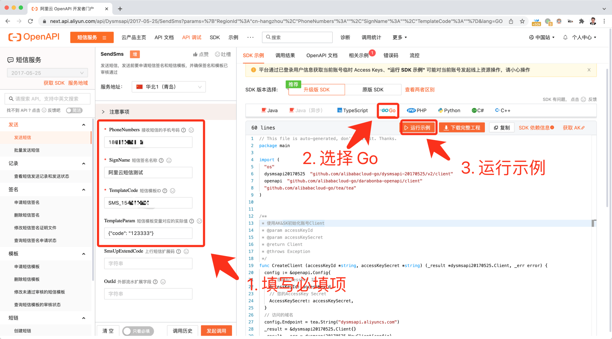

# 7.1. 阿里短信平台

原文链接：https://learnku.com/courses/go-api/1.19/ali-sms-platform/13510

## 说明

这一章开始我们将来开发数字验证码功能。本节先来申请阿里云短信的接口权限。

## 不区分短信平台

国内的短信平台五花八门，阿里短信平台大家用的比较多，我们就以它来做例子。其他主流的短信平台，接口权限的申请基本上都差不多，都是下面几个流程：

1. 注册账号；

2. 账号做企业认证（现在正规平台都需要）；

3. 获取权限

1. 创建签名（需要人工审核）

2. 创建短信模板（需要人工审核）

3. access_key ID 和 Secret

获取权限那里，都是这四个要素才能发送短信。

现在很少有提供个人能使用的短信接口，基本上都要公司认证后才能使用。运营商也是为了防止短信接口被滥用，例如说发送广告短信、诈骗短信等，严格一点可以理解。

不过作为开发者，依然会提供限制严格的测试接口供我们使用。下面一起来申请一个阿里云的短信测试接口权限。

>

提示： 短信接口『测试』和『正式』的调用规则没有区别，只是使用不同的签名和模板而已。这两个信息我们会写到配置信息里，上线时代码不需要修改，只改配置。

## 四个要素

后台操作有点绕，这里重申下我们的目标，是获取发送短信的四个要素：

- sign_name —— 签名

- template_code ——  模板

- access_key_id —— 秘钥 ID

- access_key_secret —— 秘钥密码

## 1. 获取测试签名和模板

首先进入 [阿里云管理后台](https://dysms.console.aliyun.com/domestic/text) ：

记下来签名和模板，注意需要先绑定一台测试手机。

## 2. 获取 Access Key

进入 Access Key 管理界面：

创建或使用原有的  Access Key。记录下来Access Key ID 和 Access Key Secret：

## 3. 发送测试短信

阿里云后台有测试短信发送功能，入口在这里  [next.api.aliyun.com/api/Dysmsapi/2...](https://next.api.aliyun.com/api/Dysmsapi/2017-05-25/SendSms)  ，进入：

发送一条成功的测试短信，以确保获取到我们需要的信息。

## 结语

下节课我们来开发发送短信的功能。
