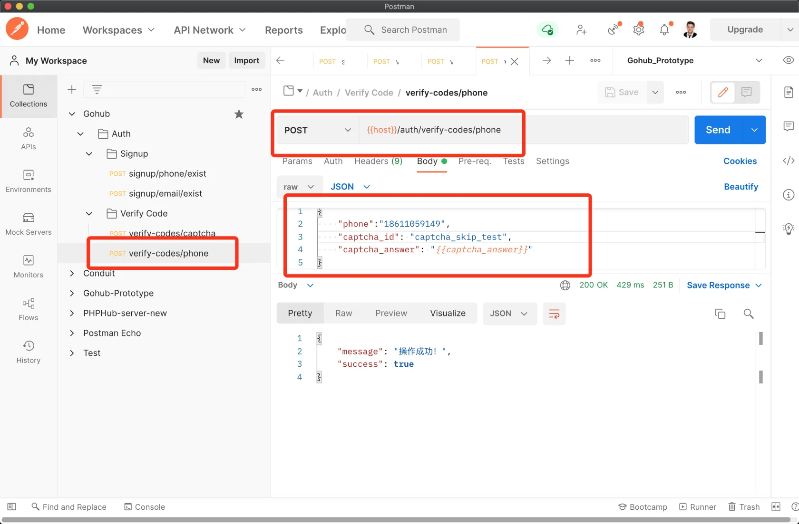

# 7.4. 发送短信验证码

原文链接：https://learnku.com/courses/go-api/1.19/send-phone-verification-code/13513

## 说明

这节课我们来开发 `verify-codes/phone` 接口。

## 1. 请求验证

app/requests/verify_code_request.go

```go
package requests

import (
	"gohub/pkg/captcha"

	"github.com/gin-gonic/gin"
	"github.com/thedevsaddam/govalidator"
)

type VerifyCodePhoneRequest struct {
	CaptchaID     string `json:"captcha_id,omitempty" valid:"captcha_id"`
	CaptchaAnswer string `json:"captcha_answer,omitempty" valid:"captcha_answer"`

	Phone string `json:"phone,omitempty" valid:"phone"`
}

// VerifyCodePhone 验证表单，返回长度等于零即通过
func VerifyCodePhone(data interface{}, c *gin.Context) map[string][]string {

	// 1. 定制认证规则
	rules := govalidator.MapData{
		"phone":          []string{"required", "digits:11"},
		"captcha_id":     []string{"required"},
		"captcha_answer": []string{"required", "digits:6"},
	}

	// 2. 定制错误消息
	messages := govalidator.MapData{
		"phone": []string{
			"required:手机号为必填项，参数名称 phone",
			"digits:手机号长度必须为 11 位的数字",
		},
		"captcha_id": []string{
			"required:图片验证码的 ID 为必填",
		},
		"captcha_answer": []string{
			"required:图片验证码答案必填",
			"digits:图片验证码长度必须为 6 位的数字",
		},
	}

	errs := validate(data, rules, messages)

	// 图片验证码
	_data := data.(*VerifyCodePhoneRequest)
	if ok := captcha.NewCaptcha().VerifyCaptcha(_data.CaptchaID, _data.CaptchaAnswer); !ok {
		errs["captcha_answer"] = append(errs["captcha_answer"], "图片验证码错误")
	}

	return errs
}
```

## 2. 控制器方法

app/http/controllers/api/v1/auth/verify_code_controller.go

```go
.
.
.
// SendUsingPhone 发送手机验证码
func (vc *VerifyCodeController) SendUsingPhone(c *gin.Context) {

	// 1. 验证表单
	request := requests.VerifyCodePhoneRequest{}
	if ok := requests.Validate(c, &request, requests.VerifyCodePhone); !ok {
		return
	}

	// 2. 发送 SMS
	if ok := verifycode.NewVerifyCode().SendSMS(request.Phone); !ok {
		response.Abort500(c, "发送短信失败~")
	} else {
		response.Success(c)
	}
}
```

## 3. 注册路由

routes/api.go

```go
.
.
.
authGroup.POST("/verify-codes/captcha", vcc.ShowCaptcha)
authGroup.POST("/verify-codes/phone", vcc.SendUsingPhone)
}
}
}
```

## 4. 测试一下

打开 Postman 创建新请求 `verify-codes/phone`，请求内容：

```json
{
    "phone": "手机号（阿里后台绑定的测试手机号）",
    "captcha_id": "captcha_skip_test",
    "captcha_answer": "{{captcha_answer}}"
}
```

>

接收验证码的手机号使用的是 PostMan 环境变量中设置的 phone

因为我们的图片验证码包里有这一段：

```go
// VerifyCaptcha 验证验证码是否正确
func (c *Captcha) VerifyCaptcha(id string, answer string) (match bool) {

	// 方便本地和 API 自动测试
	if !app.IsProduction() && id == config.GetString("captcha.testing_key") {
		return true
	}
	// 第三个参数是验证后是否删除，我们选择 false
	// 这样方便用户多次提交，防止表单提交错误需要多次输入图片验证码
	return c.Base64Captcha.Verify(id, answer, false)
}
```

config/captcha.go 里对 `testing_key` 配置的值是 `captcha_skip_test`，所以当请求数据里 captcha_id 的值为 `captcha_skip_test` 会跳过图片验证码的检查。

发送请求：



air 终端会有类似输出：

```
2022-01-03 22:20:30     DEBUG   sms/driver_aliyun.go:35 短信[阿里云] {"请求内容": "{\"AccessKeyId\":\"xxxxxxx\",\"Timestamp\":\"2022-01-03T14:20:29Z\",\"Format\":\"json\",\"SignatureMethod\":\"HMAC-SHA1\",\"SignatureVersion\":\"1.0\",\"SignatureNonce\":\"xxxxx\",\"Signature\":\"\",\"Action\":\"SendSms\",\"Version\":\"2017-05-25\",\"RegionId\":\"cn-hangzhou\",\"PhoneNumbers\":\"xxxxx\",\"SignName\":\"阿里云短信测试\",\"TemplateCode\":\"SMS_154950909\",\"TemplateParam\":\"{\\\"code\\\":\\\"123456\\\"}\",\"SmsUpExtendCode\":\"90999\",\"OutId\":\"abcdefg\"}"}
2022-01-03 22:20:30     DEBUG   sms/driver_aliyun.go:36 短信[阿里云] {"接口响应": "{\"RequestId\":\"25B30211-168D-5CD9-A9D3-C92EE8C76759\",\"Code\":\"OK\",\"Message\":\"OK\",\"BizId\":\"285311341219629848^0\"}"}
2022-01-03 22:20:30     DEBUG   sms/driver_aliyun.go:50 短信[阿里云] {"发信成功": ""}
2022-01-03 22:20:30     DEBUG   middlewares/logger.go:65     HTTP Access Log  {"status": 200, "request": "POST /v1/auth/verify-codes/phone", "query": "", "ip": "::1", "user-agent": "PostmanRuntime/7.28.4", "errors": "", "time": "286.286ms", "Request Body": "", "Response Body": "{\"message\":\"操作成功！\",\"success\":true}"}
```

结果符合预期。

## 代码版本

本节功能开发完毕。开始下一节之前，先来为代码做下版本标记：

```bash
$ git add .
$ git commit -m "发送短信验证码"
```
