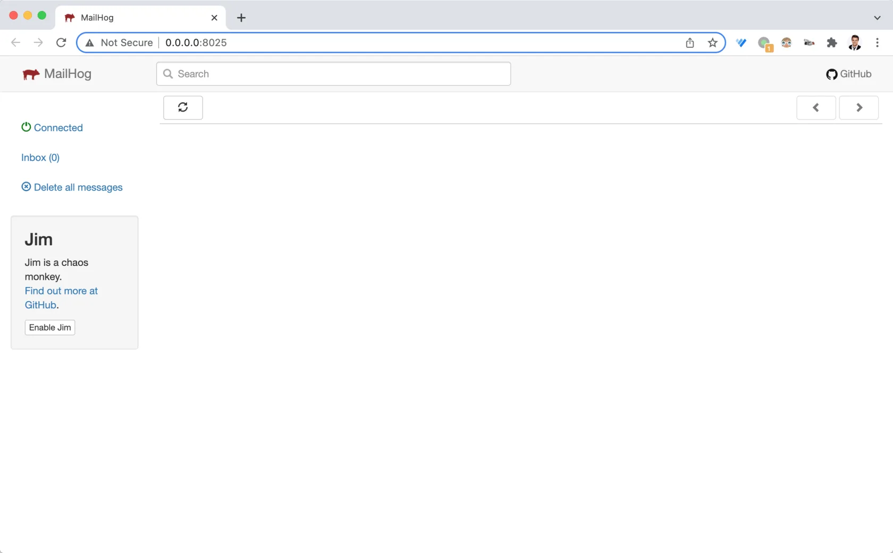

# 7.5. 安装 Mailhog

原文链接：https://learnku.com/courses/go-api/1.19/install-mailhog/13514

## 说明

发送邮件需要有邮件服务器，在开发『发送邮件验证码功能』前，我们先来创建邮件服务器。

## Mailhog

本课程将使用 Mailhog 来作为邮件服务器。

>

使用『测试邮件服务器』不会影响我们的代码，上线时只需要将端口配置为生产环境的邮件服务即可。

[Mailhog](https://github.com/mailhog/MailHog) 是一个很棒的邮件测试项目。且其使用 Go 编写，安装非常简单。

命令行安装 Mailhog ：

```bash
$ GO111MODULE=on  go install github.com/mailhog/MailHog@latest
```

安装完成后运行 Mailhog ：

```bash
$ MailHog
```

输出：

```
2021/12/15 11:48:48 Using in-memory storage
2021/12/15 11:48:48 [SMTP] Binding to address: 0.0.0.0:1025
[HTTP] Binding to address: 0.0.0.0:8025
2021/12/15 11:48:48 Serving under http://0.0.0.0:8025/
Creating API v1 with WebPath:
Creating API v2 with WebPath:
```

以上输出有两个比较重要的信息：

- 0.0.0.0:1025 是 SMTP 端口

- [0.0.0.0:8025/](http://0.0.0.0:8025/) 是网页界面

## Web 界面

访问 [0.0.0.0:8025/](http://0.0.0.0:8025/) ，可以看到：



开发发送邮件功能时，再来讲解这个 Web 界面的使用。

请确保 Mailhog 服务的可用，很快我们就会用到。

## 代码版本

本节没有修改任何代码。
