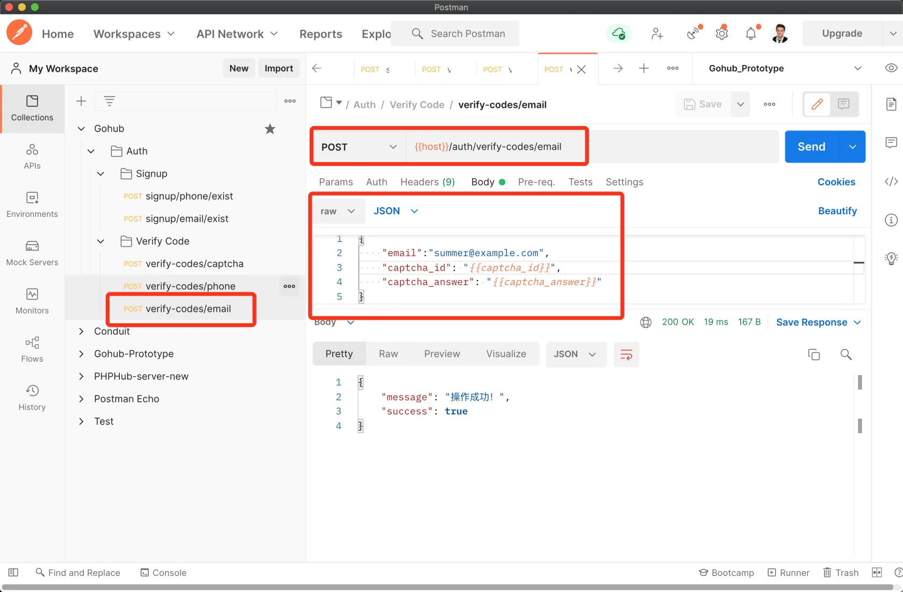
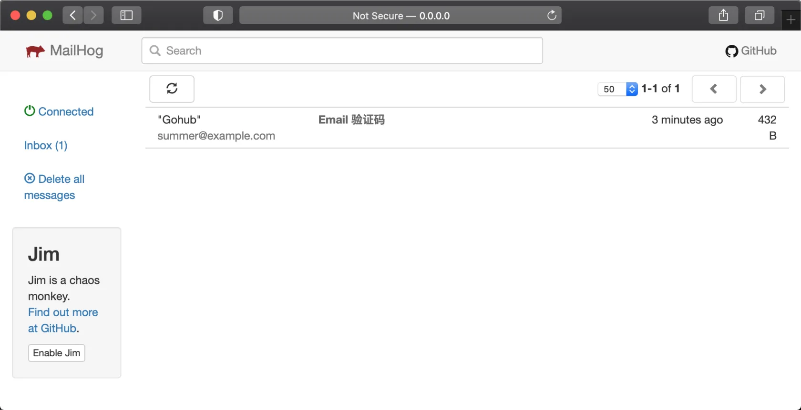
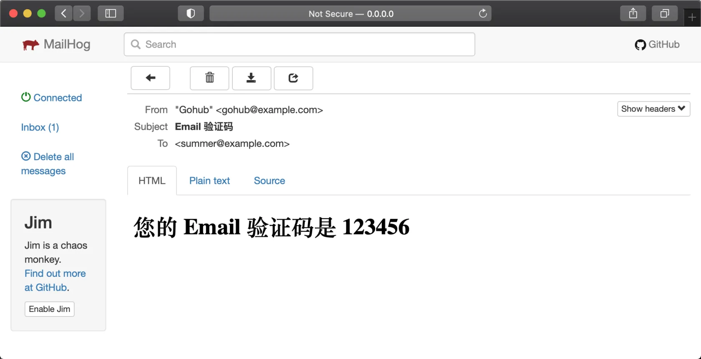

# 7.7. 发送邮件验证码

原文链接：https://learnku.com/courses/go-api/1.19/send-mail-verification-code/13516

## 说明

本节将开发 `verify-codes/email` 接口。

## 1. verifycode 发送邮件验证码

pkg/verifycode/verifycode.go

```go
.
.
.
// SendEmail 发送邮件验证码，调用示例：
//         verifycode.NewVerifyCode().SendEmail(request.Email)
func (vc *VerifyCode) SendEmail(email string) error {

    // 生成验证码
    code := vc.generateVerifyCode(email)

    // 方便本地和 API 自动测试
    if !app.IsProduction() && strings.HasSuffix(email, config.GetString("verifycode.debug_email_suffix")) {
        return nil
    }

    content := fmt.Sprintf("<h1>您的 Email 验证码是 %v </h1>", code)
    // 发送邮件
    mail.NewMailer().Send(mail.Email{
            From: mail.From{
                Address: config.GetString("mail.from.address"),
                Name:    config.GetString("mail.from.name"),
            },
            To:      []string{email},
            Subject: "Email 验证码",
            HTML:    []byte(content),
    })

    return nil
}

// CheckAnswer 检查用户提交的验证码是否正确，key 可以是手机号或者 Email
.
.
.
```

## 2. 验证请求

### 1. 创建验证器

app/requests/verify_code_request.go

```go
.
.
.
type VerifyCodeEmailRequest struct {
	CaptchaID     string `json:"captcha_id,omitempty" valid:"captcha_id"`
	CaptchaAnswer string `json:"captcha_answer,omitempty" valid:"captcha_answer"`

	Email string `json:"email,omitempty" valid:"email"`
}

// VerifyCodeEmail 验证表单，返回长度等于零即通过
func VerifyCodeEmail(data interface{}, c *gin.Context) map[string][]string {

	// 1. 定制认证规则
	rules := govalidator.MapData{
		"email":          []string{"required", "min:4", "max:30", "email"},
		"captcha_id":     []string{"required"},
		"captcha_answer": []string{"required", "digits:6"},
	}

	// 2. 定制错误消息
	messages := govalidator.MapData{
		"email": []string{
			"required:Email 为必填项",
			"min:Email 长度需大于 4",
			"max:Email 长度需小于 30",
			"email:Email 格式不正确，请提供有效的邮箱地址",
		},
		"captcha_id": []string{
			"required:图片验证码的 ID 为必填",
		},
		"captcha_answer": []string{
			"required:图片验证码答案必填",
			"digits:图片验证码长度必须为 6 位的数字",
		},
	}

	errs := validate(data, rules, messages)

	// 图片验证码
	_data := data.(*VerifyCodeEmailRequest)
	errs = validators.ValidateCaptcha(_data.CaptchaID, _data.CaptchaAnswer, errs)

	return errs
}
```

### 2. 图片验证码验证器

验证发送短信请求中也有『图片验证码』相关代码，我们抽象出来，方便后续维护：

app/requests/validators/custom_validators.go

```go
// Package validators 存放自定义规则和验证器
package validators

import (
	"gohub/pkg/captcha"
)

// ValidateCaptcha 自定义规则，验证『图片验证码』
func ValidateCaptcha(captchaID, captchaAnswer string, errs map[string][]string) map[string][]string {
	if ok := captcha.NewCaptcha().VerifyCaptcha(captchaID, captchaAnswer); !ok {
		errs["captcha_answer"] = append(errs["captcha_answer"], "图片验证码错误")
	}
	return errs
}
```

### 3. 修改 requests.VerifyCodePhone

将文件 app/requests/verify_code_request.go 中的：

```
// 图片验证码
_data := data.(*VerifyCodePhoneRequest)
if ok := captcha.NewCaptcha().VerifyCaptcha(_data.CaptchaID, _data.CaptchaAnswer); !ok {
errs["captcha_answer"] = append(errs["captcha_answer"], "图片验证码错误")
}
```

改为：

```
// 图片验证码
_data := data.(*VerifyCodePhoneRequest)
errs = validators.ValidateCaptcha(_data.CaptchaID, _data.CaptchaAnswer, errs)
```

## 3. 控制器方法

app/http/controllers/api/v1/auth/verify_code_controller.go

```go
.
.
.
// SendUsingEmail 发送 Email 验证码
func (vc *VerifyCodeController) SendUsingEmail(c *gin.Context) {

	// 1. 验证表单
	request := requests.VerifyCodeEmailRequest{}
	if ok := requests.Validate(c, &request, requests.VerifyCodeEmail); !ok {
		return
	}

	// 2. 发送邮件
	err := verifycode.NewVerifyCode().SendEmail(request.Email)
	if err != nil {
		response.Abort500(c, "发送 Email 验证码失败~")
	} else {
		response.Success(c)
	}
}
```

## 4. 注册路由

routes/api.go

```go
.
.
.
authGroup.POST("/verify-codes/phone", vcc.SendUsingPhone)
authGroup.POST("/verify-codes/email", vcc.SendUsingEmail)
}
}
}
```

## 测试

测试之前请确保 Mailhog 运行着的：

```bash
$ Mailhog
2022/01/03 23:03:29 Using in-memory storage
2022/01/03 23:03:29 [SMTP] Binding to address: 0.0.0.0:1025
[HTTP] Binding to address: 0.0.0.0:8025
2022/01/03 23:03:29 Serving under http://0.0.0.0:8025/
Creating API v1 with WebPath:
Creating API v2 with WebPath:
```

Postman 里创建 `verify-codes/email` 请求。请求 JSON :

```json
{
    "email": "summer@example.com",
    "captcha_id": "captcha_skip_test",
    "captcha_answer": "{{captcha_answer}}"
}
```

发送请求：



打开 Mailhog 的 Web 界面 [0.0.0.0:8025](http://0.0.0.0:8025) ：



点进去查看邮件：



可用看到我们的邮件验证码。

air 终端输出的日志信息：

```
2022-01-03 23:03:50     DEBUG   verifycode/verifycode.go:111验证码  {"生成验证码": "{\"summer@example.com\":\"123456\"}"}
2022-01-03 23:03:50     DEBUG   mail/driver_smtp.go:27  发送邮件      {"发件详情": "{\"ReplyTo\":null,\"From\":\"Gohub \\u003cgohub@example.com\\u003e\",\"To\":[\"summer@example.com\"],\"Bcc\":null,\"Cc\":null,\"Subject\":\"Email 验证码\",\"Text\":null,\"HTML\":\"PGgxPuaCqOeahCBFbWFpbCDpqozor4HnoIHmmK8gMTIzNDU2IDwvaDE+\",\"Sender\":\"\",\"Headers\":{},\"Attachments\":null,\"ReadReceipt\":null}"}
2022-01-03 23:03:50     DEBUG   mail/driver_smtp.go:44  发送邮件      {"发件成功": ""}
```

符合预期。

## 代码版本

至此发送邮件验证码功能开发完毕。开始下一节之前，先来为代码做下版本标记：

```bash
$ git add .
$ git commit -m "发送邮件验证码"
```
