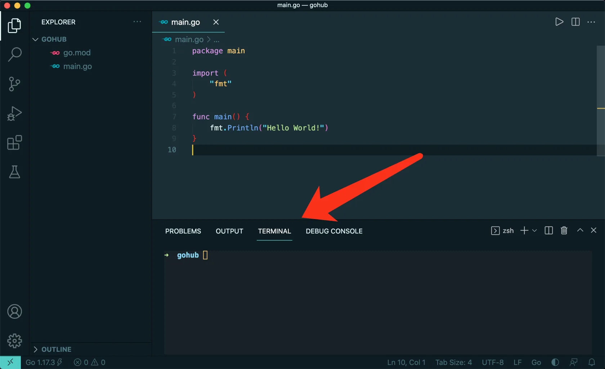
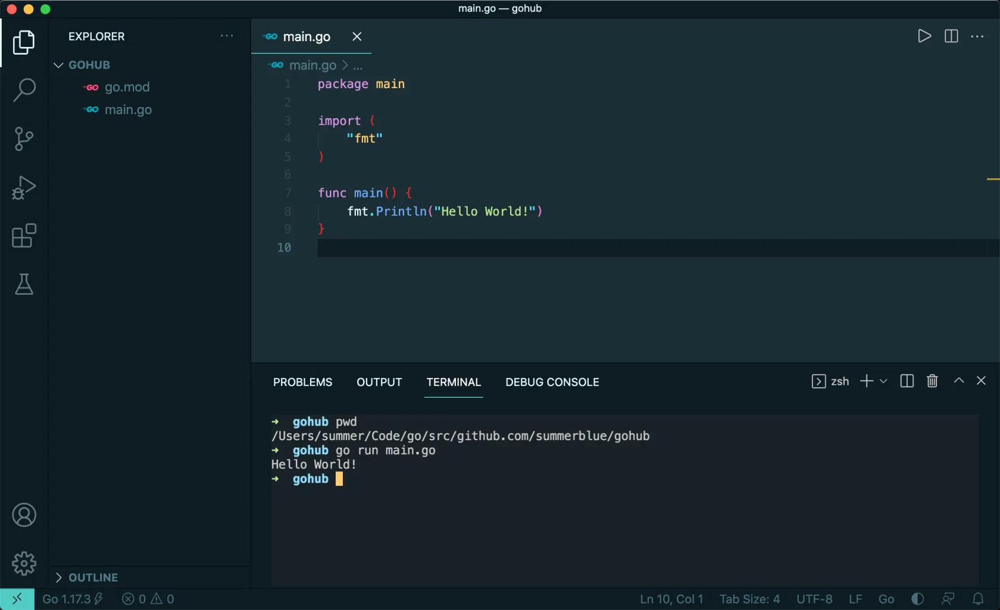

# 3.1. 创建项目 免费

原文链接：https://learnku.com/courses/go-api/1.19/create-project/13478

## 说明

本节课我们来创建项目：

1. 写一个简单的 Hello World 测试代码；

2. 初始化 Go Module 项目；

3. 并初始化 Git 版本控制。

## 1. Go Modules

我们会使用 Go Modules 来管理项目依赖。对 Go Modules 不熟悉的同学请先学习下这个视频 —— [006. Go Modules 详解 - 相关命令](https://learnku.com/courses/go-video/2022/006-go-modules-related-commands/11454)

知道怎么一回事就可以开始了，不用学太深。

## 2. 创建项目目录

一般推荐把 Go 项目放置于 `$GOPATH/src` 目录下。

推荐的做法是将 GitHub 用户名作为命名空间。

如我的 GitHub 用户名是 [summerblue](http://github.com/summerblue)，我的 gohub 项目存放目录是：

```
$ cd $GOPATH/src
$ mkdir -p github.com/summerblue/gohub
$ cd github.com/summerblue/gohub
```

这样做除了将项目推送到 GitHub 时项目地址保持一致外，另一个好处是未来随着 Go 项目增多，`src` 目录仍可保持有序。

如果你不想将代码托管到 GitHub 上，或者其他原因，可使用以下：

```
$ cd $GOPATH/src
$ mkdir gohub
$ cd gohub
```

以上两种做法选择一种即可，接下来的课程中我们都将相对于根目录 `gohub` 来讲解 。命令行如果没有特殊说明的话，也是默认在 `gohub` 目录中执行。

#### 项目必须放到 $GOPATH 下吗？

不是必须的。 使用 Go Modules 的话，可以将项目放置于任何地方，只要取一个正确的项目名称即可。这里只是使用 Go 社区推荐的做法。

## 3.  初始化 Go Modules

```
$ go mod init gohub
```

## 4. 创建 main.go 文件

命令行 VSCode 编辑器：

```
$ code .
```

右键新建文件：

main.go

```
package main

import (
"fmt"
)

func main() {
fmt.Println("Hello World!")
}
```

保存后，打开 VSCode 的内置终端，可以尝试背下快捷键，以后会经常使用：



VSCode 的内置终端默认打开的就是项目所在目录，我们可以使用以下命令打印当前目录进行确认：

```
$ pwd
```

接下来在内置终端里运行我们 go 程序：

```
$ go run main.go
```

如下：



## 5. 代码版本

日常编程中，所有代码都应该使用 Git 版本控制器来管理。接下来一起为项目代码新增版本控制：

```
$ git init .
$ git add .
$ git commit -m "初始化"
```
