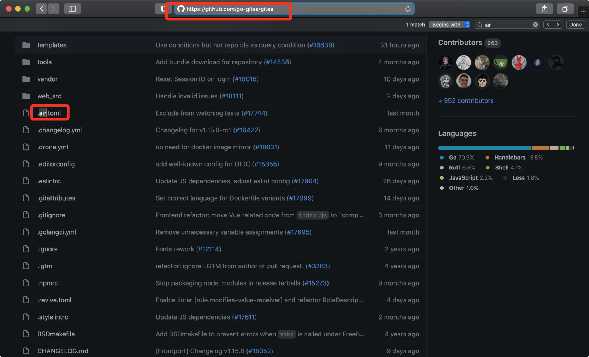
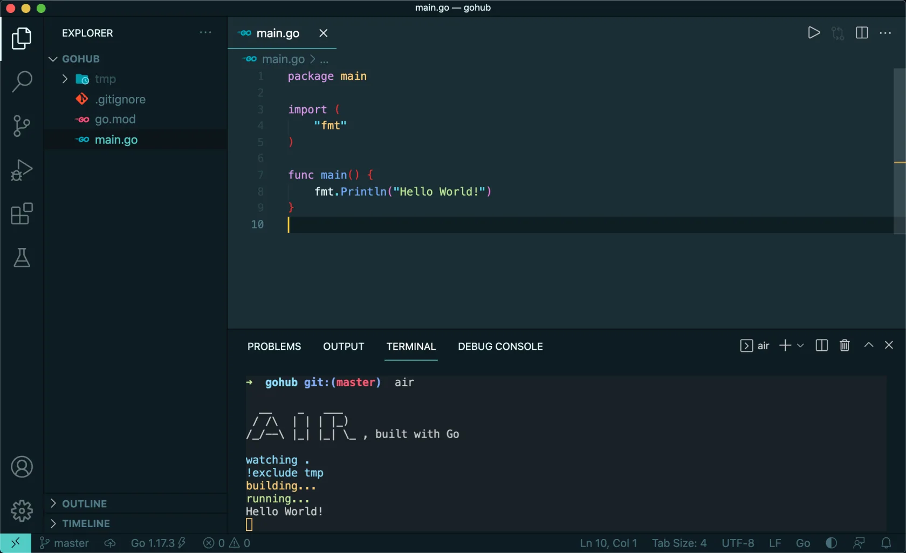
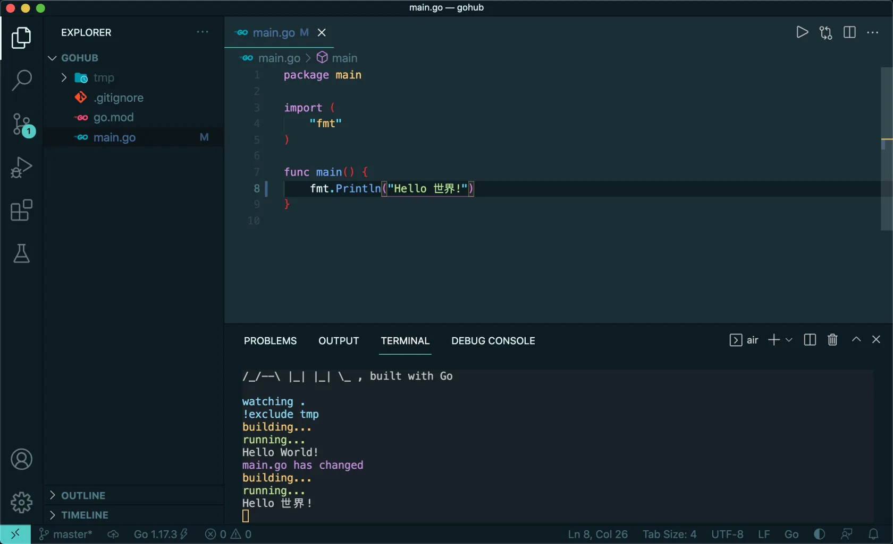
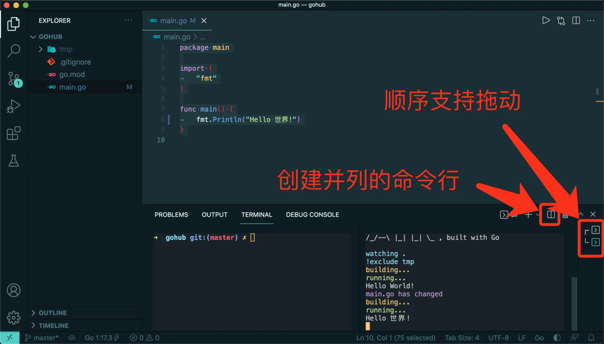

# 3.3. Air 自动重载

原文链接：https://learnku.com/courses/go-api/1.19/air-auto-reload/13480

## 说明

Go 语言为编译型语言，编译型语言有诸多好处，如：

- 部署简单 —— 一个二进制包到哪都能执行

- 提早发现错误 —— 代码有误即无法编译

- 执行效率高 —— 直接是二进制码，运行效率要比解析型语言好很多

然而，『编译』也意味着代码修改后，需重新编译才能看到效果，这为我们本地开发带来了诸多不便。

本节中我们将一起探讨如何使用第三方工具来提高开发效率。

## air

自动重载方案，比较老牌的是 [fresh](https://github.com/gravityblast/fresh) ，不过此项目已经放弃维护。

本课程我们将选用 [github.com/cosmtrek/air](https://github.com/cosmtrek/air) 。它足够稳定、功能齐全、活跃更新。

Air 也被很多大型开源项目使用，如 [github.com/go-gitea/gitea](https://github.com/go-gitea/gitea) （两万多 Star 的项目）：



## 安装 air

使用以下命令来安装 air ：

```bash
$ GO111MODULE=on  go install github.com/cosmtrek/air@latest
```

>

Windows 下也可以手动安装，进入 [github.com/cosmtrek/air/releases](https://github.com/cosmtrek/air/releases)  下载后放入Go安装目录下的 bin 目录，重命名为 air.exe。

最前面的 `GO111MODULE=on` 是只为当前命令启用 Go Module，开启以后我们才能使用 [Go Proxy 进行加速](https://learnku.com/go/wikis/38122)

>

注意： 以上操作如果遇到错误，请先确保你的 Go 版本是 1.19。使用此命令查看 `go version`。

安装成功后使用以下命令检查下：

```bash
$ air -v

__    _   ___
/ /\  | | | |_)
/_/--\ |_| |_| \_ , built with Go
```

## 使用 air

在我们的 Gohub 项目根目录运行以下命令：

```bash
$ air
```

在 VSCode 内置命令行中执行结果如下：



## 测试自动加载

修改 main.go 文件如下：

main.go

```go
package main

import (
	"fmt"
)

func main() {
	fmt.Println("Hello 世界!")
}
```

保存后可以看到命令行有相关的更信息：



即可看到我们修改后的欢迎语。至此我们成功集成了 air 自动重置功能。

后续的课程中，请确保 air 命令行时刻处于运行状态。

## 命令行并列窗口

按照以下指示，创建并列窗口：



这样左边的窗口我们可以执行 Git 命令，右边窗口可以查看终端程序的输出。

## air 配置信息

我们可以使用 .air.toml 文件来配置 air 的行为。下面的配置项 `include_ext` 里，加了两个后缀：`env` 和 `gohtml` ，后面的项目中我们会用到。

注意：Windows 用户以下的 bin 和 cmd 选项要随着注释修改。

.air.toml

```
# https://github.com/cosmtrek/air/blob/master/air_example.toml TOML 格式的配置文件

# 工作目录
# 使用 . 或绝对路径，请注意 `tmp_dir` 目录必须在 `root` 目录下
root = "."
tmp_dir = "tmp"

[build]
# 由`cmd`命令得到的二进制文件名
# Windows平台示例：bin = "./tmp/main.exe"
bin = "./tmp/main"
# 只需要写你平常编译使用的shell命令。你也可以使用 `make`
# Windows平台示例: cmd = "go build -o ./tmp/main.exe ."
cmd = "go build -o ./tmp/main ."
# 如果文件更改过于频繁，则没有必要在每次更改时都触发构建。可以设置触发构建的延迟时间
delay = 1000
# 忽略这些文件扩展名或目录
exclude_dir = ["assets", "tmp", "vendor","public/uploads"]
# 忽略以下文件
exclude_file = []
# 使用正则表达式进行忽略文件设置
exclude_regex = []
# 忽略未变更的文件
exclude_unchanged = false
# 监控系统链接的目录
follow_symlink = false
# 自定义参数，可以添加额外的编译标识，例如添加 GIN_MODE=release
full_bin = ""
# 监听以下指定目录的文件
include_dir = []
# 监听以下文件扩展名的文件.
include_ext = ["go", "tpl", "tmpl", "html", "gohtml", "env"]
# kill 命令延迟
kill_delay = "0s"
# air的日志文件名，该日志文件放置在你的`tmp_dir`中
log = "air.log"
# 在 kill 之前发送系统中断信号，windows 不支持此功能
send_interrupt = false
# error 发生时结束运行
stop_on_error = true
# 命令附加参数 (bin/full_bin). Will run './tmp/main hello world'.
args_bin  =  []

[color]
# 自定义每个部分显示的颜色。如果找不到颜色，使用原始的应用程序日志。
main = "magenta"
watcher = "cyan"
build = "yellow"
runner = "green"

[log]
# 显示日志时间
time = false

[misc]
# 退出时删除tmp目录
clean_on_exit = false
```

## 代码版本

接下来我们可以放心地将代码纳入版本控制器中：

```bash
$ git add .
$ git commit -m "air 自动重载"
```
