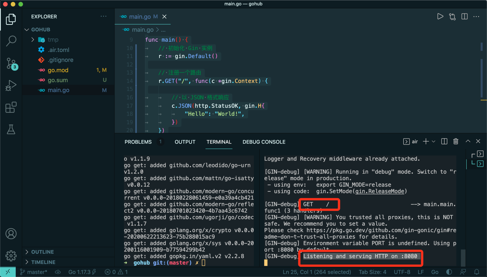
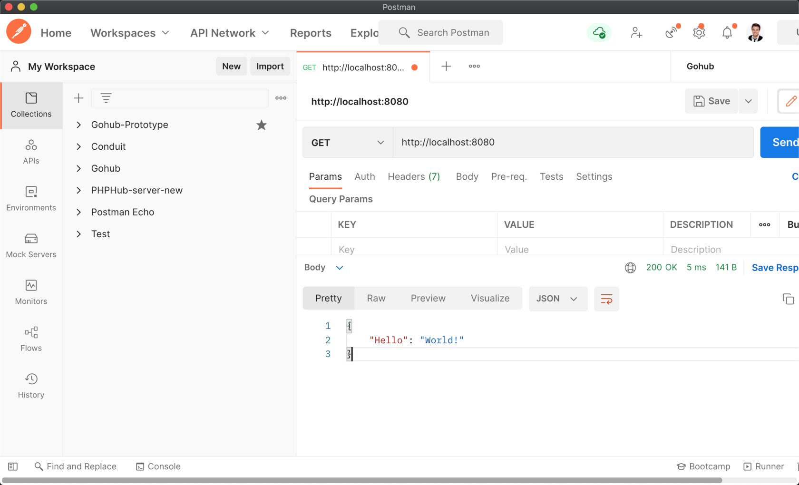
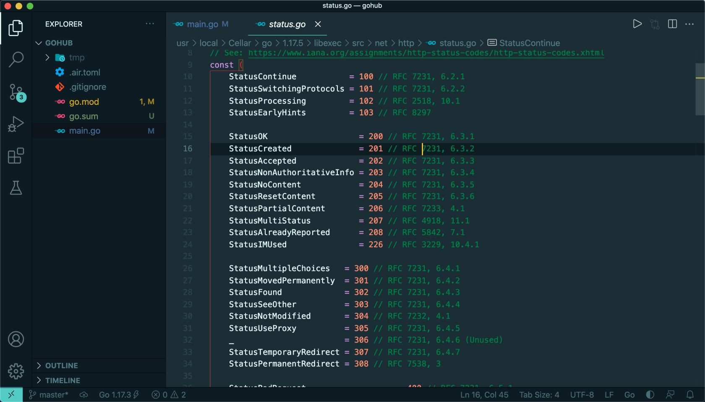
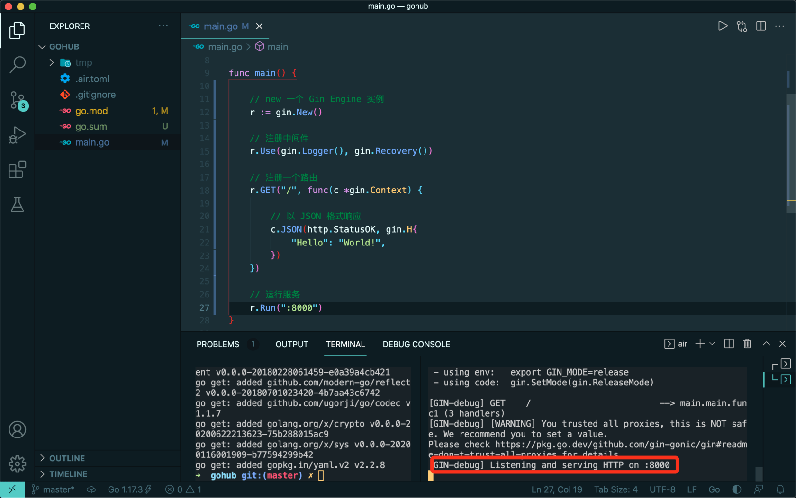
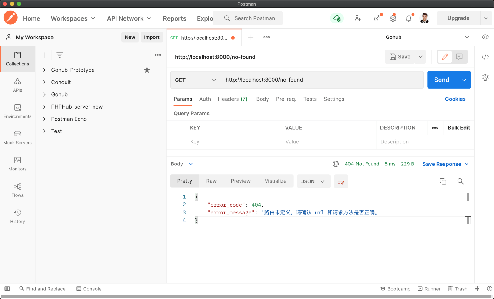

# 3.4. 集成 gin

原文链接：https://learnku.com/courses/go-api/1.19/integrated-gin/13481

## 说明

这节课我们将尝试在项目中集成高性能的路由方案 ——  [gin](https://github.com/gin-gonic/gin) 。

## Hello gin

先将 gin 导入：

```
$ go get github.com/gin-gonic/gin
```

修改 main.go 文件：

main.go

```
package main

import (
"net/http"

"github.com/gin-gonic/gin"
)

func main() {
// 初始化 Gin 实例
r := gin.Default()

// 注册一个路由
r.GET("/", func(c *gin.Context) {

// 以 JSON 格式响应
c.JSON(http.StatusOK, gin.H{
"Hello": "World!",
})
})

// 运行服务
r.Run()
}
```

查看终端，gin 默认会进入 debug 模式，在此模式下，会打印调试信息：



从终端输出那里可以看到默认监听的是 `:8080` 端口。

打开 Postman，新建一个请求，地址栏填写 `http://localhost:8080` ：



### 代码解析：

```
c.JSON(http.StatusOK, gin.H{
"Hello": "World!",
})
```

`gin.H` 是 gin 包里定义的一个的辅助类型，方便我们返回 JSON 信息，其源码如下：

```
type H map[string]interface{}
```

`http.StatusOK` 是 net/http 标准库里定义的状态码。VSCode 里，Mac 系统按住 command 键，Windows 系统按住 ctrl 键，鼠标悬停在 StatusOK 上，可以看到下划线，点击进去即可看到所有定义的 HTTP 状态码：



>

提示： 在做 Go 开发时，要养成查看源码的习惯。疑惑哪个东西怎么实现的，或者一个库具备哪些功能，直接先尝试阅读其源码，找不到在去查看文档或者 Google 搜索信息。VSCode Go 插件有很完善的源码跳转功能，需要学习的话请查看这个视频教程 ——  [004. VSCode Go 插件详解](https://learnku.com/courses/go-video/2022/vscode-go-plug-in-details/11314) 。

## Hello World 长版本

接下来我们来稍加修改下代码：

```
package main

import (
"net/http"

"github.com/gin-gonic/gin"
)

func main() {

// new 一个 Gin Engine 实例
r := gin.New()

// 注册中间件
r.Use(gin.Logger(), gin.Recovery())

// 注册一个路由
r.GET("/", func(c *gin.Context) {

// 以 JSON 格式响应
c.JSON(http.StatusOK, gin.H{
"Hello": "World!",
})
})

// 运行服务，默认为 8080，我们指定端口为 8000
r.Run(":8000")
}
```

上面的 gin 初始化的地方，以下两行：

```
r := gin.New()
r.Use(gin.Logger(), gin.Recovery())
```

等于我们第一个 Hello World 的一行：

```
r := gin.Default()
```

查看 Default 方法的源码：

```
func Default() *Engine {
debugPrintWARNINGDefault()
engine := New()
engine.Use(Logger(), Recovery())
return engine
}
```

Default 返回的是一个 Engine 对象。且默认帮我们注册了两个中间件，Logger 和 Recovery 中间件。这里暂时不深究这两个中间件，后面的课程中我们会根据需要定制自己的中间件。这里将他们写出来，方便后面的修改。

air 自动重载程序以后，也可以看到我们的端口已经绑定在 8000 端口了：



## 自定义 404 Handler

下面我们来加入 404 处理，利用 Engine 对象的 NoRoute 方法：

```
package main

import (
"net/http"
"strings"

"github.com/gin-gonic/gin"
)

func main() {
.
.
.

// 处理 404 请求
r.NoRoute(func(c *gin.Context) {
// 获取标头信息的 Accept 信息
acceptString := c.Request.Header.Get("Accept")
if strings.Contains(acceptString, "text/html") {
// 如果是 HTML 的话
c.String(http.StatusNotFound, "页面返回 404")
} else {
// 默认返回 JSON
c.JSON(http.StatusNotFound, gin.H{
"error_code":    404,
"error_message": "路由未定义，请确认 url 和请求方法是否正确。",
})
}
})

// 运行服务
r.Run(":8000")
}
```

`c.Request` 是 gin 封装的请求对象，所有用户的请求信息，都可以从这个对象中获取。

打开 Postman，访问 `http://localhost:8000/no-found` ，注意我们已经修改为 8000 端口了：



可以看到提示信息。

## 代码版本

开始下一节之前，我们先来为代码做下版本标记：

```
$ git add .
$ git commit -m "集成 gin"
```
