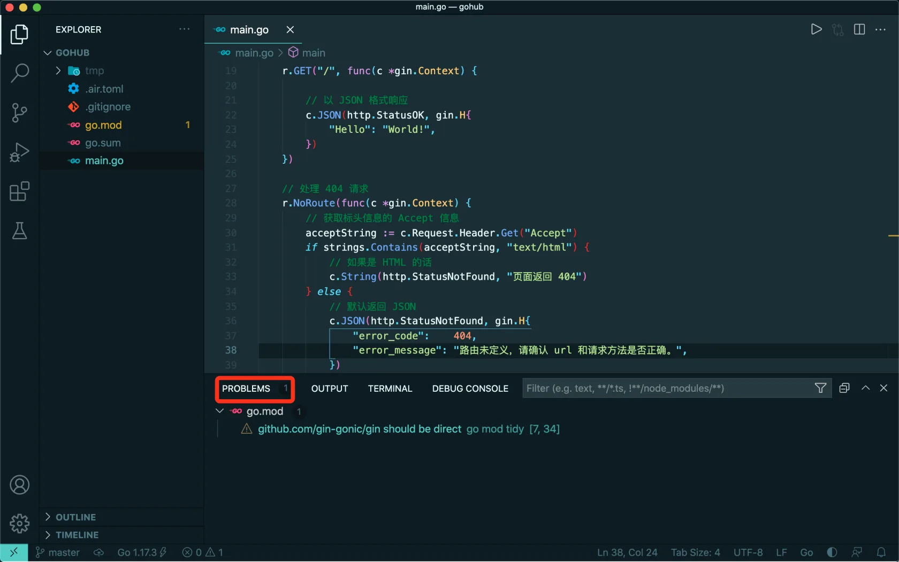
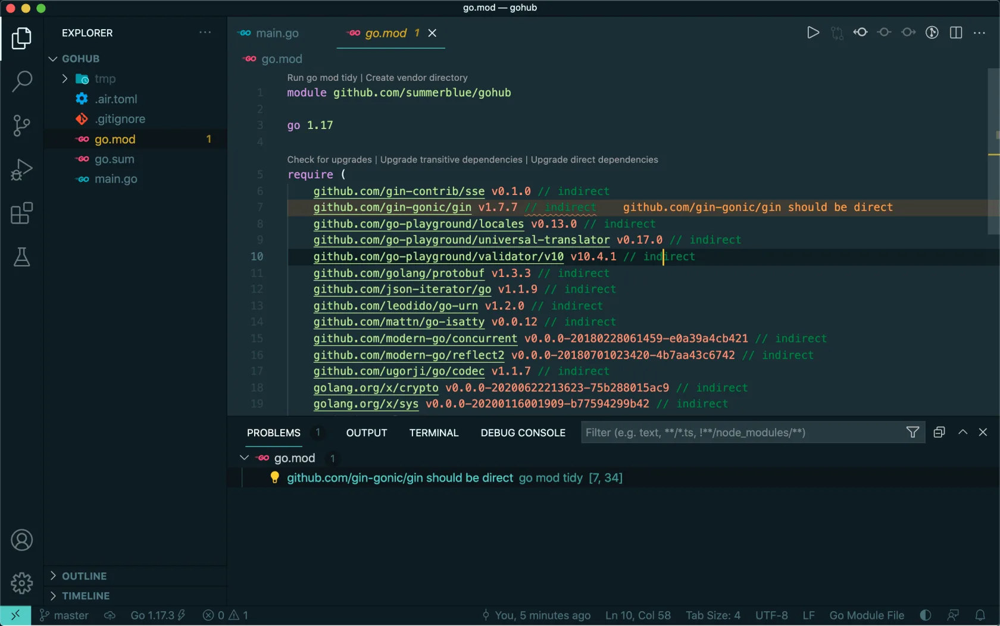
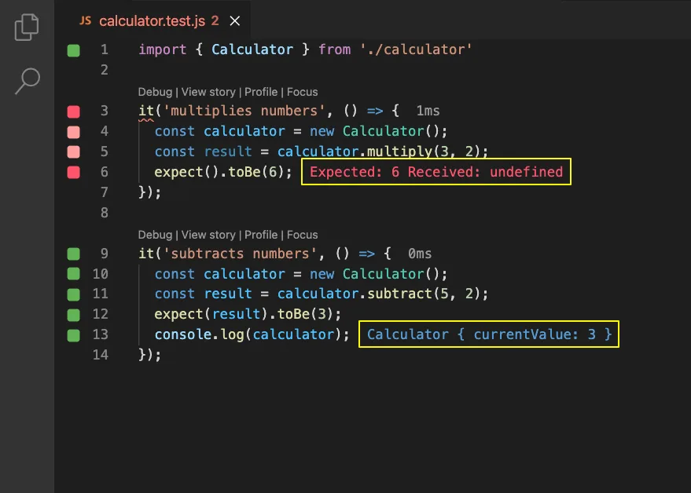

# 3.5. 关注项目的错误提示

原文链接：https://learnku.com/courses/go-api/1.19/pay-attention-to-the-error-prompt-of-the-project/13482

## 说明

我们先来处理上一节遗留下来的问题。

## 编辑器提示

Go 开发时，要特别注意 VSCode 的错误提示：



提示一般有 Warning 和 Error 。

Error 是编译器错误，一般无法编译通过。

Warning 的目的是建议、提示，可以编译通过。这也导致了很多时候我们会忽略它。

## 关注 Warning

养成一个好习惯，在每一次提交代码时，要先检查下错误提示（Warning）。

目前项目提示是：

```
github.com/gin-gonic/gin should be direct
```

点击的话，可以跳到有问题提的具体一行代码中：



Warning `should be direct` 一般发生在我们引入一个库以后，在项目中使用了此库，使用以下命令即可解决：

```bash
$ go mod tidy
```

确认没有错误提示后，我们补做一次提交：

```bash
$ git add . && git commit -m "修复 gin should be direct 的提示"
```

## 使用 『Error Lens』插件

VSCode 里推荐使用 [Error Lens](https://marketplace.visualstudio.com/items?itemName=usernamehw.errorlens) 他可以让提示更加醒目：


