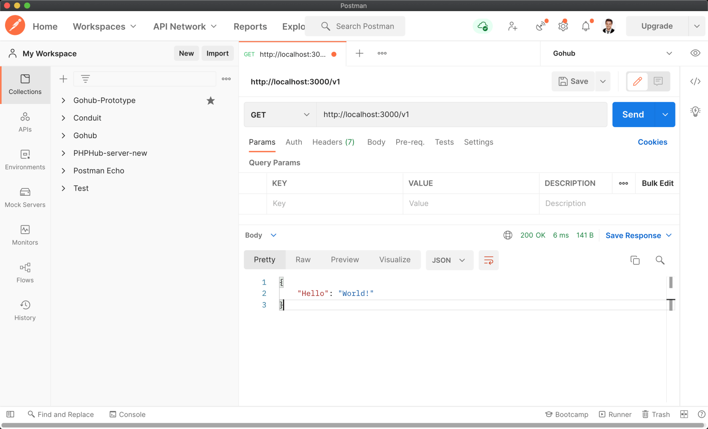

# 3.6. 初始化路由

原文链接：https://learnku.com/courses/go-api/1.19/initialize-route/13483

## 说明

这节课我们开始按照目标项目结构来调整代码。

- 创建 bootstrap 包

- 初始化路由

- 注册 api 路由

## 1. 创建 bootstrap 包

下面我们开始创建 bootstrap 包，并重新调整代码：

bootstrap/route.go

```
// Package bootstrap 处理程序初始化逻辑
package bootstrap

import (
"gohub/routes"
"net/http"
"strings"

"github.com/gin-gonic/gin"
)

// SetupRoute 路由初始化
func SetupRoute(router *gin.Engine) {

// 注册全局中间件
registerGlobalMiddleWare(router)

//  注册 API 路由
routes.RegisterAPIRoutes(router)

//  配置 404 路由
setup404Handler(router)
}

func registerGlobalMiddleWare(router *gin.Engine) {
router.Use(
gin.Logger(),
gin.Recovery(),
)
}

func setup404Handler(router *gin.Engine) {
// 处理 404 请求
router.NoRoute(func(c *gin.Context) {
// 获取标头信息的 Accept 信息
acceptString := c.Request.Header.Get("Accept")
if strings.Contains(acceptString, "text/html") {
// 如果是 HTML 的话
c.String(http.StatusNotFound, "页面返回 404")
} else {
// 默认返回 JSON
c.JSON(http.StatusNotFound, gin.H{
"error_code":    404,
"error_message": "路由未定义，请确认 url 和请求方法是否正确。",
})
}
})
}
```

## 2. 路由文件 api.go

我们所有项目 API 路由，都会统一放在 routes/api.go 文件中。创建文件：

routes/api.go

```
// Package routes 注册路由
package routes

import (
"net/http"

"github.com/gin-gonic/gin"
)

// RegisterAPIRoutes 注册网页相关路由
func RegisterAPIRoutes(r *gin.Engine) {

// 测试一个 v1 的路由组，我们所有的 v1 版本的路由都将存放到这里
v1 := r.Group("/v1")
{
// 注册一个路由
v1.GET("/", func(c *gin.Context) {
// 以 JSON 格式响应
c.JSON(http.StatusOK, gin.H{
"Hello": "World!",
})
})
}
}
```

注意这里使用 gin 提供的 `r.Group` 方法，注册了 v1 的路由组，作为我们的 API  版本区分。

随着业务的发展，需求的不断变化，API 的迭代是必然的，很可能当前版本正在使用，而我们就得开发甚至上线一个不兼容的新版本，为了让旧用户可以正常使用，为了保证开发的顺利进行，我们需要控制好 API 的版本区分。

这里我们实现的是将版本号直接加入 URL 中：

```
https://api.gohub.com/v1
https://api.gohub.com/v2
```

API  版本区分，大部分的商业 API 项目中都会有此要求。在现实生产环境中，多版本共存是很正常的情况。

## 3. main.go

接下来修改 main.go 里的调用：

```
package main

import (
"fmt"
"gohub/bootstrap"

"github.com/gin-gonic/gin"
)

func main() {

// new 一个 Gin Engine 实例
router := gin.New()

// 初始化路由绑定
bootstrap.SetupRoute(router)

// 运行服务
err := router.Run(":3000")
if err != nil {
// 错误处理，端口被占用了或者其他错误
fmt.Println(err.Error())
}
}
```

>

技巧分享：一般来讲，main.go 文件是程序的入口，要尽量保持这个文件的简介易读。目的是让人能够很快弄清楚程序到底是怎么启动的。

在我们的 Gohub 项目中，我们只会放一些初始化的代码，其他逻辑的代码我们会使用合理的结构，将他们封装到各自所属的文件和包。

## 4. bootstrap 目录和 routes 目录

我们刚刚创建了两个目录，bootstrap 和 routes。

bootstrap 目录将存放程序初始化的代码，现在是只有 route ，后面我们还会加上 database, redis, config … 。

routes 目录存放我们所有项目的路由文件，后面如果我们有 Web 前端，或者 Admin 的路由，可以在此目录下添加 web.go 和 admin.go 。

## 5. 测试一下

Postman 访问 `http://localhost:3000/v1` :



## 代码版本

开始下一节之前，我们先来为代码做下版本标记：

```
$ git add .
$ git commit -m "初始化路由"
```
