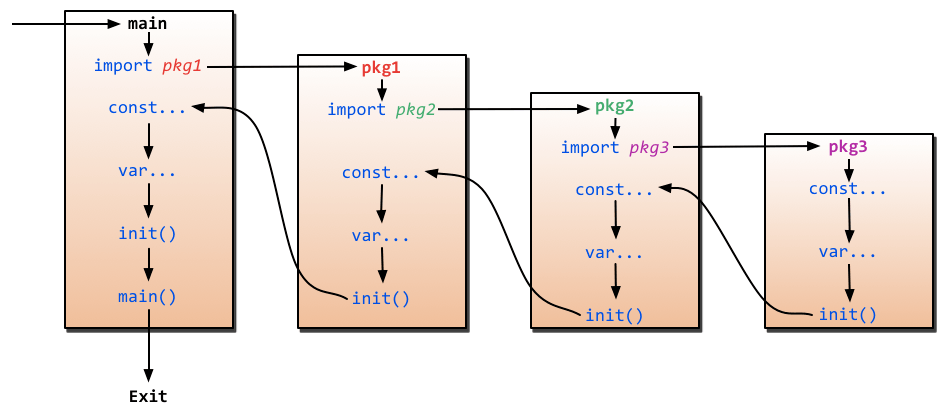

# 3.9. 配置方案的实现

原文链接：https://learnku.com/courses/go-api/1.19/config-package/13486

## 说明

config 包是我们自定的包，对 Viper 第三方库的封装。封装以下逻辑：

- 初始化

- 读取配置文件

- 设置配置项

- 读取配置项

config 包以外的其他项目代码，将对内部使用依赖包 Viper 无感知。

这样做的好处是后续以为某些特殊需求，Viper 无法满足需求，或者 Viper 不再维护有更加优秀的第三方包需要替换。除了我们的 config 包，项目中的其他代码我们都不需要动。

接下来开始编码。

## 1. 安装依赖包

```
$ go get github.com/spf13/cast
```

```
$ go get github.com/spf13/viper
```

## 2. config 包

新建文件：

pkg/config/config.go

```
// Package config 负责配置信息
package config

import (
"gohub/pkg/helpers"
"os"

"github.com/spf13/cast"
viperlib "github.com/spf13/viper" // 自定义包名，避免与内置 viper 实例冲突
)

// viper 库实例
var viper *viperlib.Viper

// ConfigFunc 动态加载配置信息
type ConfigFunc func() map[string]interface{}

// ConfigFuncs 先加载到此数组，loadConfig 再动态生成配置信息
var ConfigFuncs map[string]ConfigFunc

func init() {

// 1. 初始化 Viper 库
viper = viperlib.New()
// 2. 配置类型，支持 "json", "toml", "yaml", "yml", "properties",
//             "props", "prop", "env", "dotenv"
viper.SetConfigType("env")
// 3. 环境变量配置文件查找的路径，相对于 main.go
viper.AddConfigPath(".")
// 4. 设置环境变量前缀，用以区分 Go 的系统环境变量
viper.SetEnvPrefix("appenv")
// 5. 读取环境变量（支持 flags）
viper.AutomaticEnv()

ConfigFuncs = make(map[string]ConfigFunc)
}

// InitConfig 初始化配置信息，完成对环境变量以及 config 信息的加载
func InitConfig(env string) {
// 1. 加载环境变量
loadEnv(env)
// 2. 注册配置信息
loadConfig()
}

func loadConfig() {
for name, fn := range ConfigFuncs {
viper.Set(name, fn())
}
}

func loadEnv(envSuffix string) {

// 默认加载 .env 文件，如果有传参 --env=name 的话，加载 .env.name 文件
envPath := ".env"
if len(envSuffix) > 0 {
filepath := ".env." + envSuffix
if _, err := os.Stat(filepath); err == nil {
// 如 .env.testing 或 .env.stage
envPath = filepath
}
}

// 加载 env
viper.SetConfigName(envPath)
if err := viper.ReadInConfig(); err != nil {
panic(err)
}

// 监控 .env 文件，变更时重新加载
viper.WatchConfig()
}

// Env 读取环境变量，支持默认值
func Env(envName string, defaultValue ...interface{}) interface{} {
if len(defaultValue) > 0 {
return internalGet(envName, defaultValue[0])
}
return internalGet(envName)
}

// Add 新增配置项
func Add(name string, configFn ConfigFunc) {
ConfigFuncs[name] = configFn
}

// Get 获取配置项
// 第一个参数 path 允许使用点式获取，如：app.name
// 第二个参数允许传参默认值
func Get(path string, defaultValue ...interface{}) string {
return GetString(path, defaultValue...)
}

func internalGet(path string, defaultValue ...interface{}) interface{} {
// config 或者环境变量不存在的情况
if !viper.IsSet(path) || helpers.Empty(viper.Get(path)) {
if len(defaultValue) > 0 {
return defaultValue[0]
}
return nil
}
return viper.Get(path)
}

// GetString 获取 String 类型的配置信息
func GetString(path string, defaultValue ...interface{}) string {
return cast.ToString(internalGet(path, defaultValue...))
}

// GetInt 获取 Int 类型的配置信息
func GetInt(path string, defaultValue ...interface{}) int {
return cast.ToInt(internalGet(path, defaultValue...))
}

// GetFloat64 获取 float64 类型的配置信息
func GetFloat64(path string, defaultValue ...interface{}) float64 {
return cast.ToFloat64(internalGet(path, defaultValue...))
}

// GetInt64 获取 Int64 类型的配置信息
func GetInt64(path string, defaultValue ...interface{}) int64 {
return cast.ToInt64(internalGet(path, defaultValue...))
}

// GetUint 获取 Uint 类型的配置信息
func GetUint(path string, defaultValue ...interface{}) uint {
return cast.ToUint(internalGet(path, defaultValue...))
}

// GetBool 获取 Bool 类型的配置信息
func GetBool(path string, defaultValue ...interface{}) bool {
return cast.ToBool(internalGet(path, defaultValue...))
}

// GetStringMapString 获取结构数据
func GetStringMapString(path string) map[string]string {
return viper.GetStringMapString(path)
}
```

上面有一个 `helpers.Empty()` 方法未定义，现在定义此方法：

pkg/helpers/helpers.go

```
// Package helpers 存放辅助方法
package helpers

import "reflect"

// Empty 类似于 PHP 的 empty() 函数
func Empty(val interface{}) bool {
if val == nil {
return true
}
v := reflect.ValueOf(val)
switch v.Kind() {
case reflect.String, reflect.Array:
return v.Len() == 0
case reflect.Map, reflect.Slice:
return v.Len() == 0 || v.IsNil()
case reflect.Bool:
return !v.Bool()
case reflect.Int, reflect.Int8, reflect.Int16, reflect.Int32, reflect.Int64:
return v.Int() == 0
case reflect.Uint, reflect.Uint8, reflect.Uint16, reflect.Uint32, reflect.Uint64, reflect.Uintptr:
return v.Uint() == 0
case reflect.Float32, reflect.Float64:
return v.Float() == 0
case reflect.Interface, reflect.Ptr:
return v.IsNil()
}
return reflect.DeepEqual(val, reflect.Zero(v.Type()).Interface())
}
```

## 3. config/app.go

创建配置信息：

config/app.go

```
// Package config 站点配置信息
package config

import "gohub/pkg/config"

func init() {
config.Add("app", func() map[string]interface{} {
return map[string]interface{}{

// 应用名称
"name": config.Env("APP_NAME", "Gohub"),

// 当前环境，用以区分多环境，一般为 local, stage, production, test
"env": config.Env("APP_ENV", "production"),

// 是否进入调试模式
"debug": config.Env("APP_DEBUG", false),

// 应用服务端口
"port": config.Env("APP_PORT", "3000"),

// 加密会话、JWT 加密
"key": config.Env("APP_KEY", "33446a9dcf9ea060a0a6532b166da32f304af0de"),

// 用以生成链接
"url": config.Env("APP_URL", "http://localhost:3000"),

// 设置时区，JWT 里会使用，日志记录里也会使用到
"timezone": config.Env("TIMEZONE", "Asia/Shanghai"),
}
})
}
```

config/config.go

```
// Package config 存放程序所有的配置信息
package config

// Initialize 触发加载 config 包的所有 init 函数
func Initialize() {
}
```

## 4. .env 文件

创建 .env 文件：

.env

```
APP_ENV=local
APP_KEY=zBqYyQrPNaIUsnRhsGtHLivjqiMjBVLS
APP_DEBUG=true
APP_URL=http://localhost:3000
APP_LOG_LEVEL=debug
APP_PORT=3000
```

## 5. 配置初始化

修改 main.go

```
package main

import (
"flag"
"fmt"
"gohub/bootstrap"
btsConfig "gohub/config"
"gohub/pkg/config"

"github.com/gin-gonic/gin"
)

func init() {
// 加载 config 目录下的配置信息
btsConfig.Initialize()
}

func main() {

// 配置初始化，依赖命令行 --env 参数
var env string
flag.StringVar(&env, "env", "", "加载 .env 文件，如 --env=testing 加载的是 .env.testing 文件")
flag.Parse()
config.InitConfig(env)

// new 一个 Gin Engine 实例
router := gin.New()

// 初始化路由绑定
bootstrap.SetupRoute(router)

// 运行服务
err := router.Run(":" + config.Get("app.port"))
if err != nil {
// 错误处理，端口被占用了或者其他错误
fmt.Println(err.Error())
}
}
```

## 6. init 方法

上面我们利用 Go 的 `init()` 方法来注册 config 目录下的配置信息。下面补充一下 `init()` 的知识。

Go 里面有两个特殊的函数：

1. main 包中的 main 函数，它是所有 Go 可执行程序的入口函数；

2. 包级别的 init 函数。

`init` 函数是一个无参无返回值的函数：

```
func init() {
...
}
```

init 函数有以下逻辑：

- 如果一个包定义了 init 函数，Go 运行时会负责在该包初始化时调用它的 init 函数；

- init 不能被显式调用 ，否则会在编译期间报错；

- 多个包的情况，在初始化该包时，Go 运行时会按照一定的次序逐一顺序地调用该包的 init 函数；

- 每个 init 函数在整个 Go 程序生命周期内仅会被执行一次；

- 一般来说，先被传递给 Go 编译器的源文件中的 init 函数先被执行（main.go 作为起点）；

- 同一个源文件中的多个 init 函数按声明顺序依次执行。

关于 init 的加载顺序，这张图给了一个很好的说明：



解读：

1. 如果一个包导入了其他包，则首先初始化导入的包。

2. 然后初始化当前包的常量。

3. 接下来初始化当前包的变量。

4. 最后，调用当前包的 `init()` 函数。

## 7. 测试一下

air 的输出的命令行，可以看到：

```
[GIN-debug] Listening and serving HTTP on :3000
```

端口已成功设置为 3000 端口，这将作为我们的默认的服务端口。

端口的成功读取，也意味着配置信息的成功加载。

你可以试着修改 .env 中的 APP_PORT 项：

```
APP_PORT=2000
```

关注命令行 air 窗口是否输出：

```
[GIN-debug] Listening and serving HTTP on :2000
```

测试完成后，记得修改回 3000 端口，跟课程保持一致，以免后面出现没必要的混淆。

## 8. go mod tidy

上面加载了两个库，现在使用 mod tidy 命令来整理一下 go.mod 文件：

```
$ go mod tidy
```

如若命令行报错：

```
gohub imports
github.com/gin-gonic/gin imports
github.com/gin-gonic/gin/binding imports
gopkg.in/yaml.v2 tested by
gopkg.in/yaml.v2.test imports
gopkg.in/check.v1 loaded from gopkg.in/check.v1@v0.0.0-20161208181325-20d25e280405,
but go 1.16 would select v1.0.0-20190902080502-41f04d3bba15

To upgrade to the versions selected by go 1.16:
go mod tidy -go=1.16 && go mod tidy -go=1.17
If reproducibility with go 1.16 is not needed:
go mod tidy -compat=1.17
For other options, see:
https://golang.org/doc/modules/pruning
```

可先更新所有依赖：

```
$ go get -u
```

再：

```
$ go mod tidy
```

## 代码版本

开始下一节之前，我们先来为代码做下版本标记：

```
$ git add .
$ git commit -m "配置方案的实现"
```
