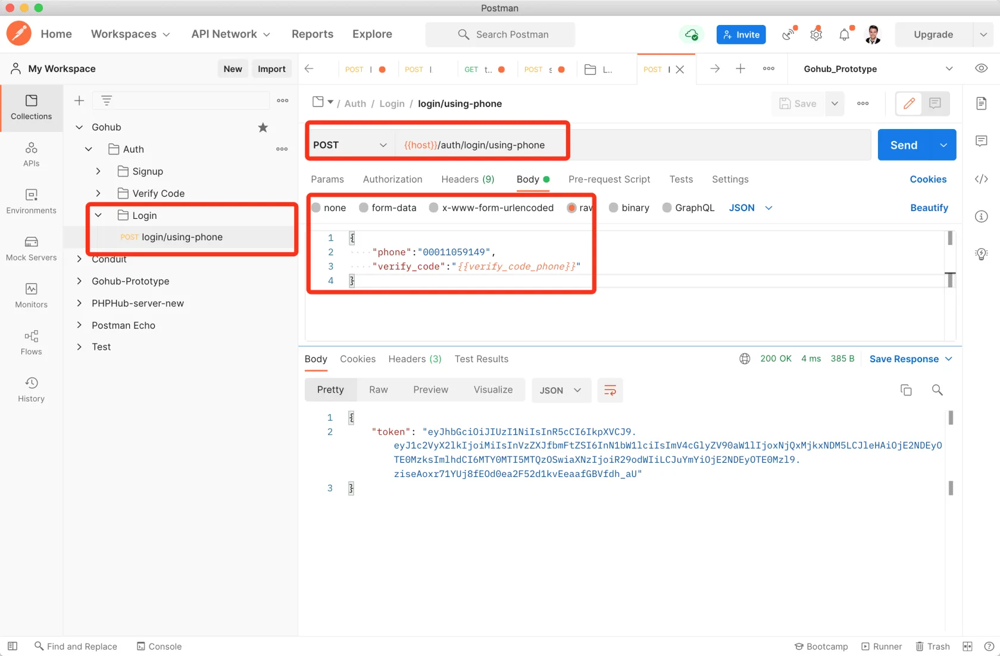

# 9.1. 手机号 + 短信验证码登录

原文链接：https://learnku.com/courses/go-api/1.19/mobile-sms-verification-code-login/13523

## 说明

本节我们来开发 `login/using-phone` 接口，允许用户使用手机号 + 短信验证码进行登录。

## 1. auth 包

auth 包负责授权相关的逻辑。

pkg/auth/auth.go

```
// Package auth 授权相关逻辑
package auth

import (
"errors"
"gohub/app/models/user"
)

// Attempt 尝试登录
func Attempt(email string, password string) (user.User, error) {
userModel := user.GetByMulti(email)
if userModel.ID == 0 {
return user.User{}, errors.New("账号不存在")
}

if !userModel.ComparePassword(password) {
return user.User{}, errors.New("密码错误")
}

return userModel, nil
}

// LoginByPhone 登录指定用户
func LoginByPhone(phone string) (user.User, error) {
userModel := user.GetByPhone(phone)
if userModel.ID == 0 {
return user.User{}, errors.New("手机号未注册")
}

return userModel, nil
}
```

## 2. 模型方法

app/models/user/user_util.go

```
.
.
.
// GetByPhone 通过手机号来获取用户
func GetByPhone(phone string) (userModel User) {
database.DB.Where("phone = ?", phone).First(&userModel)
return
}

// GetByMulti 通过 手机号/Email/用户名 来获取用户
func GetByMulti(loginID string) (userModel User) {
database.DB.
Where("phone = ?", loginID).
Or("email = ?", loginID).
Or("name = ?", loginID).
First(&userModel)
return
}
```

## 3. 验证请求

新建文件：

app/requests/login_request.go

```
package requests

import (
"gohub/app/requests/validators"

"github.com/gin-gonic/gin"
"github.com/thedevsaddam/govalidator"
)

type LoginByPhoneRequest struct {
Phone      string `json:"phone,omitempty" valid:"phone"`
VerifyCode string `json:"verify_code,omitempty" valid:"verify_code"`
}

// LoginByPhone 验证表单，返回长度等于零即通过
func LoginByPhone(data interface{}, c *gin.Context) map[string][]string {

rules := govalidator.MapData{
"phone":       []string{"required", "digits:11"},
"verify_code": []string{"required", "digits:6"},
}
messages := govalidator.MapData{
"phone": []string{
"required:手机号为必填项，参数名称 phone",
"digits:手机号长度必须为 11 位的数字",
},
"verify_code": []string{
"required:验证码答案必填",
"digits:验证码长度必须为 6 位的数字",
},
}

errs := validate(data, rules, messages)

// 手机验证码
_data := data.(*LoginByPhoneRequest)
errs = validators.ValidateVerifyCode(_data.Phone, _data.VerifyCode, errs)

return errs
}
```

## 4. 控制器

app/http/controllers/api/v1/auth/login_controller.go

```
package auth

import (
v1 "gohub/app/http/controllers/api/v1"
"gohub/app/requests"
"gohub/pkg/auth"
"gohub/pkg/jwt"
"gohub/pkg/response"

"github.com/gin-gonic/gin"
)

// LoginController 用户控制器
type LoginController struct {
v1.BaseAPIController
}

// LoginByPhone 手机登录
func (lc *LoginController) LoginByPhone(c *gin.Context) {

// 1. 验证表单
request := requests.LoginByPhoneRequest{}
if ok := requests.Validate(c, &request, requests.LoginByPhone); !ok {
return
}

// 2. 尝试登录
user, err := auth.LoginByPhone(request.Phone)
if err != nil {
// 失败，显示错误提示
response.Error(c, err, "账号不存在")
} else {
// 登录成功
token := jwt.NewJWT().IssueToken(user.GetStringID(), user.Name)

response.JSON(c, gin.H{
"token": token,
})
}
}
```

## 5. 路由注册

routes/api.go

```
.
.
.
lgc := new(auth.LoginController)
// 使用手机号，短信验证码进行登录
authGroup.POST("/login/using-phone", lgc.LoginByPhone)
}
}
}
```

## 6. 测试一下

Postman 创建文件夹 `Login` ，在此文件夹中创建 `login/using-phone` 请求。

使用我们之前注册成功的用户（没有的话 Postman 里重新注册一个，手机号 000 开头的不会验证『短信验证码』）：



结果符合预期。

## 代码版本

本节功能开发完毕。开始下一节之前，先来为代码做下版本标记：

```
$ git add .
$ git commit -m "手机 + 短信验证码登录"
```
