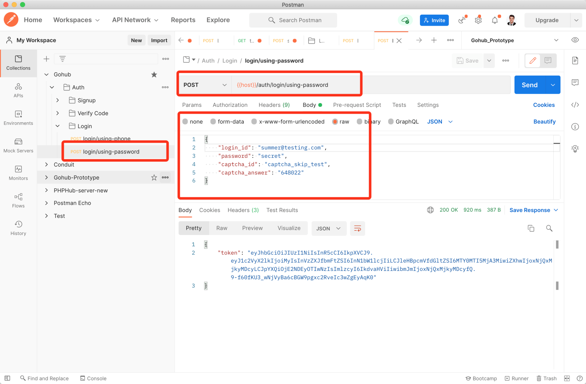

# 9.2. 使用密码登录

原文链接：https://learnku.com/courses/go-api/1.19/login-with-password/13524

## 说明

本节我们来开发 `login/using-password` 接口，允许用户使用 login_id + 密码进行登录。

login_id 可以是：手机号、email 或用户名。

## 1. 验证请求

app/requests/login_request.go

```
.
.
.
type LoginByPasswordRequest struct {
CaptchaID     string `json:"captcha_id,omitempty" valid:"captcha_id"`
CaptchaAnswer string `json:"captcha_answer,omitempty" valid:"captcha_answer"`

LoginID  string `valid:"login_id" json:"login_id"`
Password string `valid:"password" json:"password,omitempty"`
}

// LoginByPassword 验证表单，返回长度等于零即通过
func LoginByPassword(data interface{}, c *gin.Context) map[string][]string {

rules := govalidator.MapData{
"login_id":       []string{"required", "min:3"},
"password":       []string{"required", "min:6"},
"captcha_id":     []string{"required"},
"captcha_answer": []string{"required", "digits:6"},
}
messages := govalidator.MapData{
"login_id": []string{
"required:登录 ID 为必填项，支持手机号、邮箱和用户名",
"min:登录 ID 长度需大于 3",
},
"password": []string{
"required:密码为必填项",
"min:密码长度需大于 6",
},
"captcha_id": []string{
"required:图片验证码的 ID 为必填",
},
"captcha_answer": []string{
"required:图片验证码答案必填",
"digits:图片验证码长度必须为 6 位的数字",
},
}

errs := validate(data, rules, messages)

// 图片验证码
_data := data.(*LoginByPasswordRequest)
errs = validators.ValidateCaptcha(_data.CaptchaID, _data.CaptchaAnswer, errs)

return errs
}
```

## 2. 控制器方法

app/http/controllers/api/v1/auth/login_controller.go

```
.
.
.
// LoginByPassword 多种方法登录，支持手机号、email 和用户名
func (lc *LoginController) LoginByPassword(c *gin.Context) {
// 1. 验证表单
request := requests.LoginByPasswordRequest{}
if ok := requests.Validate(c, &request, requests.LoginByPassword); !ok {
return
}

// 2. 尝试登录
user, err := auth.Attempt(request.LoginID, request.Password)
if err != nil {
// 失败，显示错误提示
response.Unauthorized(c, "账号不存在或密码错误")

} else {
token := jwt.NewJWT().IssueToken(user.GetStringID(), user.Name)
response.JSON(c, gin.H{
"token": token,
})
}
}
```

需要注意的是，上面登录失败显示的是 `账号不存在或密码错误`，这是有意而为之。安全考虑，一般不要对用户显示具体是密码错误还是账号不存在，以防止黑客利用此信息来暴力破解账号。

## 3. 注册路由

routes/api.go

```
.
.
.
authGroup.POST("/login/using-phone", lgc.LoginByPhone)
// 支持手机号，Email 和 用户名
authGroup.POST("/login/using-password", lgc.LoginByPassword)
}
}
}
```

## 4. 测试

Postman 里新建 `login/using-password` 请求：



login_id 可以试着使用 手机号、email 或用户名进行测试。

## 代码版本

本节功能开发完毕。开始下一节之前，先来为代码做下版本标记：

```
$ git add .
$ git commit -m "使用密码登录"
```
