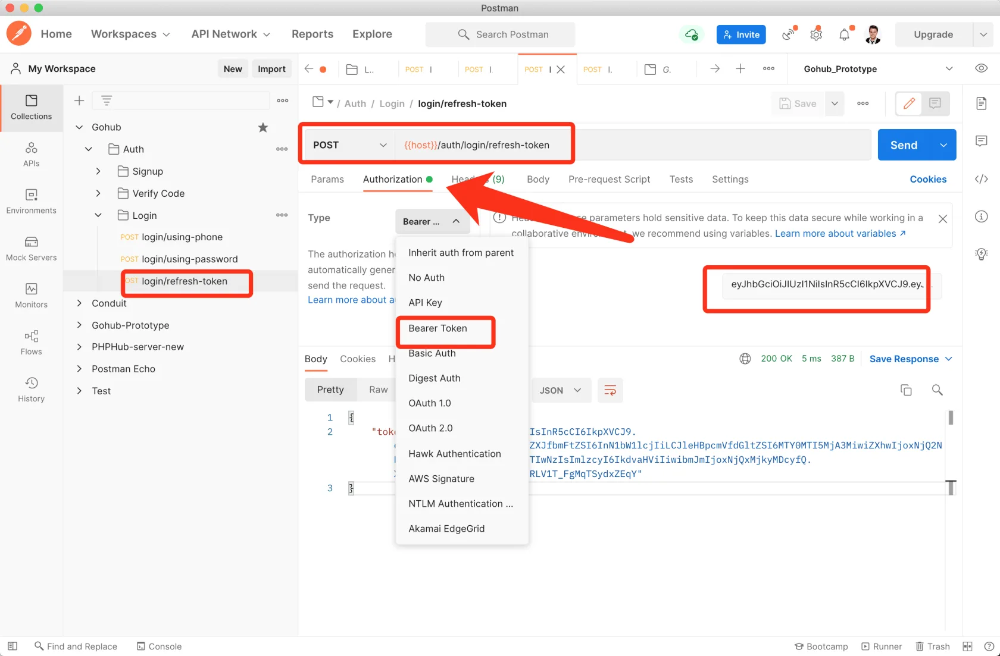
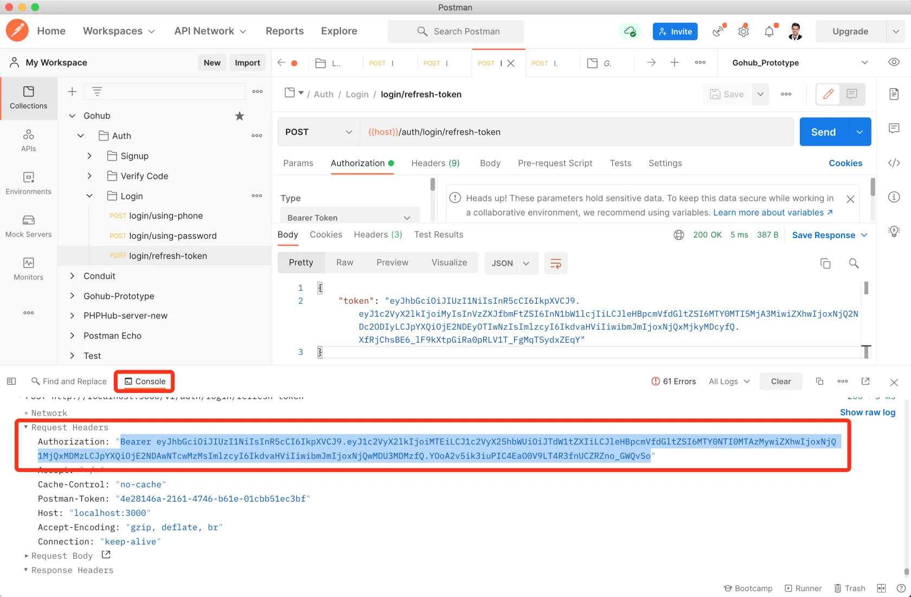
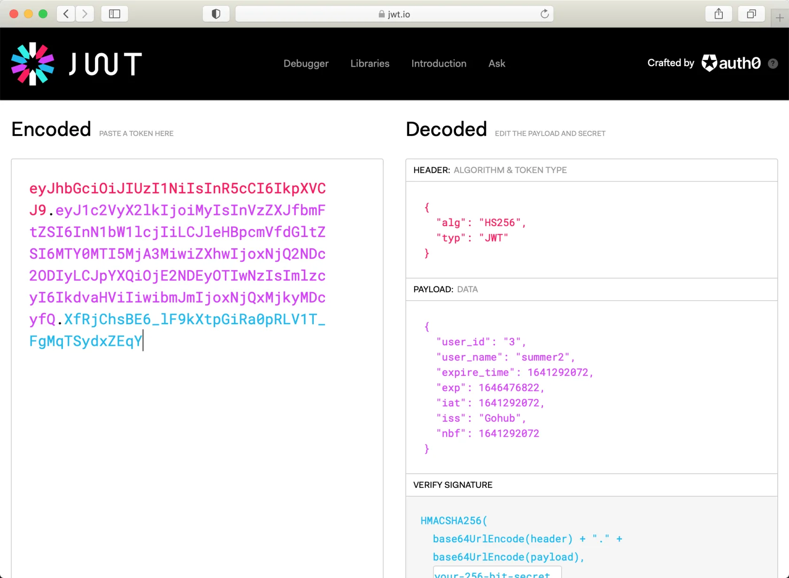

# 9.3. Refresh Token

原文链接：https://learnku.com/courses/go-api/1.19/refresh-token/13525

## 说明

这节课我们来开发 `login/refresh-token` 接口。

## 1. 控制器

app/http/controllers/api/v1/auth/login_controller.go

```go
.
.
.
// RefreshToken 刷新 Access Token
func (lc *LoginController) RefreshToken(c *gin.Context) {

	token, err := jwt.NewJWT().RefreshToken(c)

	if err != nil {
		response.Error(c, err, "令牌刷新失败")
	} else {
		response.JSON(c, gin.H{
			"token": token,
		})
	}
}
```

## 2. 注册路由

routes/api.go

```go
.
.
.
authGroup.POST("/login/refresh-token", lgc.RefreshToken)
}
}
}
```

## 3. 测试一下

Postman 里新建  `login/refresh-token` 接口，使用 Bearer Token 认证模式：



看下 console ，拉到最下面，可以看到具体的请求标头信息：



结果符合预期。

## 4. JWT 解码

打开 [jwt.io/](https://jwt.io/) ，将我们的 Token 黏贴到 Encoded 框里，可以看到解析出来的内容：



你也许会疑惑，直接页面上就能解码，是不是不安全？

不会的。 JWT Token 里包含了 3 段信息：

1. 加密类型；

2. 附加信息；

3. 哈希值。

我们的服务器端接收到 JWT Token ，不会直接使用『附加信息』，而是会将附加信息按照『加密类型』进行哈希处理，然后匹配第三部分『哈希值』看是否一致。

哈希处理时，会添加我们的 app key，所以第三段内容『哈希值』也很难被伪造。

## 代码版本

本节功能开发完毕。开始下一节之前，先来为代码做下版本标记：

```bash
$ git add .
$ git commit -m "Refresh Token"
```
