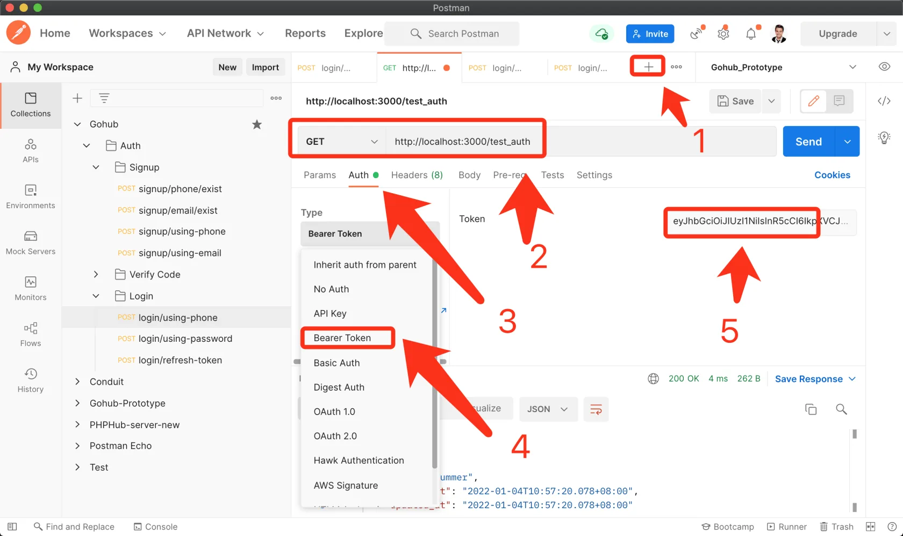

# 9.4. Auth 中间件

原文链接：https://learnku.com/courses/go-api/1.19/auth-and-guest-middleware/13526

## 说明

这一节我们来创建 Auth 中间件。

Auth 中间件用在一些需要用户授权才能操作的接口，例如说创建话题、更新个人资料等。

使用方法是在路由中做绑定，哪些路由需要授权才能访问，直接为其添加中间件即可。

## 1. 创建中间件

app/http/middlewares/auth_jwt.go

```
// Package middlewares Gin 中间件
package middlewares

import (
"fmt"
"gohub/app/models/user"
"gohub/pkg/config"
"gohub/pkg/jwt"
"gohub/pkg/response"

"github.com/gin-gonic/gin"
)

func AuthJWT() gin.HandlerFunc {
return func(c *gin.Context) {

// 从标头 Authorization:Bearer xxxxx 中获取信息，并验证 JWT 的准确性
claims, err := jwt.NewJWT().ParserToken(c)

// JWT 解析失败，有错误发生
if err != nil {
response.Unauthorized(c, fmt.Sprintf("请查看 %v 相关的接口认证文档", config.GetString("app.name")))
return
}

// JWT 解析成功，设置用户信息
userModel := user.Get(claims.UserID)
if userModel.ID == 0 {
response.Unauthorized(c, "找不到对应用户，用户可能已删除")
return
}

// 将用户信息存入 gin.context 里，后续 auth 包将从这里拿到当前用户数据
c.Set("current_user_id", userModel.GetStringID())
c.Set("current_user_name", userModel.Name)
c.Set("current_user", userModel)

c.Next()
}
}
```

注意中间件里，当在 `c.Next()` 之前 return 掉，就会中断所有的后续请求。

## 2. 创建 `user.Get()`

app/models/user/user_util.go

```
.
.
.
// Get 通过 ID 获取用户
func Get(idstr string) (userModel User) {
database.DB.Where("id", idstr).First(&userModel)
return
}
```

## 3. 完善 auth 包

下面添加两个方法到 auth 包里，方便后续使用：

pkg/auth/auth.go

```
.
.
.
// CurrentUser 从 gin.context 中获取当前登录用户
func CurrentUser(c *gin.Context) user.User {
userModel, ok := c.MustGet("current_user").(user.User)
if !ok {
logger.LogIf(errors.New("无法获取用户"))
return user.User{}
}
// db is now a *DB value
return userModel
}

// CurrentUID 从 gin.context 中获取当前登录用户 ID
func CurrentUID(c *gin.Context) string {
return c.GetString("current_user_id")
}
```

## 4. 测试一下

main.go 里：

main.go

```
.
.
.
bootstrap.SetupRoute(router)

router.GET("/test_auth", middlewares.AuthJWT(), func(c *gin.Context) {
userModel := auth.CurrentUser(c)
response.Data(c, userModel)
})

// 运行服务
.
.
.
```

创建一个测试的请求，Token 的值可以使用我们之前开发的那两个接口获取。

发送请求：



符合预期。

可自行测试 Token 错误，或者为空，看是否会返回 401 未授权。

## 5. 删除测试代码

记得删除 main.go 里的这段测试代码：

```
router.GET("/test_auth", middlewares.AuthJWT(), func(c *gin.Context) {
userModel := auth.CurrentUser(c)
response.Data(c, userModel)
})
```

## 代码版本

本节功能开发完毕。开始下一节之前，先来为代码做下版本标记：

```
$ git add .
$ git commit -m "Auth 中间件"
```
