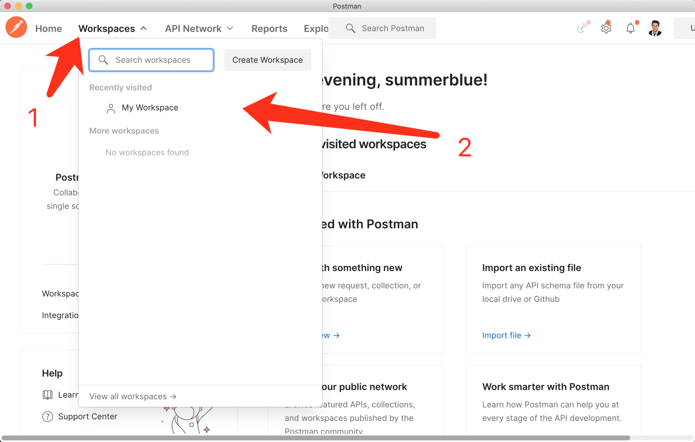
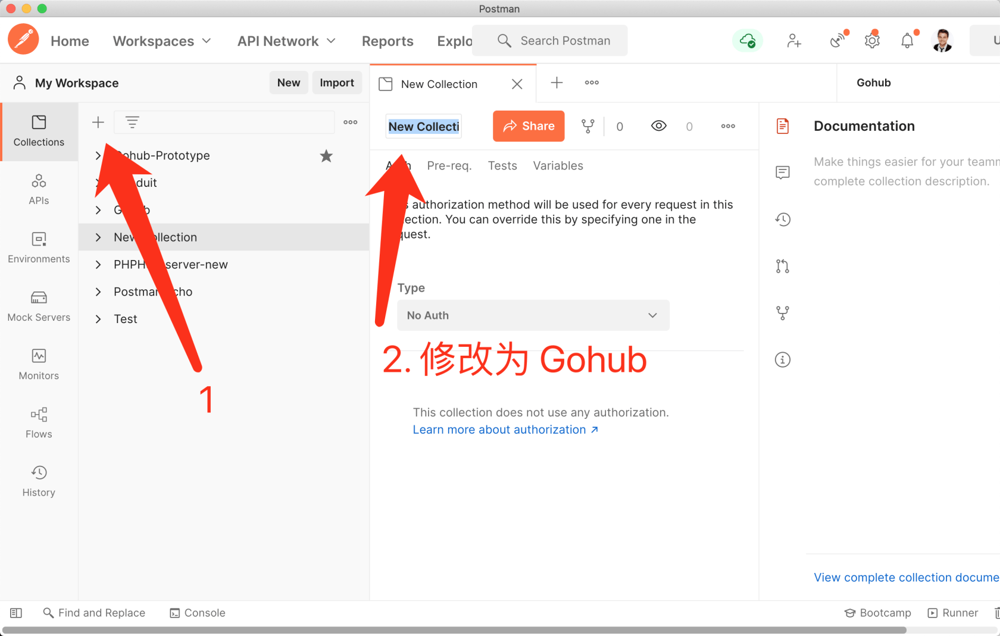
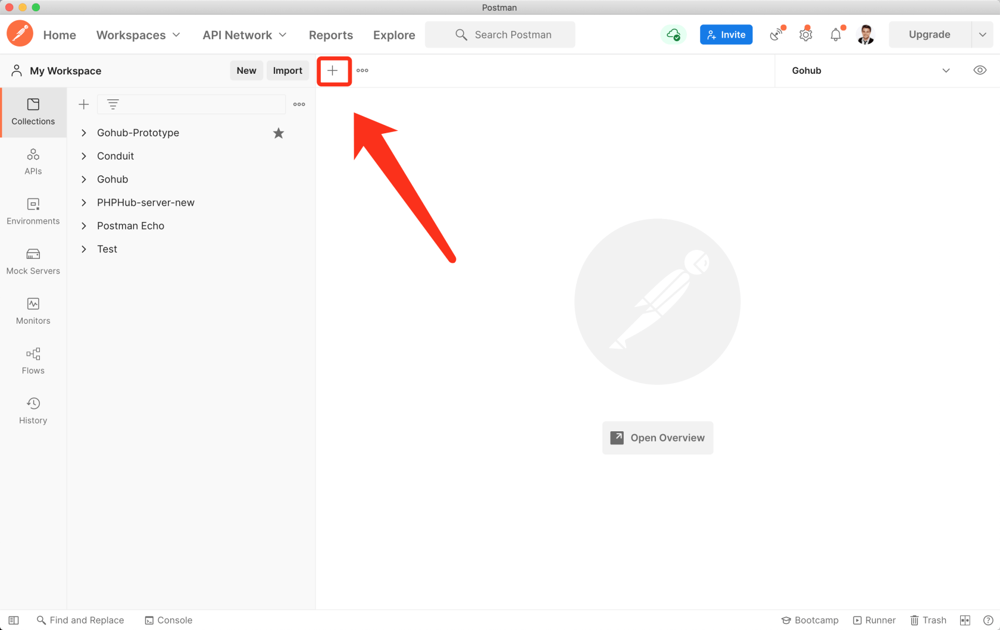
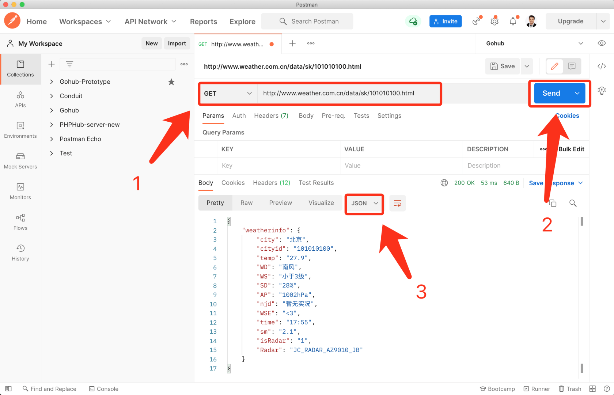
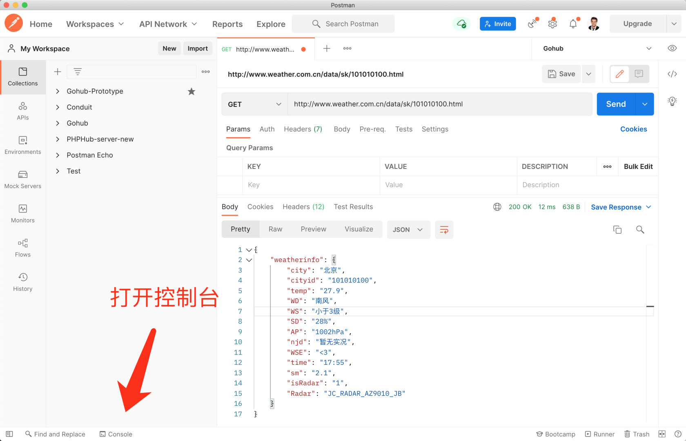
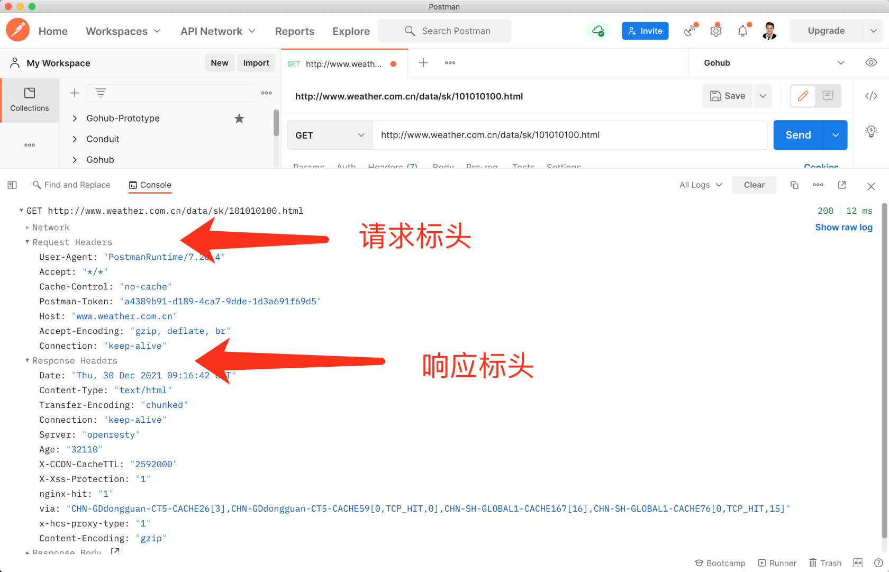
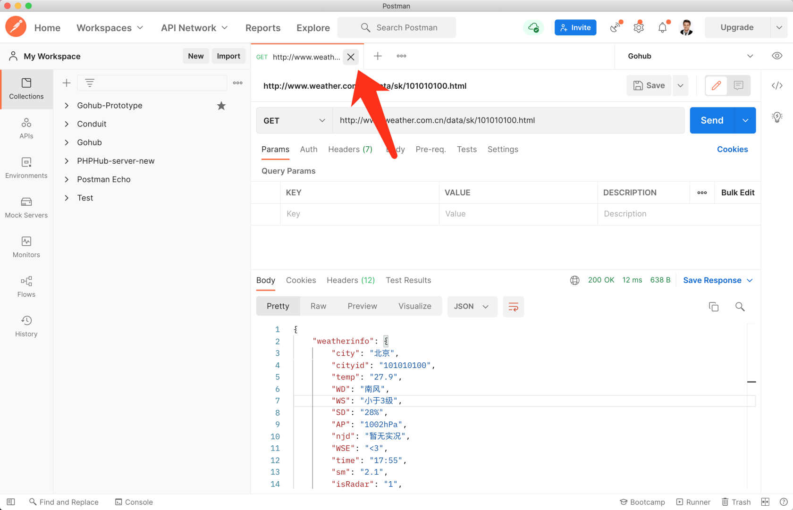
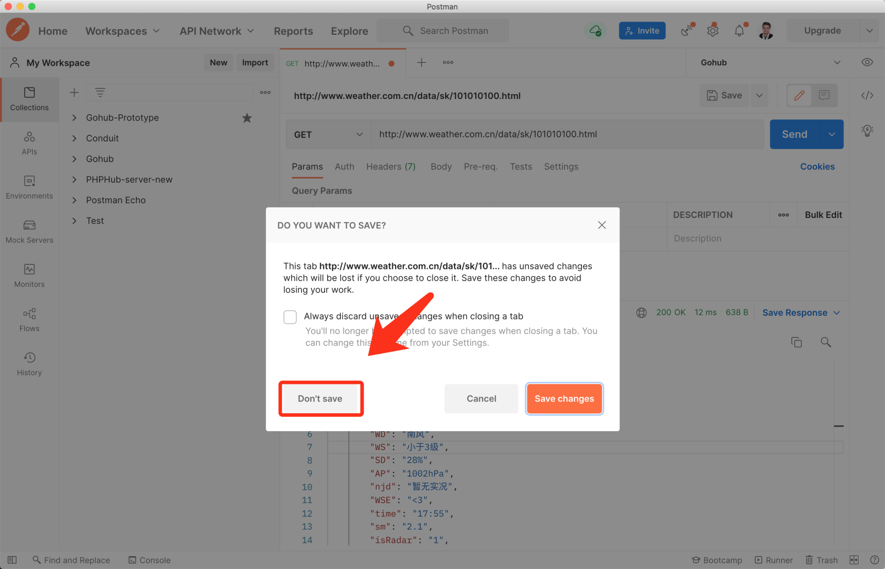

# 2.5. 安装 Postman 免费

原文链接：https://learnku.com/courses/go-api/1.19/installing-postman/13477

## 1. 什么是 PostMan？

PostMan 是一款跨平台的 API 调试工具，可以在 [PostMan官网](https://www.getpostman.com/) 下载。

API 测试工具中，PostMan 的市场占有率很高。PostMan 导入导出项目，基本上也兼容了主流的其他 API 测试工具，所以本课程会使用 PostMan 来作为我们的 API 测试工具。

## 2. PostMan 的替代方案

PostMan 是一款国外软件，服务器在国外，因为网络原因，国内访问并不稳定，导致下载和登录功能使用受限。尤其是登录和同步功能，可以保证我们的工作不会丢失。

动手能力差的同学，可以使用国内的服务，这里有两个替代方案，这两个都是：

- [apipost](https://www.apipost.cn/?utm_apipost_download_ad)  —— 基本上和 PostMan 一样，定位就是国内的替代版

- [apifox](https://www.apifox.cn/?utm_source=learnku&utm_medium=sponsor)  —— 使用简单

## 3. PostMan 使用

下面我们来大概过一遍 PostMan 提供的功能。

### 1. 选择 workshop



### 2. 创建接口集合



### 3. 创建测试接口



随便找个接口调用一下，这个是国家气象局提供的 [天气预报接口](http://www.weather.com.cn/data/sk/101010100.html)：

```
http://www.weather.com.cn/data/sk/101010100.html
```

将其填入『请求地址』处：



### 4. 请求控制台

请求控制台可以看到我们发送到服务端的原始请求信息。

入口如下：



内容：



### 5. 删除测试接口

Postman 会保留我们的工作状态，每一个请求都是用一个标签来显示，也就是说有独立的页面。

保持和删除这些请求，都需要手动操作。

下面我们来演示删除的操作：



选择『不保存』选项：



这样就删除了我们的测试接口。

## 结语

目前来讲掌握简单的操作即可，其他功能我们在后面使用到时在挖掘。
