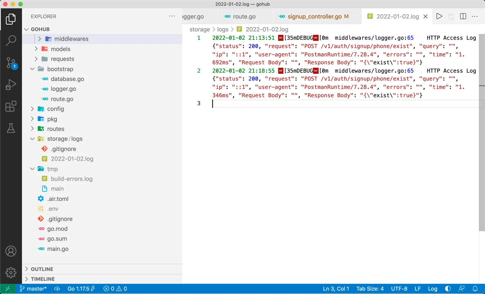

# 5.4. HTTP 访问日志

原文链接：https://learnku.com/courses/go-api/1.19/http-access-log/13499

## 说明

gin 自带访问日志的功能，bootstrap 包里有个叫 registerGlobalMiddleWare 的函数：

```
func registerGlobalMiddleWare(router *gin.Engine) {
router.Use(
gin.Logger(),
gin.Recovery(),
)
}
```

gin.Logger() 就是 gin 内置的中间件。

本节课我们将自定中间件，使用 zap ，使 HTTP 支持日志等级，且对 500 的错误做 error 级别的日志记录。

## 1. 自定义中间件

在 Gohub 项目里，我们所有的中间件都将放到 app/http/middlewares 目录下。

接下来创建目录且创建 HTTP Logger 中间件：

app/http/middlewares/logger.go

```
// Package middlewares 存放系统中间件
package middlewares

import (
"bytes"
"gohub/pkg/helpers"
"gohub/pkg/logger"
"io"
"time"

"github.com/gin-gonic/gin"
"github.com/spf13/cast"
"go.uber.org/zap"
)

type responseBodyWriter struct {
gin.ResponseWriter
body *bytes.Buffer
}

func (r responseBodyWriter) Write(b []byte) (int, error) {
r.body.Write(b)
return r.ResponseWriter.Write(b)
}

// Logger 记录请求日志
func Logger() gin.HandlerFunc {
return func(c *gin.Context) {

// 获取 response 内容
w := &responseBodyWriter{body: &bytes.Buffer{}, ResponseWriter: c.Writer}
c.Writer = w

// 获取请求数据
var requestBody []byte
if c.Request.Body != nil {
// c.Request.Body 是一个 buffer 对象，只能读取一次
requestBody, _ = io.ReadAll(c.Request.Body)
// 读取后，重新赋值 c.Request.Body ，以供后续的其他操作
c.Request.Body = io.NopCloser(bytes.NewBuffer(requestBody))
}

// 设置开始时间
start := time.Now()
c.Next()

// 开始记录日志的逻辑
cost := time.Since(start)
responStatus := c.Writer.Status()

logFields := []zap.Field{
zap.Int("status", responStatus),
zap.String("request", c.Request.Method+" "+c.Request.URL.String()),
zap.String("query", c.Request.URL.RawQuery),
zap.String("ip", c.ClientIP()),
zap.String("user-agent", c.Request.UserAgent()),
zap.String("errors", c.Errors.ByType(gin.ErrorTypePrivate).String()),
zap.String("time", helpers.MicrosecondsStr(cost)),
}
if c.Request.Method == "POST" || c.Request.Method == "PUT" || c.Request.Method == "DELETE" {
// 请求的内容
logFields = append(logFields, zap.String("Request Body", string(requestBody)))

// 响应的内容
logFields = append(logFields, zap.String("Response Body", w.body.String()))
}

if responStatus > 400 && responStatus <= 499 {
// 除了 StatusBadRequest 以外，warning 提示一下，常见的有 403 404，开发时都要注意
logger.Warn("HTTP Warning "+cast.ToString(responStatus), logFields...)
} else if responStatus >= 500 && responStatus <= 599 {
// 除了内部错误，记录 error
logger.Error("HTTP Error "+cast.ToString(responStatus), logFields...)
} else {
logger.Debug("HTTP Access Log", logFields...)
}
}
}
```

以上代码中需要注意 500 状态码返回时，我们将以 error 等级的日志输出，并打印调用堆栈。

错误提示会提示我们 helpers.MicrosecondsStr 未找到：

```
helpers.MicrosecondsStr(cost))
```

下面创建此方法：

pkg/helpers/helpers.go

```
.
.
.
// MicrosecondsStr 将 time.Duration 类型（nano seconds 为单位）
// 输出为小数点后 3 位的 ms （microsecond 毫秒，千分之一秒）
func MicrosecondsStr(elapsed time.Duration) string {
return fmt.Sprintf("%.3fms", float64(elapsed.Nanoseconds())/1e6)
}
```

## 2. 使用中间件

bootstrap/route.go

```
.
.
.
func registerGlobalMiddleWare(router *gin.Engine) {
router.Use(
middlewares.Logger(),
gin.Recovery(),
)
}
.
.
.
```

## 3. 设置 gin 为 release 模式

默认运行 gin 会有以下提示：

```
[GIN-debug] [WARNING] Running in "debug" mode. Switch to "release" mode in production.
- using env:   export GIN_MODE=release
- using code:  gin.SetMode(gin.ReleaseMode)
```

提示我们可以有两种方式来设置 gin 的调试模式，一种是通过设置环境变量 `GIN_MODE` ，第二种是在代码中调用 `gin.SetMode(gin.ReleaseMode)` 。

我们使用第二种来关闭 gin 的 debug 模式:

main.go

```
.
.
.
// 初始化 Logger
bootstrap.SetupLogger()

// 设置 gin 的运行模式，支持 debug, release, test
// release 会屏蔽调试信息，官方建议生产环境中使用
// 非 release 模式 gin 终端打印太多信息，干扰到我们程序中的 Log
// 故此设置为 release，有特殊情况手动改为 debug 即可
gin.SetMode(gin.ReleaseMode)

// new 一个 Gin Engine 实例
.
.
.
```

再次查看 air 程序的输出，重载程序以后， gin 将不再输出 debug 信息。这符合我们的预期。

## 5. 排除 storage/logs 目录的版本控制

日志文件我们当然不希望提交到版本控制器中，接下来进行设置。

先来创建下日志目录：

```
$ mkdir -p storage/logs
```

添加 .gitignore 文件：

storage/logs/.gitignore

```
*
!.gitignore
```

意为除了 .gitignore 文件以外， storage/logs 目录下的所有文件都排除在版本控制器以外。

## 6. 测试一下

使用 Postman 调用我们之前的接口  signup/phone/exist ，可以看到终端输出：

```
2022-01-02 21:18:55     DEBUG   middlewares/logger.go:65        HTTP Access Log     {"status": 200, "request": "POST /v1/auth/signup/phone/exist", "query": "", "ip": "::1", "user-agent": "PostmanRuntime/7.28.4", "errors": "", "time": "1.346ms", "Request Body": "", "Response Body": "{\"exist\":true}"}
```

JSON 格式化以后的数据：

```
{
"status":200,
"request":"POST /v1/auth/signup/phone/exist",
"query":"",
"ip":"::1",
"user-agent":"PostmanRuntime/7.28.4",
"errors":"",
"time":"1.346ms",
"Request Body":"",
"Response Body":"{\"exist\":true}"
}
```

符合预期。

打开 storage/logs 目录，可以看到对应日期的日志文件：



可以看到有一些乱码：

```
[35mDEBUG[
```

这是命令行高亮，因为我们设置了：

```
// 终端输出的关键词高亮
encoderConfig.EncodeLevel = zapcore.CapitalColorLevelEncoder
```

zap 对终端输出高亮的支持还是很弱，这也许是性能优势带来的折衷。不过没关系，本地开发记录文件不是我们的主要需求，线上环境我们也不会使用 `CapitalColorLevelEncoder` 。所以这里可以忽略。

## 代码版本

本节功能开发完毕。开始下一节之前，先来为代码做下版本标记：

```
$ git add .
$ git commit -m "HTTP 访问日志"
```
