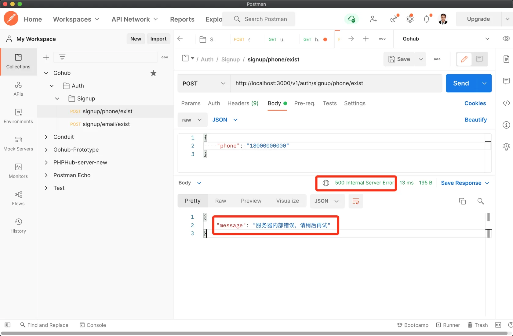

# 5.5. Panic Recovery

原文链接：https://learnku.com/courses/go-api/1.19/panic-recovery/13500

## 说明

`panic` 这个词，在英语中具有`恐慌、恐慌的`等意思。从字面意思理解的话，在 Go 语言中，代表极其严重的问题，程序员最害怕出现的问题。一旦出现，就意味着程序的结束并退出。Go 语言中 `panic` 关键字主要用于主动抛出异常。

`recover` 这个词，在英语中具有`恢复、复原`等意思。从字面意思理解的话，在 Go 语言中，代表将程序状态从严重的错误中恢复到正常状态。Go 语言中 `recover` 关键字主要用于捕获异常，让程序回到正常状态。

我们的程序是一个 web 服务器，当程序发生 panic 时，我们不希望 web 服务器中断运行，而是使用 recover 记录 error 级别的日志，并重新运行程序。

Gin 内置了一个中间件 `gin.Recovery()` ：

```
func registerGlobalMiddleWare(router *gin.Engine) {
router.Use(
middlewares.Logger(),
gin.Recovery(),
)
}
```

我们希望当 recovery 时，使用 zap 来记录日志，所以需要创建自定的中间件。

## 1. 创建 recovery 中间件

app/http/middlewares/recovery.go

```
package middlewares

import (
"gohub/pkg/logger"
"net"
"net/http"
"net/http/httputil"
"os"
"strings"
"time"

"github.com/gin-gonic/gin"
"go.uber.org/zap"
)

// Recovery 使用 zap.Error() 来记录 Panic 和 call stack
func Recovery() gin.HandlerFunc {

return func(c *gin.Context) {
defer func() {
if err := recover(); err != nil {

// 获取用户的请求信息
httpRequest, _ := httputil.DumpRequest(c.Request, true)

// 链接中断，客户端中断连接为正常行为，不需要记录堆栈信息
var brokenPipe bool
if ne, ok := err.(*net.OpError); ok {
if se, ok := ne.Err.(*os.SyscallError); ok {
errStr := strings.ToLower(se.Error())
if strings.Contains(errStr, "broken pipe") || strings.Contains(errStr, "connection reset by peer") {
brokenPipe = true
}
}
}
// 链接中断的情况
if brokenPipe {
logger.Error(c.Request.URL.Path,
zap.Time("time", time.Now()),
zap.Any("error", err),
zap.String("request", string(httpRequest)),
)
c.Error(err.(error))
c.Abort()
// 链接已断开，无法写状态码
return
}

// 如果不是链接中断，就开始记录堆栈信息
logger.Error("recovery from panic",
zap.Time("time", time.Now()),               // 记录时间
zap.Any("error", err),                      // 记录错误信息
zap.String("request", string(httpRequest)), // 请求信息
zap.Stack("stacktrace"),                    // 调用堆栈信息
)

// 返回 500 状态码
c.AbortWithStatusJSON(http.StatusInternalServerError, gin.H{
"message": "服务器内部错误，请稍后再试",
})
}
}()
c.Next()
}
}
```

## 2. 注册全局中间件

bootstrap/route.go

```
.
.
.
func registerGlobalMiddleWare(router *gin.Engine) {
router.Use(
middlewares.Logger(),
middlewares.Recovery(),
)
}
.
.
.
```

## 3. 测试一下

在检测手机是否注册过的控制器方法中，我们试着 panic 一下：

app/http/controllers/api/v1/auth/signup_controller.go

```
.
.
.
// IsPhoneExist 检测手机号是否被注册
func (sc *SignupController) IsPhoneExist(c *gin.Context) {
panic("这是 panic 测试")
.
.
.
```

Postman 里，发送 `signup/phone/exist`请求；



air 会有类似的输出：

```
2022-01-02 21:46:38     ERROR   middlewares/recovery.go:50      recovery from panic {"time": "2022-01-02 21:46:38", "error": "这是 panic 测试", "request": "POST /v1/auth/signup/phone/exist HTTP/1.1\r\nHost: localhost:3000\r\nAccept: */*\r\nAccept-Encoding: gzip, deflate, br\r\nCache-Control: no-cache\r\nConnection: keep-alive\r\nContent-Length: 30\r\nContent-Type: application/json\r\nPostman-Token: 42bd3ced-28e7-455c-b858-40f8350afa2c\r\nUser-Agent: PostmanRuntime/7.28.4\r\n\r\n", "stacktrace": "gohub/app/http/middlewares.Recovery.func1.1\n\t/Users/summer/Code/go/src/github.com/summerblue/gohub/app/http/middlewares/recovery.go:54\nruntime.gopanic\n\t/usr/local/Cellar/go/1.17.5/libexec/src/runtime/panic.go:1038\ngohub/app/http/controllers/api/v1/auth.(*SignupController).IsPhoneExist\n\t/Users/summer/Code/go/src/github.com/summerblue/gohub/app/http/controllers/api/v1/auth/signup_controller.go:26\ngithub.com/gin-gonic/gin.(*Context).Next\n\t/Users/summer/Code/go/pkg/mod/github.com/gin-gonic/gin@v1.7.7/context.go:168\ngohub/app/http/middlewares.Recovery.func1\n\t/Users/summer/Code/go/src/github.com/summerblue/gohub/app/http/middlewares/recovery.go:63\ngithub.com/gin-gonic/gin.(*Context).Next\n\t/Users/summer/Code/go/pkg/mod/github.com/gin-gonic/gin@v1.7.7/context.go:168\ngohub/app/http/middlewares.Logger.func1\n\t/Users/summer/Code/go/src/github.com/summerblue/gohub/app/http/middlewares/logger.go:34\ngithub.com/gin-gonic/gin.(*Context).Next\n\t/Users/summer/Code/go/pkg/mod/github.com/gin-gonic/gin@v1.7.7/context.go:168\ngithub.com/gin-gonic/gin.(*Engine).handleHTTPRequest\n\t/Users/summer/Code/go/pkg/mod/github.com/gin-gonic/gin@v1.7.7/gin.go:555\ngithub.com/gin-gonic/gin.(*Engine).ServeHTTP\n\t/Users/summer/Code/go/pkg/mod/github.com/gin-gonic/gin@v1.7.7/gin.go:511\nnet/http.serverHandler.ServeHTTP\n\t/usr/local/Cellar/go/1.17.5/libexec/src/net/http/server.go:2879\nnet/http.(*conn).serve\n\t/usr/local/Cellar/go/1.17.5/libexec/src/net/http/server.go:1930"}
gohub/app/http/middlewares.Recovery.func1.1
/Users/summer/Code/go/src/github.com/summerblue/gohub/app/http/middlewares/recovery.go:50
runtime.gopanic
/usr/local/Cellar/go/1.17.5/libexec/src/runtime/panic.go:1038
gohub/app/http/controllers/api/v1/auth.(*SignupController).IsPhoneExist
/Users/summer/Code/go/src/github.com/summerblue/gohub/app/http/controllers/api/v1/auth/signup_controller.go:26
github.com/gin-gonic/gin.(*Context).Next
/Users/summer/Code/go/pkg/mod/github.com/gin-gonic/gin@v1.7.7/context.go:168
gohub/app/http/middlewares.Recovery.func1
/Users/summer/Code/go/src/github.com/summerblue/gohub/app/http/middlewares/recovery.go:63
github.com/gin-gonic/gin.(*Context).Next
/Users/summer/Code/go/pkg/mod/github.com/gin-gonic/gin@v1.7.7/context.go:168
gohub/app/http/middlewares.Logger.func1
/Users/summer/Code/go/src/github.com/summerblue/gohub/app/http/middlewares/logger.go:34
github.com/gin-gonic/gin.(*Context).Next
/Users/summer/Code/go/pkg/mod/github.com/gin-gonic/gin@v1.7.7/context.go:168
github.com/gin-gonic/gin.(*Engine).handleHTTPRequest
/Users/summer/Code/go/pkg/mod/github.com/gin-gonic/gin@v1.7.7/gin.go:555
github.com/gin-gonic/gin.(*Engine).ServeHTTP
/Users/summer/Code/go/pkg/mod/github.com/gin-gonic/gin@v1.7.7/gin.go:511
net/http.serverHandler.ServeHTTP
/usr/local/Cellar/go/1.17.5/libexec/src/net/http/server.go:2879
net/http.(*conn).serve
/usr/local/Cellar/go/1.17.5/libexec/src/net/http/server.go:1930
```

符合预期。

## 4. 删除测试代码

```
panic("这是 panic 测试")
```

## 代码版本

本节功能开发完毕。开始下一节之前，先来为代码做下版本标记：

```
$ git add .
$ git commit -m "Panic Recovery"
```
