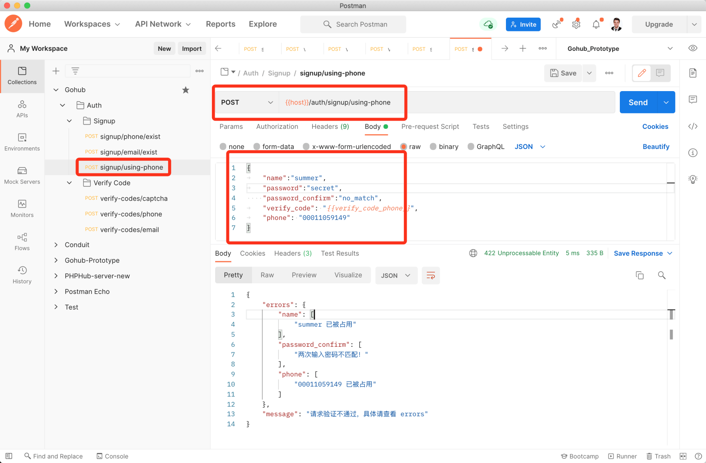

# 8.1. 手机号+短信验证码注册

原文链接：https://learnku.com/courses/go-api/1.19/mobile-sms-verification-code-registration/13518

## 说明

开始之前，请重温下 [注册用户的流程](https://learnku.com/courses/go-api/1.17/authentication-interface-design#a2a74f) 。

注册用户会调用四个 API ：

1. 调用 `signup/phone/exist` 检查手机号是否已被注册;

2. 调用 `verify-codes/captcha` 获取图片验证码，验证后才有发『数字验证码』权限；

3. 调用 `verify-codes/phone` 发送短信验证码;

4. 调用 `signup/using-phone` 注册用户。

前三个 API 我们已经开发完成，这节课我们来开发 `signup/using-phone`。

## 1. 验证请求

`signup/using-phone` 需要以下参数：

```
{
"name":"summer",
"password":"secret",
"password_confirm":"secret",
"verify_code": "{{verify_code_phone}}",
"phone": "00000000000"
}
```

verify_code 是短信验证码，以验证手机号是否得到机主的授权。

### 1). 创建验证器：

app/requests/signup_request.go

```
.
.
.

// SignupUsingPhoneRequest 通过手机注册的请求信息
type SignupUsingPhoneRequest struct {
Phone           string `json:"phone,omitempty" valid:"phone"`
VerifyCode      string `json:"verify_code,omitempty" valid:"verify_code"`
Name            string `valid:"name" json:"name"`
Password        string `valid:"password" json:"password,omitempty"`
PasswordConfirm string `valid:"password_confirm" json:"password_confirm,omitempty"`
}

func SignupUsingPhone(data interface{}, c *gin.Context) map[string][]string {

rules := govalidator.MapData{
"phone":            []string{"required", "digits:11", "not_exists:users,phone"},
"name":             []string{"required", "alpha_num", "between:3,20", "not_exists:users,name"},
"password":         []string{"required", "min:6"},
"password_confirm": []string{"required"},
"verify_code":      []string{"required", "digits:6"},
}

messages := govalidator.MapData{
"phone": []string{
"required:手机号为必填项，参数名称 phone",
"digits:手机号长度必须为 11 位的数字",
},
"name": []string{
"required:用户名为必填项",
"alpha_num:用户名格式错误，只允许数字和英文",
"between:用户名长度需在 3~20 之间",
},
"password": []string{
"required:密码为必填项",
"min:密码长度需大于 6",
},
"password_confirm": []string{
"required:确认密码框为必填项",
},
"verify_code": []string{
"required:验证码答案必填",
"digits:验证码长度必须为 6 位的数字",
},
}

errs := validate(data, rules, messages)

_data := data.(*SignupUsingPhoneRequest)
errs = validators.ValidatePasswordConfirm(_data.Password, _data.PasswordConfirm, errs)
errs = validators.ValidateVerifyCode(_data.Phone, _data.VerifyCode, errs)

return errs
}
```

### 2). 自定义 not_exists 规则

注册用户时，用户名和手机号我们需要保证其唯一性，这里使用 `not_exists` 自定义的规则。下面创建此规则：

app/requests/validators/custom_rules.go

```
// Package validators 存放自定义规则和验证器
package validators

import (
"errors"
"fmt"
"gohub/pkg/database"
"strings"

"github.com/thedevsaddam/govalidator"
)

// 此方法会在初始化时执行，注册自定义表单验证规则
func init() {

// 自定义规则 not_exists，验证请求数据必须不存在于数据库中。
// 常用于保证数据库某个字段的值唯一，如用户名、邮箱、手机号、或者分类的名称。
// not_exists 参数可以有两种，一种是 2 个参数，一种是 3 个参数：
// not_exists:users,email 检查数据库表里是否存在同一条信息
// not_exists:users,email,32 排除用户掉 id 为 32 的用户
govalidator.AddCustomRule("not_exists", func(field string, rule string, message string, value interface{}) error {
rng := strings.Split(strings.TrimPrefix(rule, "not_exists:"), ",")

// 第一个参数，表名称，如 users
tableName := rng[0]
// 第二个参数，字段名称，如 email 或者 phone
dbFiled := rng[1]

// 第三个参数，排除 ID
var exceptID string
if len(rng) > 2 {
exceptID = rng[2]
}

// 用户请求过来的数据
requestValue := value.(string)

// 拼接 SQL
query := database.DB.Table(tableName).Where(dbFiled+" = ?", requestValue)

// 如果传参第三个参数，加上 SQL Where 过滤
if len(exceptID) > 0 {
query.Where("id != ?", exceptID)
}

// 查询数据库
var count int64
query.Count(&count)

// 验证不通过，数据库能找到对应的数据
if count != 0 {
// 如果有自定义错误消息的话
if message != "" {
return errors.New(message)
}
// 默认的错误消息
return fmt.Errorf("%v 已被占用", requestValue)
}
// 验证通过
return nil
})
}
```

### 3). 自定义验证器

验证『确认密码』和『数字验证码』的逻辑，后续使用 Email 接口也会用到，我们封装到 `ValidatePasswordConfirm` 和 `ValidateVerifyCode` 方法中。接下来创建这两个方法：

app/requests/validators/custom_validators.go

```
.
.
.
// ValidatePasswordConfirm 自定义规则，检查两次密码是否正确
func ValidatePasswordConfirm(password, passwordConfirm string, errs map[string][]string) map[string][]string {
if password != passwordConfirm {
errs["password_confirm"] = append(errs["password_confirm"], "两次输入密码不匹配！")
}
return errs
}

// ValidateVerifyCode 自定义规则，验证『手机/邮箱验证码』
func ValidateVerifyCode(key, answer string, errs map[string][]string) map[string][]string {
if ok := verifycode.NewVerifyCode().CheckAnswer(key, answer); !ok {
errs["verify_code"] = append(errs["verify_code"], "验证码错误")
}
return errs
}
```

## 2. 控制器

app/http/controllers/api/v1/auth/signup_controller.go

```
.
.
.
// SignupUsingPhone 使用手机和验证码进行注册
func (sc *SignupController) SignupUsingPhone(c *gin.Context) {

// 1. 验证表单
request := requests.SignupUsingPhoneRequest{}
if ok := requests.Validate(c, &request, requests.SignupUsingPhone); !ok {
return
}

// 2. 验证成功，创建数据
_user := user.User{
Name:     request.Name,
Phone:    request.Phone,
Password: request.Password,
}
_user.Create()

if _user.ID > 0 {
response.CreatedJSON(c, gin.H{
"data": _user,
})
} else {
response.Abort500(c, "创建用户失败，请稍后尝试~")
}
}
```

## 3. 模型新增 Create 方法

app/models/user/user_model.go

```
.
.
.
// Create 创建用户，通过 User.ID 来判断是否创建成功
func (userModel *User) Create() {
database.DB.Create(&userModel)
}
```

这里需要注意的是，我们已经 [自定义了 Gorm Logger](https://learnku.com/courses/go-api/1.17/database-request-log)，Gorm Logger 里已经做好了错误处理， 所以模型里 不需要处理 SQL 错误。

后续项目里的 SQL 请求，只要使用 GORM ，都适用此规则。

## 4. 注册路由

routes/api.go

```
authGroup.POST("/signup/email/exist", suc.IsEmailExist)
authGroup.POST("/signup/using-phone", suc.SignupUsingPhone)

// 发送验证码
```

## 5. 测试

Postman 里创建 `signup/using-phone` 请求，请求数据如下：

```
{
"name":"summer",
"password":"secret",
"password_confirm":"no_match",
"verify_code": "{{verify_code_phone}}",
"phone": "00011059149"
}
```

注意我们这里的 phone 字段使用了 `000` 开头，在我们的代码里有约定，会跳过验证码的检查，请见 config/verifycode.go 。

篇幅考虑，这里只测试 `signup/using-phone` ，请自行做整个流程的真实测试，phone 使用你的在阿里云后台测试接口那里绑定的手机号即可。



测试：

- 提交可以成功的请求；

- 提交用户名太少或者太多的情况；

- 提交密码不一致的情况；

- 提交手机号不一致的情况。

## 代码版本

本节功能开发完毕。开始下一节之前，先来为代码做下版本标记：

```
$ git add .
$ git commit -m "手机号+短信验证码注册"
```
