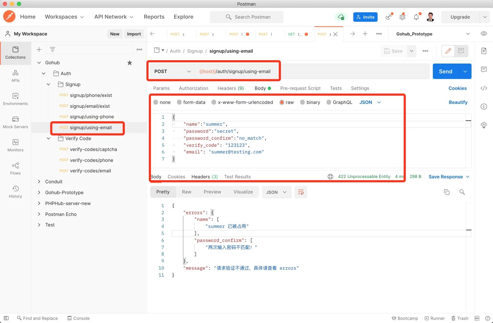

# 8.2. Email + 邮件验证码注册

原文链接：https://learnku.com/courses/go-api/1.19/email-email-verification-code-registration/13519

## 说明

开始之前，请重温下 [注册用户的流程](https://learnku.com/courses/go-api/1.17/authentication-interface-design#a2a74f) ，使用邮箱加验证码注册那块。

注册用户会调用四个 API ：

1. 调用 `signup/email/exist` 检查邮箱是否已注册;

2. 调用 `verify-codes/captcha` 获取图片验证码，验证后才有发『数字验证码』的权限；

3. 调用 `verify-codes/email` 发送邮箱验证码;

4. 调用 `signup/using-email` 注册用户。

前三个 API 我们已经开发完成，这节课我们来开发 `signup/using-email`。

## 1. 验证请求

app/requests/signup_request.go

```go
.
.
.
// SignupUsingEmailRequest 通过邮箱注册的请求信息
type SignupUsingEmailRequest struct {
	Email           string `json:"email,omitempty" valid:"email"`
	VerifyCode      string `json:"verify_code,omitempty" valid:"verify_code"`
	Name            string `valid:"name" json:"name"`
	Password        string `valid:"password" json:"password,omitempty"`
	PasswordConfirm string `valid:"password_confirm" json:"password_confirm,omitempty"`
}

func SignupUsingEmail(data interface{}, c *gin.Context) map[string][]string {

	rules := govalidator.MapData{
		"email":            []string{"required", "min:4", "max:30", "email", "not_exists:users,email"},
		"name":             []string{"required", "alpha_num", "between:3,20", "not_exists:users,name"},
		"password":         []string{"required", "min:6"},
		"password_confirm": []string{"required"},
		"verify_code":      []string{"required", "digits:6"},
	}

	messages := govalidator.MapData{
		"email": []string{
			"required:Email 为必填项",
			"min:Email 长度需大于 4",
			"max:Email 长度需小于 30",
			"email:Email 格式不正确，请提供有效的邮箱地址",
			"not_exists:Email 已被占用",
		},
		"name": []string{
			"required:用户名为必填项",
			"alpha_num:用户名格式错误，只允许数字和英文",
			"between:用户名长度需在 3~20 之间",
		},
		"password": []string{
			"required:密码为必填项",
			"min:密码长度需大于 6",
		},
		"password_confirm": []string{
			"required:确认密码框为必填项",
		},
		"verify_code": []string{
			"required:验证码答案必填",
			"digits:验证码长度必须为 6 位的数字",
		},
	}

	errs := validate(data, rules, messages)

	_data := data.(*SignupUsingEmailRequest)
	errs = validators.ValidatePasswordConfirm(_data.Password, _data.PasswordConfirm, errs)
	errs = validators.ValidateVerifyCode(_data.Email, _data.VerifyCode, errs)

	return errs
}
```

## 2. 控制器

app/http/controllers/api/v1/auth/signup_controller.go

```go
.
.
,
// SignupUsingEmail 使用 Email + 验证码进行注册
func (sc *SignupController) SignupUsingEmail(c *gin.Context) {

    // 1. 验证表单
    request := requests.SignupUsingEmailRequest{}
    if ok := requests.Validate(c, &request, requests.SignupUsingEmail); !ok {
        return
    }

    // 2. 验证成功，创建数据
    userModel := user.User{
        Name:     request.Name,
        Email:    request.Email,
        Password: request.Password,
    }
    userModel.Create()

    if userModel.ID > 0 {
        response.CreatedJSON(c, gin.H{
            "data": userModel,
        })
    } else {
        response.Abort500(c, "创建用户失败，请稍后尝试~")
    }
}
```

## 3. 注册路由

routes/api.go

```go
.
.
.
authGroup.POST("/signup/using-phone", suc.SignupUsingPhone)
authGroup.POST("/signup/using-email", suc.SignupUsingEmail)

// 发送验证码
.
.
.
```

## 4. 测试一下

Postman 里新建 `signup/using-email` 请求。

请求数据如下：

```json
{
    "name": "summer",
    "password": "secret",
    "password_confirm": "no_match",
    "verify_code": "123123",
    "email": "summer@testing.com"
}
```

注意我们这里的 email 字段使用了 `@testing.com` 结尾，在我们的代码里有约定，会跳过验证码的检查，请见 config/verifycode.go 。

篇幅考虑，这里只测试 `signup/using-email` ，请自行做整个流程的真实测试。

发送请求：



测试：

- 提交可以成功的请求；

- 提交用户名太少或者太多的情况；

- 提交密码不一致的情况；

- 提交邮箱重复的情况。

## 代码版本

本节功能开发完毕。开始下一节之前，先来为代码做下版本标记：

```bash
$ git add .
$ git commit -m "Email + 邮件验证码注册"
```
