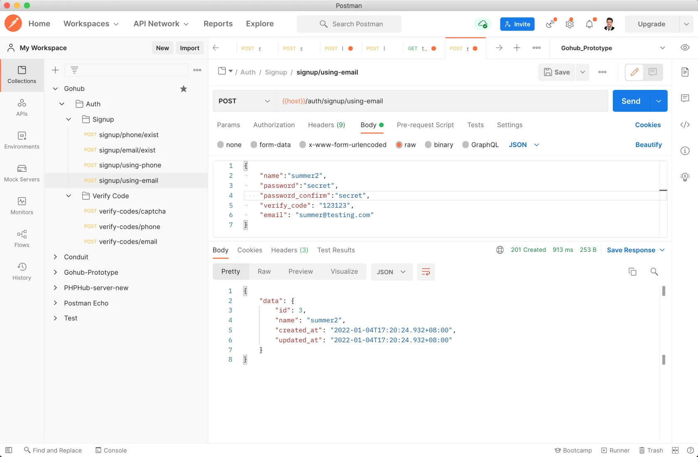
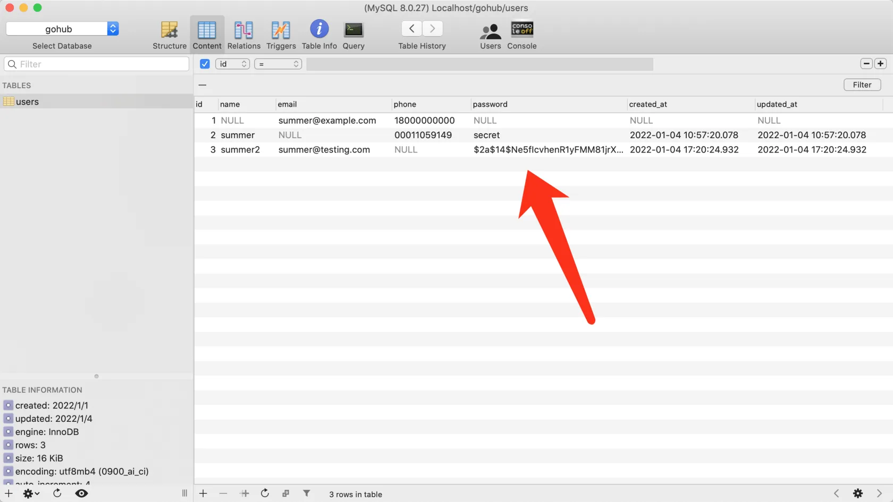

# 8.3. 密码加密存储

原文链接：https://learnku.com/courses/go-api/1.19/password-encrypted-storage/13520

## 说明

目前用户密码是明文存储在数据库中的，我们需要对其进行哈希后再存入，以保证用户密码的安全。

>

推荐阅读：[大家对于 CSDN 等网站的用户密码泄漏事件怎么看？](https://www.zhihu.com/question/19983099)

## 1. 创建哈希包

首先加载 golang.org/x/crypto 包：

```
$ go get golang.org/x/crypto
```

创建密码加密的 hash 包：

pkg/hash/hash.go

```
// Package hash 哈希操作类
package hash

import (
"gohub/pkg/logger"

"golang.org/x/crypto/bcrypt"
)

// BcryptHash 使用 bcrypt 对密码进行加密
func BcryptHash(password string) string {
// GenerateFromPassword 的第二个参数是 cost 值。建议大于 12，数值越大耗费时间越长
bytes, err := bcrypt.GenerateFromPassword([]byte(password), 14)
logger.LogIf(err)

return string(bytes)
}

// BcryptCheck 对比明文密码和数据库的哈希值
func BcryptCheck(password, hash string) bool {
err := bcrypt.CompareHashAndPassword([]byte(hash), []byte(password))
return err == nil
}

// BcryptIsHashed 判断字符串是否是哈希过的数据
func BcryptIsHashed(str string) bool {
// bcrypt 加密后的长度等于 60
return len(str) == 60
}
```

## 2. Gorm BeforeSave 钩子

Gorm 提供了 BeforeSave 的模型钩子，会在模型创建和更新前被调用，我们利用此机制在入库前对密码做加密：

app/models/user/user_hooks.go

```
package user

import (
"gohub/pkg/hash"

"gorm.io/gorm"
)

// BeforeSave GORM 的模型钩子，在创建和更新模型前调用
func (userModel *User) BeforeSave(tx *gorm.DB) (err error) {

if !hash.BcryptIsHashed(userModel.Password) {
userModel.Password = hash.BcryptHash(userModel.Password)
}
return
}
```

## 3. 匹对密码

app/models/user/user_model.go

```
.
.
.
// ComparePassword 密码是否正确
func (userModel *User) ComparePassword(_password string) bool {
return hash.BcryptCheck(_password, userModel.Password)
}
```

## 4. 测试一下

打开 Postman ，注册一个新用户：



注册成功后查看数据库，可以看到密码已被加密：



>

提示：因为我们使用的是模型钩子，所以原有的注册逻辑不需要修改。

## go mod tidy

上面加载了 golang.org/x/crypto 库，现在使用 mod tidy 命令来整理一下 go.mod 文件：

```
$ go mod tidy
```

## 代码版本

本节功能开发完毕。开始下一节之前，先来为代码做下版本标记：

```
$ git add .
$ git commit -m "密码加密存储"
```
