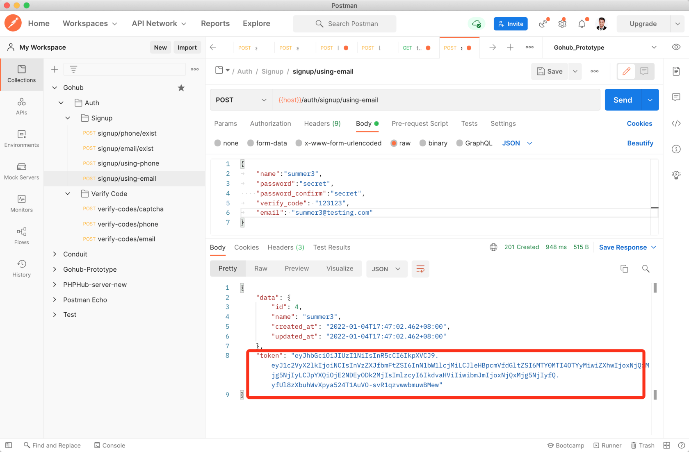

# 8.4. JWT 授权

原文链接：https://learnku.com/courses/go-api/1.19/jwt-authorization/13521

## 说明

目前注册成功后，返回的是当前的用户信息。

主流的逻辑中，注册后应该顺带登录用户。也就是返回用户的 access token。

## 1. 什么是 JWT

JWT 就是一种基于 Token 的轻量级认证模式，服务端认证通过后，会生成一个 JSON 对象，经过签名后得到一个Token（令牌）再发回给用户。用户后续请求只需要带上这个 Token，服务端解密之后就能获取该用户的相关信息了。

对 JWT 不熟悉的同学，阮一峰有一篇简单讲解 JWT 原理的文章 ——  [JSON Web Token 入门教程](https://www.ruanyifeng.com/blog/2018/07/json_web_token-tutorial.html) ，可以参考下。

理解不了也没关系，我们直接上代码。代码里有详尽的注释，逻辑都在里面，把代码摸熟再去看讲原理的教程会容易得多。

## 2. 创建 jwt 包

我们先来安装一个底层包，这个包负责加密解密：

```
$ go get github.com/golang-jwt/jwt
```

下面创建 jwt 包：

pkg/jwt/jwt.go

```
// Package jwt 处理 JWT 认证
package jwt

import (
"errors"
"gohub/pkg/app"
"gohub/pkg/config"
"gohub/pkg/logger"
"strings"
"time"

"github.com/gin-gonic/gin"
jwtpkg "github.com/golang-jwt/jwt"
)

var (
ErrTokenExpired           error = errors.New("令牌已过期")
ErrTokenExpiredMaxRefresh error = errors.New("令牌已过最大刷新时间")
ErrTokenMalformed         error = errors.New("请求令牌格式有误")
ErrTokenInvalid           error = errors.New("请求令牌无效")
ErrHeaderEmpty            error = errors.New("需要认证才能访问！")
ErrHeaderMalformed        error = errors.New("请求头中 Authorization 格式有误")
)

// JWT 定义一个jwt对象
type JWT struct {

// 秘钥，用以加密 JWT，读取配置信息 app.key
SignKey []byte

// 刷新 Token 的最大过期时间
MaxRefresh time.Duration
}

// JWTCustomClaims 自定义载荷
type JWTCustomClaims struct {
UserID       string `json:"user_id"`
UserName     string `json:"user_name"`
ExpireAtTime int64  `json:"expire_time"`

// StandardClaims 结构体实现了 Claims 接口继承了  Valid() 方法
// JWT 规定了7个官方字段，提供使用:
// - iss (issuer)：发布者
// - sub (subject)：主题
// - iat (Issued At)：生成签名的时间
// - exp (expiration time)：签名过期时间
// - aud (audience)：观众，相当于接受者
// - nbf (Not Before)：生效时间
// - jti (JWT ID)：编号
jwtpkg.StandardClaims
}

func NewJWT() *JWT {
return &JWT{
SignKey:    []byte(config.GetString("app.key")),
MaxRefresh: time.Duration(config.GetInt64("jwt.max_refresh_time")) * time.Minute,
}
}

// ParserToken 解析 Token，中间件中调用
func (jwt *JWT) ParserToken(c *gin.Context) (*JWTCustomClaims, error) {

tokenString, parseErr := jwt.getTokenFromHeader(c)
if parseErr != nil {
return nil, parseErr
}

// 1. 调用 jwt 库解析用户传参的 Token
token, err := jwt.parseTokenString(tokenString)

// 2. 解析出错
if err != nil {
validationErr, ok := err.(*jwtpkg.ValidationError)
if ok {
if validationErr.Errors == jwtpkg.ValidationErrorMalformed {
return nil, ErrTokenMalformed
} else if validationErr.Errors == jwtpkg.ValidationErrorExpired {
return nil, ErrTokenExpired
}
}
return nil, ErrTokenInvalid
}

// 3. 将 token 中的 claims 信息解析出来和 JWTCustomClaims 数据结构进行校验
if claims, ok := token.Claims.(*JWTCustomClaims); ok && token.Valid {
return claims, nil
}

return nil, ErrTokenInvalid
}

// RefreshToken 更新 Token，用以提供 refresh token 接口
func (jwt *JWT) RefreshToken(c *gin.Context) (string, error) {

// 1. 从 Header 里获取 token
tokenString, parseErr := jwt.getTokenFromHeader(c)
if parseErr != nil {
return "", parseErr
}

// 2. 调用 jwt 库解析用户传参的 Token
token, err := jwt.parseTokenString(tokenString)

// 3. 解析出错，未报错证明是合法的 Token（甚至未到过期时间）
if err != nil {
validationErr, ok := err.(*jwtpkg.ValidationError)
// 满足 refresh 的条件：只是单一的报错 ValidationErrorExpired
if !ok || validationErr.Errors != jwtpkg.ValidationErrorExpired {
return "", err
}
}

// 4. 解析 JWTCustomClaims 的数据
claims := token.Claims.(*JWTCustomClaims)

// 5. 检查是否过了『最大允许刷新的时间』
x := app.TimenowInTimezone().Add(-jwt.MaxRefresh).Unix()
if claims.IssuedAt > x {
// 修改过期时间
claims.StandardClaims.ExpiresAt = jwt.expireAtTime()
return jwt.createToken(*claims)
}

return "", ErrTokenExpiredMaxRefresh
}

// IssueToken 生成  Token，在登录成功时调用
func (jwt *JWT) IssueToken(userID string, userName string) string {

// 1. 构造用户 claims 信息(负荷)
expireAtTime := jwt.expireAtTime()
claims := JWTCustomClaims{
userID,
userName,
expireAtTime,
jwtpkg.StandardClaims{
NotBefore: app.TimenowInTimezone().Unix(), // 签名生效时间
IssuedAt:  app.TimenowInTimezone().Unix(), // 首次签名时间（后续刷新 Token 不会更新）
ExpiresAt: expireAtTime,                   // 签名过期时间
Issuer:    config.GetString("app.name"),   // 签名颁发者
},
}

// 2. 根据 claims 生成token对象
token, err := jwt.createToken(claims)
if err != nil {
logger.LogIf(err)
return ""
}

return token
}

// createToken 创建 Token，内部使用，外部请调用 IssueToken
func (jwt *JWT) createToken(claims JWTCustomClaims) (string, error) {
// 使用HS256算法进行token生成
token := jwtpkg.NewWithClaims(jwtpkg.SigningMethodHS256, claims)
return token.SignedString(jwt.SignKey)
}

// expireAtTime 过期时间
func (jwt *JWT) expireAtTime() int64 {
timenow := app.TimenowInTimezone()

var expireTime int64
if config.GetBool("app.debug") {
expireTime = config.GetInt64("jwt.debug_expire_time")
} else {
expireTime = config.GetInt64("jwt.expire_time")
}

expire := time.Duration(expireTime) * time.Minute
return timenow.Add(expire).Unix()
}

// parseTokenString 使用 jwtpkg.ParseWithClaims 解析 Token
func (jwt *JWT) parseTokenString(tokenString string) (*jwtpkg.Token, error) {
return jwtpkg.ParseWithClaims(tokenString, &JWTCustomClaims{}, func(token *jwtpkg.Token) (interface{}, error) {
return jwt.SignKey, nil
})
}

// getTokenFromHeader 使用 jwtpkg.ParseWithClaims 解析 Token
// Authorization:Bearer xxxxx
func (jwt *JWT) getTokenFromHeader(c *gin.Context) (string, error) {
authHeader := c.Request.Header.Get("Authorization")
if authHeader == "" {
return "", ErrHeaderEmpty
}
// 按空格分割
parts := strings.SplitN(authHeader, " ", 2)
if !(len(parts) == 2 && parts[0] == "Bearer") {
return "", ErrHeaderMalformed
}
return parts[1], nil
}
```

## 3. 时区

`app.TimenowInTimezone()` 方法是统一时区，config/app.go 里面我已经设置了时区为 `Asia/Shanghai` ，接下来在 app 包里创建此方法进行读取：

pkg/app/app.go

```
.
.
.
// TimenowInTimezone 获取当前时间，支持时区
func TimenowInTimezone() time.Time {
chinaTimezone, _ := time.LoadLocation(config.GetString("app.timezone"))
return time.Now().In(chinaTimezone)
}
```

## 4. 配置信息

config/jwt.go

```
package config

import "gohub/pkg/config"

func init() {
config.Add("jwt", func() map[string]interface{} {
return map[string]interface{}{

// 使用 config.GetString("app.key")
// "signing_key":

// 过期时间，单位是分钟，一般不超过两个小时
"expire_time": config.Env("JWT_EXPIRE_TIME", 120),

// 允许刷新时间，单位分钟，86400 为两个月，从 Token 的签名时间算起
"max_refresh_time": config.Env("JWT_MAX_REFRESH_TIME", 86400),

// debug 模式下的过期时间，方便本地开发调试
"debug_expire_time": 86400,
}
})
}
```

## 5. 控制器里调用

app/http/controllers/api/v1/auth/signup_controller.go

```
.
.
.
// SignupUsingPhone 使用手机和验证码进行注册
func (sc *SignupController) SignupUsingPhone(c *gin.Context) {

// 1. 验证表单
request := requests.SignupUsingPhoneRequest{}
if ok := requests.Validate(c, &request, requests.SignupUsingPhone); !ok {
return
}

// 2. 验证成功，创建数据
userModel := user.User{
Name:     request.Name,
Phone:    request.Phone,
Password: request.Password,
}
userModel.Create()

if userModel.ID > 0 {
token := jwt.NewJWT().IssueToken(userModel.GetStringID(), userModel.Name)
response.CreatedJSON(c, gin.H{
"token": token,
"data":  userModel,
})
} else {
response.Abort500(c, "创建用户失败，请稍后尝试~")
}
}

// SignupUsingEmail 使用 Email + 验证码进行注册
func (sc *SignupController) SignupUsingEmail(c *gin.Context) {

// 1. 验证表单
request := requests.SignupUsingEmailRequest{}
if ok := requests.Validate(c, &request, requests.SignupUsingEmail); !ok {
return
}

// 2. 验证成功，创建数据
userModel := user.User{
Name:     request.Name,
Email:    request.Email,
Password: request.Password,
}
userModel.Create()

if userModel.ID > 0 {
token := jwt.NewJWT().IssueToken(userModel.GetStringID(), userModel.Name)
response.CreatedJSON(c, gin.H{
"token": token,
"data":  userModel,
})
} else {
response.Abort500(c, "创建用户失败，请稍后尝试~")
}
}
```

## 6. userModel.GetStringID()

接下来创建 `GetStringID()` 方法，这个方法不是 User 模型专有，而应该是所有的模型都可使用。所以我们将其放到模型基类里：

app/models/model.go

```
.
.
.
// GetStringID 获取 ID 的字符串格式
func (a BaseModel) GetStringID() string {
return cast.ToString(a.ID)
}
```

因为我们的 User 模型里，继承于 `models.BaseModel`：

```
// User 用户模型
type User struct {
models.BaseModel
...
```

所以可以通过 models.BaseModel 来直接调用 `GetStringID()` 方法。

## 7. 测试一下

测试一下注册接口，看注册成功后是否能返回 token 字段：



符合预期。

## go mod tidy

上面加载了第三方库，现在使用 mod tidy 命令来整理一下 go.mod 文件：

```
$ go mod tidy
```

## 代码版本

本节功能开发完毕。开始下一节之前，先来为代码做下版本标记：

```
$ git add .
$ git commit -m "JWT 授权"
```
