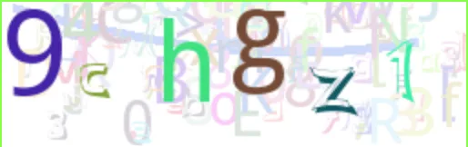
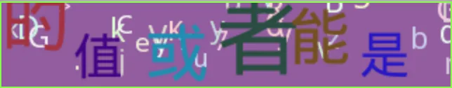
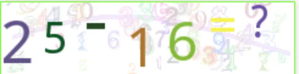

# 6.3. 图片验证码库（captcha）

原文链接：https://learnku.com/courses/go-api/1.19/picture-verification-code/13505

## 说明

目前来讲，图片验证码是防范机器人程序简单、有效的方案。

图片验证码防范机器人的原理是显示一张图片，机器人难以辨别，但是正常的人类可以识别，例如『随机字符串验证』：



如果一个验证码很容易破解，我们还可以增加其难度。

例如『中文验证码』：



例如『数学计算验证码』：



## 1. 验证码流程

验证码流程，拿简单的随机字符串验证码为例（其他类型的图片验证码类似）：

1. 服务端生成随机验证码 random_code；

2. 生成一个 captcha_id ，可以是随机字串，将 random_code 作为 captcha_id 的值存储到 redis 中，并设置过期时间为 15 分钟（过期时间可配置）；

3. 生成一张 random_code 对应的验证码图片 captcha；

4. 将 captcha (base64 编码) 和 captcha_id 返回给客户端；

5. 客户端将 captcha 渲染为图片，展示给用户；

6. 客户端将用户输出的内容 captcha_answer 和 captcha_id 传给服务器；

7. 服务端使用 captcha_id 从 redis 中读取数据，将读取出来的数据和 captcha_answer 进行匹对验证。

## 2. base64Captcha 库

图片验证码是很常见的需求，我们不需要重新发明车轮，Go 社区有一个优秀的开源项目 [github.com/mojocn/base64Captcha](https://github.com/mojocn/base64Captcha) 可供使用。

此项目还提供了一个 Web 视图来演示其生成的验证码，在这个视图界面上，你还可以尝试各种配置，详见 [captcha.mojotv.cn/](https://captcha.mojotv.cn/) 。

加载 base64Captcha 库：

```bash
$ go get github.com/mojocn/base64Captcha
```

## 3. 实现  base64Captcha.Store interface

base64Captcha 内置了一个简单的内存存储。内存存储的好处是免配置，开箱即用，坏处是后续如果我们需要多机部署，将会是一个问题。

这里我们将自定存储驱动，使用 redis 进行作为主要存储器。

base64Captcha 已经为我们考虑好扩展性，只需要实现 base64Captcha.Store interface 即可。

pkg/captcha/store_redis.go

```go
package captcha

import (
	"errors"
	"gohub/pkg/app"
	"gohub/pkg/config"
	"gohub/pkg/redis"
	"time"
)

// RedisStore 实现 base64Captcha.Store interface
type RedisStore struct {
	RedisClient *redis.RedisClient
	KeyPrefix   string
}

// Set 实现 base64Captcha.Store interface 的 Set 方法
func (s *RedisStore) Set(key string, value string) error {

	ExpireTime := time.Minute * time.Duration(config.GetInt64("captcha.expire_time"))
	// 方便本地开发调试
	if app.IsLocal() {
		ExpireTime = time.Minute * time.Duration(config.GetInt64("captcha.debug_expire_time"))
	}

	if ok := s.RedisClient.Set(s.KeyPrefix+key, value, ExpireTime); !ok {
		return errors.New("无法存储图片验证码答案")
	}
	return nil
}

// Get 实现 base64Captcha.Store interface 的 Get 方法
func (s *RedisStore) Get(key string, clear bool) string {
	key = s.KeyPrefix + key
	val := s.RedisClient.Get(key)
	if clear {
		s.RedisClient.Del(key)
	}
	return val
}

// Verify 实现 base64Captcha.Store interface 的 Verify 方法
func (s *RedisStore) Verify(key, answer string, clear bool) bool {
	v := s.Get(key, clear)
	return v == answer
}
```

## 4. captcha 库

接下来我们创建 captcha 库。

pkg/captcha/captcha.go

```go
// Package captcha 处理图片验证码逻辑
package captcha

import (
	"gohub/pkg/app"
	"gohub/pkg/config"
	"gohub/pkg/redis"
	"sync"

	"github.com/mojocn/base64Captcha"
)

type Captcha struct {
	Base64Captcha *base64Captcha.Captcha
}

// once 确保 internalCaptcha 对象只初始化一次
var once sync.Once

// internalCaptcha 内部使用的 Captcha 对象
var internalCaptcha *Captcha

// NewCaptcha 单例模式获取
func NewCaptcha() *Captcha {
	once.Do(func() {
		// 初始化 Captcha 对象
		internalCaptcha = &Captcha{}

		// 使用全局 Redis 对象，并配置存储 Key 的前缀
		store := RedisStore{
			RedisClient: redis.Redis,
			KeyPrefix:   config.GetString("app.name") + ":captcha:",
		}

		// 配置 base64Captcha 驱动信息
		driver := base64Captcha.NewDriverDigit(
			config.GetInt("captcha.height"),      // 宽
			config.GetInt("captcha.width"),       // 高
			config.GetInt("captcha.length"),      // 长度
			config.GetFloat64("captcha.maxskew"), // 数字的最大倾斜角度
			config.GetInt("captcha.dotcount"),    // 图片背景里的混淆点数量
		)

		// 实例化 base64Captcha 并赋值给内部使用的 internalCaptcha 对象
		internalCaptcha.Base64Captcha = base64Captcha.NewCaptcha(driver, &store)
	})

	return internalCaptcha
}

// GenerateCaptcha 生成图片验证码
func (c *Captcha) GenerateCaptcha() (id string, b64s string, err error) {
	return c.Base64Captcha.Generate()
}

// VerifyCaptcha 验证验证码是否正确
func (c *Captcha) VerifyCaptcha(id string, answer string) (match bool) {

	// 方便本地和 API 自动测试
	if !app.IsProduction() && id == config.GetString("captcha.testing_key") {
		return true
	}
	// 第三个参数是验证后是否删除，我们选择 false
	// 这样方便用户多次提交，防止表单提交错误需要多次输入图片验证码
	return c.Base64Captcha.Verify(id, answer, false)
}
```

## 5. captcha 配置信息

config/captcha.go

```go
package config

import "gohub/pkg/config"

func init() {
	config.Add("captcha", func() map[string]interface{} {
		return map[string]interface{}{

			// 验证码图片高度
			"height": 80,

			// 验证码图片宽度
			"width": 240,

			// 验证码的长度
			"length": 6,

			// 数字的最大倾斜角度
			"maxskew": 0.7,

			// 图片背景里的混淆点数量
			"dotcount": 80,

			// 过期时间，单位是分钟
			"expire_time": 15,

			// debug 模式下的过期时间，方便本地开发调试
			"debug_expire_time": 10080,

			// 非 production 环境，使用此 key 可跳过验证，方便测试
			"testing_key": "captcha_skip_test",
		}
	})
}
```

## 6. 测试

我们加入了一些方便测试的逻辑，使用 `if app.IsLocal() { }` 。我们将在完成图片验证码开发后，再一起测试。

## go mod tidy

上面加载了第三方库，现在使用 mod tidy 命令来整理一下 go.mod 文件：

```bash
$ go mod tidy
```

## 代码版本

本节功能开发完毕。开始下一节之前，先来为代码做下版本标记：

```bash
$ git add .
$ git commit -m "图片验证码库（captcha）"
```
