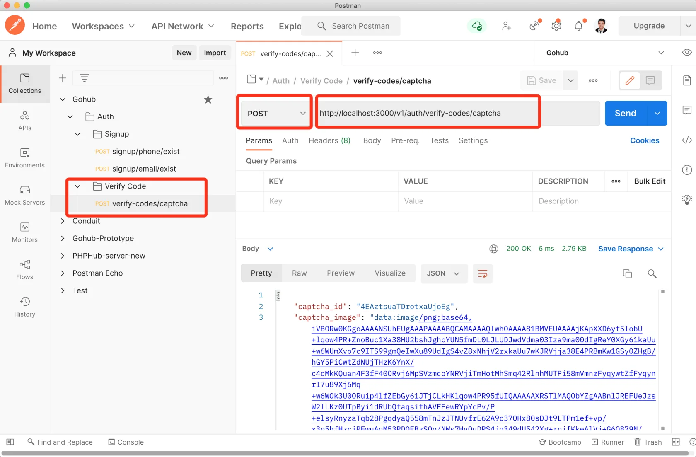
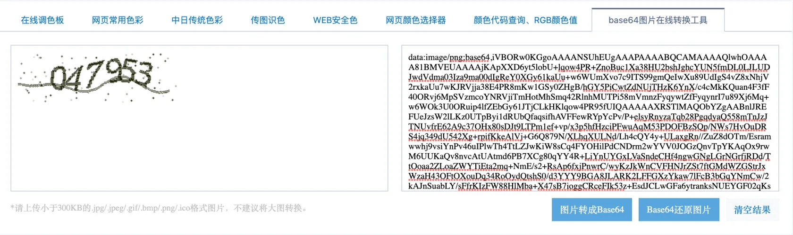
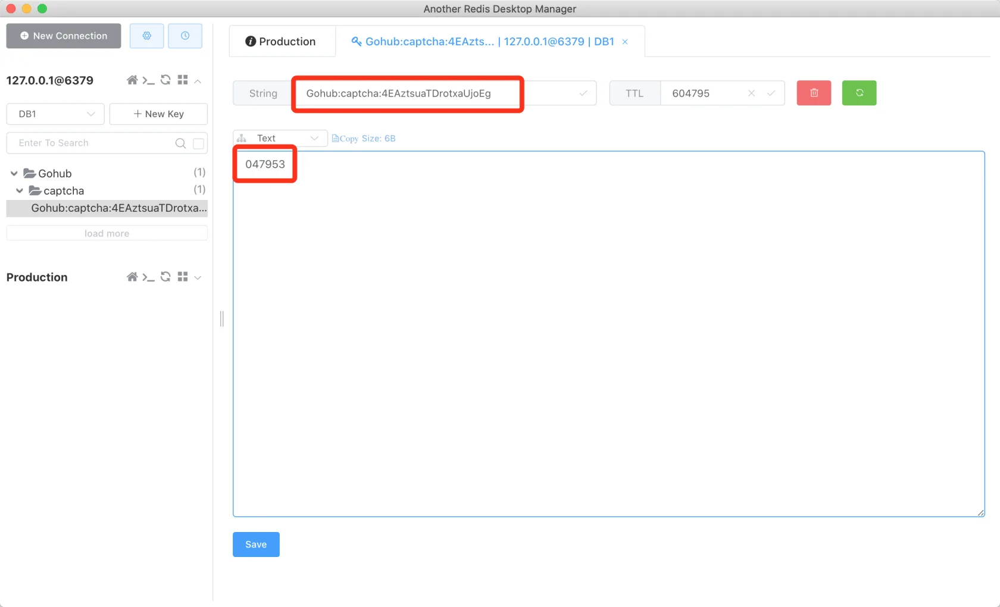
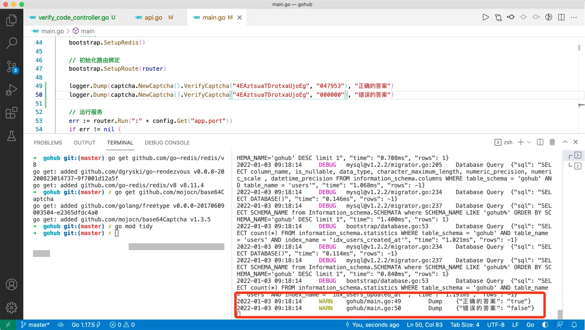

# 6.4. 图片验证码接口

原文链接：https://learnku.com/courses/go-api/1.19/picture-verification-code-interface/13506

## 说明

验证码库已经开发完毕，本节将开发 `/verify-codes/captcha` 接口。

## 1. 控制器

app/http/controllers/api/v1/auth/verify_code_controller.go

```
package auth

import (
v1 "gohub/app/http/controllers/api/v1"
"gohub/pkg/captcha"
"gohub/pkg/logger"
"net/http"

"github.com/gin-gonic/gin"
)

// VerifyCodeController 用户控制器
type VerifyCodeController struct {
v1.BaseAPIController
}

// ShowCaptcha 显示图片验证码
func (vc *VerifyCodeController) ShowCaptcha(c *gin.Context) {
// 生成验证码
id, b64s, err := captcha.NewCaptcha().GenerateCaptcha()
// 记录错误日志，因为验证码是用户的入口，出错时应该记 error 等级的日志
logger.LogIf(err)
// 返回给用户
c.JSON(http.StatusOK, gin.H{
"captcha_id":    id,
"captcha_image": b64s,
})
}
```

## 2. 注册路由

routes/api.go

```
.
.
.
authGroup.POST("/signup/email/exist", suc.IsEmailExist)

// 发送验证码
vcc := new(auth.VerifyCodeController)
// 图片验证码，需要加限流
authGroup.POST("/verify-codes/captcha", vcc.ShowCaptcha)
}
}
}
```

## 3. 测试

### 1). 发送请求

Postman 创建一个新目录 `Verify Code`， 建立新的请求 `verify-codes/captcha` 。

请求链接 [localhost:3000/v1/auth/verify-codes...](http://localhost:3000/v1/auth/verify-codes/captcha) ：



### 2). 解码图片

点击发送以后，返回的 captcha_image 是一个 base64 加密的图片，把他放到 `` 即可显示。

或者找一个在线工具 [tool.chinaz.com/tools/imgtobase](http://tool.chinaz.com/tools/imgtobase) ，黏贴后点击 Base64还原图片 按钮：



可以看到图片验证码。

### 3). 查看 Redis 里的数据

captcha 的答案存放在 Redis 里。

下面来查看 Redis 数据（推荐安装这个软件 [github.com/qishibo/AnotherRedisDes...](https://github.com/qishibo/AnotherRedisDesktopManager) ）：



可以看到 captcha_id  `4EAztsuaTDrotxaUjoEg` 对应六位数数字 047953 。

### 4). 测试下 VerifyCaptcha 方法：

main.go 里调用 `VerifyCaptcha()` 尝试验证答案：

main.go

```
.
.
.
// 初始化路由绑定
bootstrap.SetupRoute(router)

logger.Dump(captcha.NewCaptcha().VerifyCaptcha("4EAztsuaTDrotxaUjoEg", "047953"), "正确的答案")
logger.Dump(captcha.NewCaptcha().VerifyCaptcha("4EAztsuaTDrotxaUjoEg", "000000"), "错误的答案")

// 运行服务
.
.
.
```

保持文件 air 重载我们的程序后，即可看到输出符合预期：



>

注意： 目前终端输出有点过载，这是因为初始化数据库时，我们使用 `database.DB.AutoMigrate(&user.User{})` 这行代码，AutoMigrate 方法会保持数据库表结构对应上我们的 `user.User` struct。这个问题暂且不用管，后面我们将使用自己的数据库迁移方案。

## 4. 删除测试代码

请删除 main.go 里下面这两行测试代码：

```
logger.Dump(captcha.NewCaptcha().VerifyCaptcha("4EAztsuaTDrotxaUjoEg", "047953"), "正确的答案")
logger.Dump(captcha.NewCaptcha().VerifyCaptcha("4EAztsuaTDrotxaUjoEg", "000000"), "错误的答案")
```

## 代码版本

本节功能开发完毕。开始下一节之前，先来为代码做下版本标记：

```
$ git add .
$ git commit -m "图片验证码接口"
```
