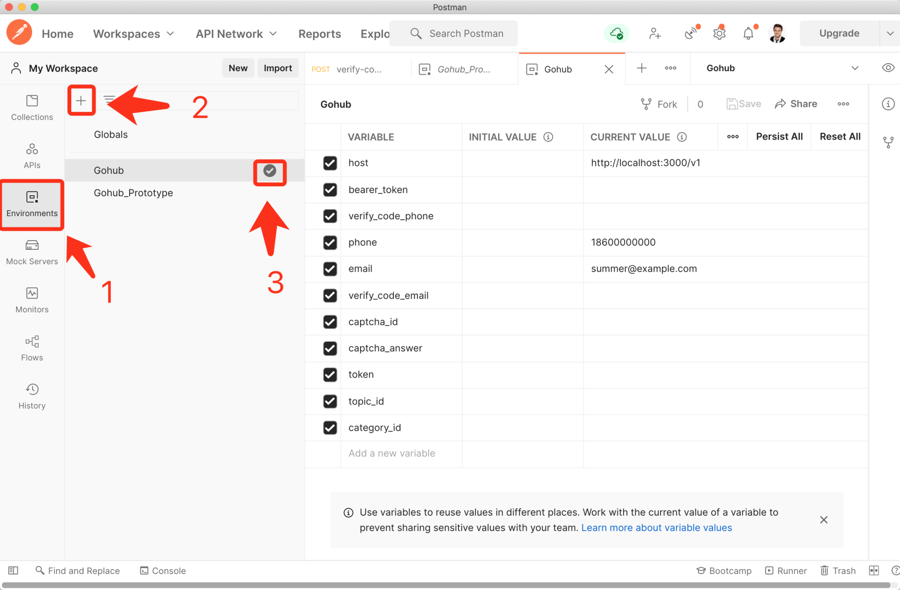
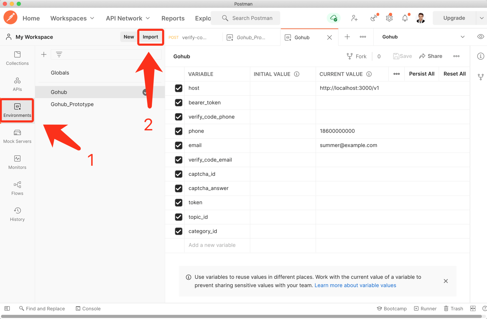
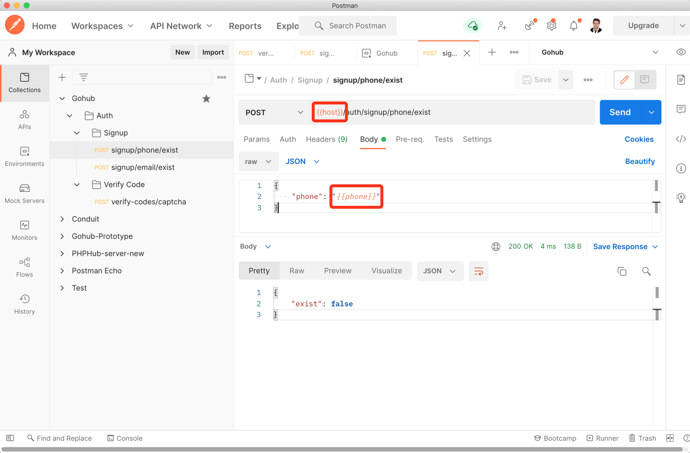

# 6.5. Postman 变量

原文链接：https://learnku.com/courses/go-api/1.19/postman-variable/13507

## 说明

Postman 有一个 环境变量 的功能，这节课我们来查看如何利用此功能优化我们的开发流程。

## 1. 创建

1. 进入环境变量窗口；

2. 创建新的环境变量；

3. 激活环境变量。

上图我们设置一些 Gohub 项目常用的环境变量。

## 2. 导入

Postman 支持环境变量的导入和导出功能。为了方便大家，这里我导出一份：

>

链接: [pan.baidu.com/s/1QW__CJZoe7abLPl03...](https://pan.baidu.com/s/1QW__CJZoe7abLPl03xzR2w)
提取码: hyfw

下载后，Postman 里导入：

导入成功后请打钩激活环境变量。

## 3. 使用环境变量

环境变量的使用语法为 `{{host}}` ，如下：

请自行修改我们现有的三个接口，地址栏的请求链接使用 `{{host}}` ，请求 JSON 内容里手机和 Email 使用 `{{email}}` 和 `{{phone}}`。

## 结语

后续我们的所有请求，请自行加上环境变量信息。使用环境变量的好处是，假如我们要修改服务端口为 4000 ，只需要修改环境变量一个地方即可。

Postman 的请求和环境变量都支持导入导出功能，项目开发完成后，可将这些内容导出给前端或者客户端开发人员。

## 代码版本

本节不涉及代码修改。
