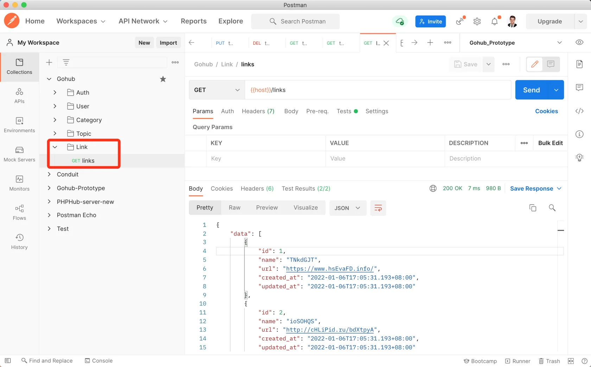

# 17.2. 友情链接列表

原文链接：https://learnku.com/courses/go-api/1.19/link-list/13583

## 说明

这节课我们来开发『友情链接列表』接口。

## 1. 创建数据工厂

首先我们来填充一些数据，方便测试分页。

先来创建友情链接工厂：

```
$ go run main.go make factory link
[database/factories/link_factory.go] created.
```

修改内容如下；

database/factories/link_factory.go

```
.
.
.
func MakeLinks(times int) []link.Link {

var objs []link.Link

for i := 0; i < times; i++ {
model := link.Link{
Name: faker.Username(),
URL:  faker.URL(),
}
objs = append(objs, model)
}

return objs
}
```

## 2. Seeder

接下来创建 Seeder：

```
$ go run main.go make seeder link
[database/seeders/links_seeder.go] created.
```

links_seeder.go 里的代码修改下需要创建的数据量，友情链接不用多，五个即可：

```
links  := factories.MakeLinks(5)
```

## 3. 填充数据

我们只需要填充 SeedLinksTable 即可：

```
$ go run main.go seed SeedLinksTable
Table [links] 5 rows seeded
```

## 4. 控制器方法

创建控制器：

```
$ go run main.go make apicontroller v1/link

[app/http/controllers/api/v1/links_controller.go] created.
```

留下 Index 方法：

app/http/controllers/api/v1/links_controller.go

```
package v1

import (
"gohub/app/models/link"
"gohub/pkg/response"

"github.com/gin-gonic/gin"
)

type LinksController struct {
BaseAPIController
}

func (ctrl *LinksController) Index(c *gin.Context) {
links := link.All()
response.Data(c, links)
}

```

分页方法 `link.All()`生成模型文件的时候已经为我们准备好，直接调用即可。

## 5. 注册路由

routes/api.go

```
.
.
.
lsc := new(controllers.LinksController)
linksGroup := v1.Group("/links")
{
linksGroup.GET("", lsc.Index)
}
}
}
```

## 6. 测试

Postman 里新建一个 Link 目录，目录中创建一条 GET `links` 的请求，不需要认证，也不需要 JSON 请求内容：



符合预期。

## 代码版本

本节功能开发完毕。开始下一节之前，先来为代码做下版本标记：

```
$ git add .
$ git commit -m "友情链接列表"
```
