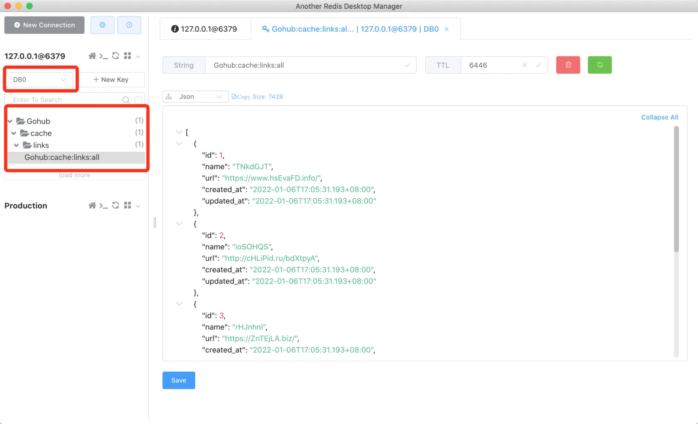
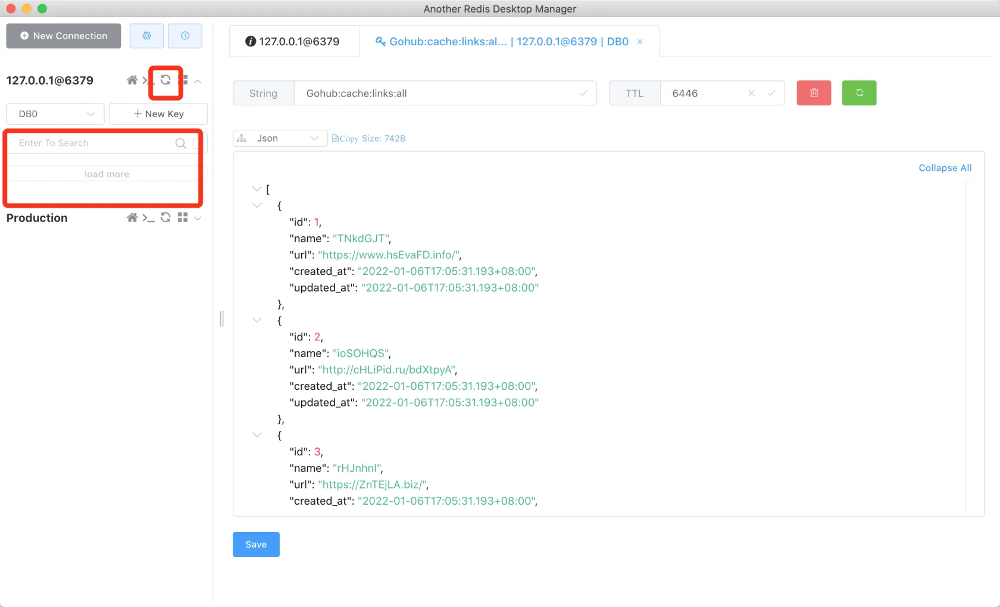

# 17.5. cache clear 命令

原文链接：https://learnku.com/courses/go-api/1.19/cache-command/13586

## 说明

这节课我们来开发 cache clear 命令，清空缓存。

## 1. 创建命令

使用我们 make cmd 生成命令文件：

```bash
$ go run main.go make cmd cache
```

修改如下：

app/cmd/cache.go

```go
package cmd

import (
	"gohub/pkg/cache"
	"gohub/pkg/console"

	"github.com/spf13/cobra"
)

var CmdCache = &cobra.Command{
	Use:   "cache",
	Short: "Cache management",
}

var CmdCacheClear = &cobra.Command{
	Use:   "clear",
	Short: "Clear cache",
	Run:   runCacheClear,
}

func init() {
	// 注册 cache 命令的子命令
	CmdCache.AddCommand(CmdCacheClear)
}

func runCacheClear(cmd *cobra.Command, args []string) {
	cache.Flush()
	console.Success("Cache cleared.")
}
```

调用我们之前开发好的 `cache.Flush()` 即可清空缓存。

## 2. 注册命令

main.go

```
.
.
.
// 注册子命令
rootCmd.AddCommand(
.
.
.
cmd.CmdCache,
)
.
.
.
```

## 测试

使用 Redis 管理工具可以看到我们的缓存数据：



运行清空缓存命令：

```bash
$ go run main.go cache clear
Cache cleared.
```

Redis 管理工具中，刷新数据，可以看到所有的 Key 已被清空：



符合预期。

## 代码版本

本节功能开发完毕。开始下一节之前，先来为代码做下版本标记：

```bash
$ git add .
$ git commit -m "cache clear 命令"
```
