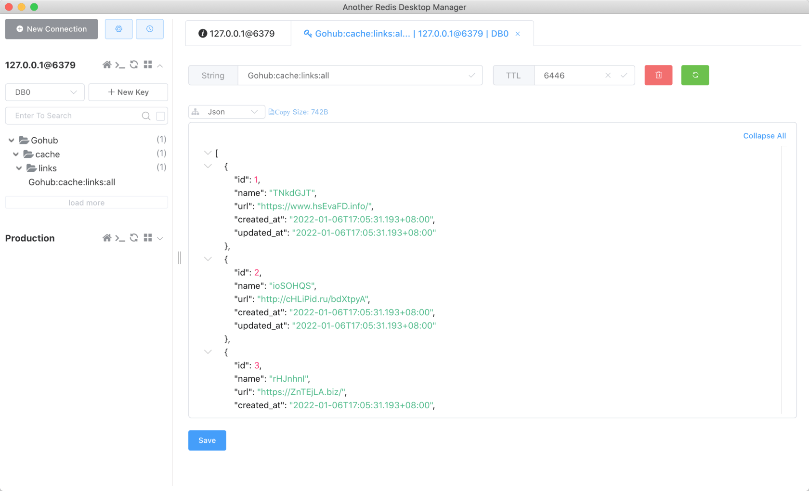

# 17.6. cache forget 命令

原文链接：https://learnku.com/courses/go-api/1.19/cache-forget-command/13587

## 说明

这节课我们来开发 cache forget 命令，清空特定 key 的缓存。

## 添加命令

app/cmd/cache.go

```
package cmd

import (
"fmt"
"gohub/pkg/cache"
"gohub/pkg/console"

"github.com/spf13/cobra"
)

var CmdCache = &cobra.Command{
Use:   "cache",
Short: "Cache management",
}

var CmdCacheClear = &cobra.Command{
Use:   "clear",
Short: "Clear cache",
Run:   runCacheClear,
}

var CmdCacheForget = &cobra.Command{
Use:   "forget",
Short: "Delete redis key, example: cache forget cache-key",
Run:   runCacheForget,
}

// forget 命令的选项
var cacheKey string

func init() {
// 注册 cache 命令的子命令
CmdCache.AddCommand(CmdCacheClear, CmdCacheForget)

// 设置 cache forget 命令的选项
CmdCacheForget.Flags().StringVarP(&cacheKey, "key", "k", "", "KEY of the cache")
CmdCacheForget.MarkFlagRequired("key")
}

func runCacheClear(cmd *cobra.Command, args []string) {
cache.Flush()
console.Success("Cache cleared.")
}

func runCacheForget(cmd *cobra.Command, args []string) {
cache.Forget(cacheKey)
console.Success(fmt.Sprintf("Cache key [%s] deleted.", cacheKey))
}
```

逻辑实现是 `cache.Forget(cacheKey)` 这个调用。

## 测试

上节课最后已将缓存清空，开始测试之前，先 Postman 中请求一下我们的『友情链接列表』接口，会创建缓存。

Redis 客户端刷新，确保有缓存内容：



调用 cache forget 命令：

```
$ go run main.go cache forget --key=links:all
Cache key [links:all] deleted.
```

注意：Redis 客户端里的 KEY 前部分

```
Gohub:cache:
```

是我们的 cache prefix ，cache 包里自动加的，清空时候不需要附加前缀， forget 命令会自动加上。使用我们在 `link.AllCached()` 方法里设置的 key 即可。

再次刷新 Redis 客户端，可以看到缓存已被删除。符合预期。

## 代码版本

本节功能开发完毕。开始下一节之前，先来为代码做下版本标记：

```
$ git add .
$ git commit -m "cache forget 命令"
```
