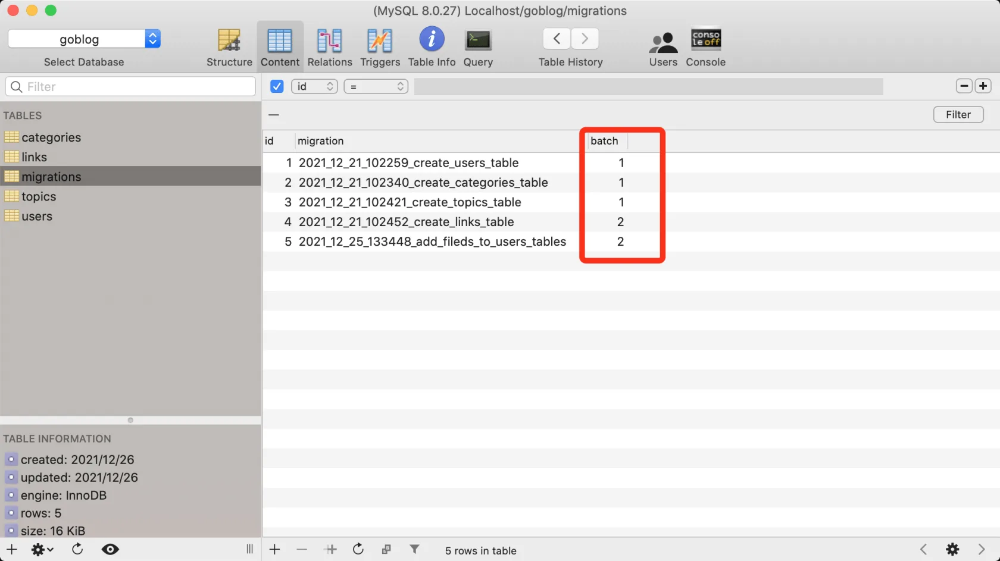

# 13.1. 数据库迁移设计

原文链接：https://learnku.com/courses/go-api/1.19/database-migration-design/13547

## 说明

在 bootstrap/database.go 文件中，我们使用 Gorm 的 AutoMigrate 方法来维护数据库表结构：

```
database.DB.AutoMigrate(&user.User{})
```

使用 AutoMigrate 第一个不足的地方是，它不会删除未使用的列，详见 [数据库迁移《GORM 中文文档》](https://learnku.com/docs/gorm/v2/migration/9746) 。使用定制的迁移方案能获取最大程度的控制。

另一方面，有时候我们希望使用迁移功能来做一些只执行一次的数据填充，例如说管理员后台的『用户组权限数据』。在这类逻辑中，我们的代码依赖于用户组权限，就如我们依赖数据表结构一样。

自定义的数据迁移方案，也允许我们做一些数据矫正，迁移文件为 Go 代码，可以给我们足够的灵活性。

## 表设计

我们的数据迁移方案，将会使用 migrations 表来跟踪迁移文件的执行情况：

```
CREATE TABLE `migrations` (
`id` bigint unsigned NOT NULL AUTO_INCREMENT,
`migration` varchar(255) NOT NULL,
`batch` bigint DEFAULT NULL,
PRIMARY KEY (`id`),
UNIQUE KEY `migration` (`migration`)
) ENGINE=InnoDB AUTO_INCREMENT=6 DEFAULT CHARSET=utf8mb4 COLLATE=utf8mb4_0900_ai_ci;
```

迁移文件是附带按时间标记的 Go 文件，如下：

```
├── 2021_12_21_102259_create_users_table.go
├── 2021_12_21_102340_create_categories_table.go
├── 2021_12_21_102421_create_topics_table.go
├── 2021_12_21_102452_create_links_table.go
├── 2021_12_25_133448_add_fileds_to_users_tables.go
├── 2021_12_27_134552_seed_links.go
```

文件名称除了标记时间，还有做了哪些操作的概述。

## batch 字段的设计

migrations 表里的 batch 字段，是 批次 的意思。每一个相同的批次里，记录了每次运行 migrate up 命令执行的所有文件，每运行一次，批次就会加一。

例如下面的批次 1 执行了三个文件，2 执行了两个文件：



batch 允许我们对执行批次进行操作，例如说 rollback 回退命令，就可以对最近一批次执行撤销操作（执行迁移文件里的 down 方法）。像上面的数据，执行 rollback 就会撤销 ID 为  5 和 4 的迁移变更。

## up 和 down

迁移文件里会有 up 和 down 函数，例如下方 up 是创建 links 表，down 是删除 links 表：

```
// 执行操作
up := func(migrator gorm.Migrator, DB *sql.DB) {
migrator.AutoMigrate(&Link{})
}

// 回退操作
down := func(migrator gorm.Migrator, DB *sql.DB) {
migrator.DropTable(&Link{})
}

// 注册 up 和 down 回调
migrate.Add("2021_12_21_102452_create_links_table", up, down)
```

## Gorm 的 migrator 对象

本项目将使用 Gorm 提供的 migrator 对象来操作数据表结构变更。

migrator 支持的方法：

```
type Migrator interface {
// AutoMigrate 自动迁移
AutoMigrate(dst ...interface{}) error

// Database 数据库操作
CurrentDatabase() string
FullDataTypeOf(*schema.Field) clause.Expr

// Tables 表操作
CreateTable(dst ...interface{}) error
DropTable(dst ...interface{}) error
HasTable(dst interface{}) bool
RenameTable(oldName, newName interface{}) error

// Columns 表字段操作
AddColumn(dst interface{}, field string) error
DropColumn(dst interface{}, field string) error
AlterColumn(dst interface{}, field string) error
HasColumn(dst interface{}, field string) bool
RenameColumn(dst interface{}, oldName, field string) error
MigrateColumn(dst interface{}, field *schema.Field, columnType *sql.ColumnType) error
ColumnTypes(dst interface{}) ([]*sql.ColumnType, error)

// Constraints 操作约束
CreateConstraint(dst interface{}, name string) error
DropConstraint(dst interface{}, name string) error
HasConstraint(dst interface{}, name string) bool

// Indexes 操作索引
CreateIndex(dst interface{}, name string) error
DropIndex(dst interface{}, name string) error
HasIndex(dst interface{}, name string) bool
RenameIndex(dst interface{}, oldName, newName string) error
}
```

基本上涵盖了数据表维护的方方面面。

使用 Grom 的 migrator 除了能跟系统里的其他模块共享数据库连接外，最大的好处是让我们的迁移文件轻松支持多种类型的数据库。例如说后面我们要使用 SQLite 或者 PostgreSQL  ，都可以很方便的切换。

对比 Go 生态圈比较知名的两个库 [github.com/golang-migrate/migrate](https://github.com/golang-migrate/migrate) 和 [github.com/rubenv/sql-migrate](https://github.com/rubenv/sql-migrate) ，都是直接使用 .sql 文件进行管理，支持多种数据库的场景将会很复杂，例如从 MySQL 转到 PostgreSQL 或 SQLite，都需要写一套专属的 SQL 文件。

## 迁移命令

迁移的命令

1. up —— 执行迁移

2. rollback (down) —— 回滚上一步执行的迁移

3. fresh —— 删除所有表，然后执行所有迁移

4. reset —— 回滚所有迁移

5. refresh —— 回滚所有迁移，然后再执行所有迁移

## 结语

这节课谈了我们数据库迁移工具的设计，比较抽象，看不懂没关系，等这一章学完在回来看，会轻松很多。
