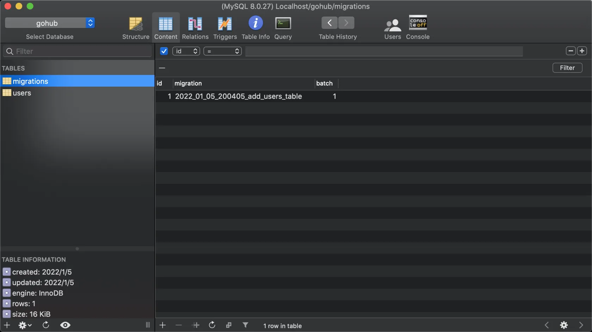

# 13.4. make migration 命令

原文链接：https://learnku.com/courses/go-api/1.19/make-migration-command/13550

## 说明

这节课我们来开发 make migration 命令，用以创建迁移文件。

## 1. 创建 make migration 命令

app/cmd/make/make_migration.go

```go
package make

import (
	"fmt"
	"gohub/pkg/app"
	"gohub/pkg/console"

	"github.com/spf13/cobra"
)

var CmdMakeMigration = &cobra.Command{
	Use:   "migration",
	Short: "Create a migration file, example: make migration add_users_table",
	Run:   runMakeMigration,
	Args:  cobra.ExactArgs(1), // 只允许且必须传 1 个参数
}

func runMakeMigration(cmd *cobra.Command, args []string) {

	// 日期格式化
	timeStr := app.TimenowInTimezone().Format("2006_01_02_150405")

	model := makeModelFromString(args[0])
	fileName := timeStr + "_" + model.PackageName
	filePath := fmt.Sprintf("database/migrations/%s.go", fileName)
	createFileFromStub(filePath, "migration", model, map[string]string{"{{FileName}}": fileName})
	console.Success("Migration file created，after modify it, use `migrate up` to migrate database.")
}
```

## 2. 注册命令

app/cmd/make/make.go

```go
.
.
.
func init() {
    // 注册 make 的子命令
    CmdMake.AddCommand(
        .
        .
        .
        CmdMakeMigration,
    )
}
.
.
.
```

## 3. 模板

app/cmd/make/stubs/migration.stub

```go
package migrations

import (
	"database/sql"
	"gohub/app/models"
	"gohub/pkg/migrate"

	"gorm.io/gorm"
)

func init() {

	type User struct {
		models.BaseModel

		Name     string `gorm:"type:varchar(255);not null;index"`
		Email    string `gorm:"type:varchar(255);index;default:null"`
		Phone    string `gorm:"type:varchar(20);index;default:null"`
		Password string `gorm:"type:varchar(255)"`

		models.CommonTimestampsField
	}

	up := func(migrator gorm.Migrator, DB *sql.DB) {
		migrator.AutoMigrate(&User{})
	}

	down := func(migrator gorm.Migrator, DB *sql.DB) {
		migrator.DropTable(&User{})
	}

	migrate.Add("{{FileName}}", up, down)
}
```

## 4. 删除自动迁移

打开 bootstrap/database.go ，将以下这一行删除：

```
database.DB.AutoMigrate(&user.User{})
```

## 5. 创建 users 表迁移

执行以下命令：

```bash
$ go run main.go make migration add_users_table
```

输出：

```
[database/migrations/2022_01_05_200405_add_users_table.go] created.
Migration file created，after modify it, use `migrate up` to migrate database.
```

打开上面的迁移文件（不需要修改）：

database/migrations/{timstamp}_add_users_table.go

```go
package migrations

import (
	"database/sql"
	"gohub/app/models"
	"gohub/pkg/migrate"

	"gorm.io/gorm"
)

func init() {

	type User struct {
		models.BaseModel

		Name     string `gorm:"type:varchar(255);not null;index"`
		Email    string `gorm:"type:varchar(255);index;default:null"`
		Phone    string `gorm:"type:varchar(20);index;default:null"`
		Password string `gorm:"type:varchar(255)"`

		models.CommonTimestampsField
	}

	up := func(migrator gorm.Migrator, DB *sql.DB) {
		migrator.AutoMigrate(&User{})
	}

	down := func(migrator gorm.Migrator, DB *sql.DB) {
		migrator.DropTable(&User{})
	}

	migrate.Add("2022_08_18_111518_add_users_table", up, down)
}
```

## 执行迁移

开始之前，先使用数据库管理工具删除用户表 users。

执行 migrate up 命令：

```bash
$ go run main.go migrate up
migrating 2022_01_05_200405_add_users_table
migrated 2022_01_05_200405_add_users_table
```

使用数据库管理工具查看是否多了两张表：



符合预期。

## 代码版本

本节功能开发完毕。开始下一节之前，先来为代码做下版本标记：

```bash
$ git add .
$ git commit -m "make migration 命令"
```
