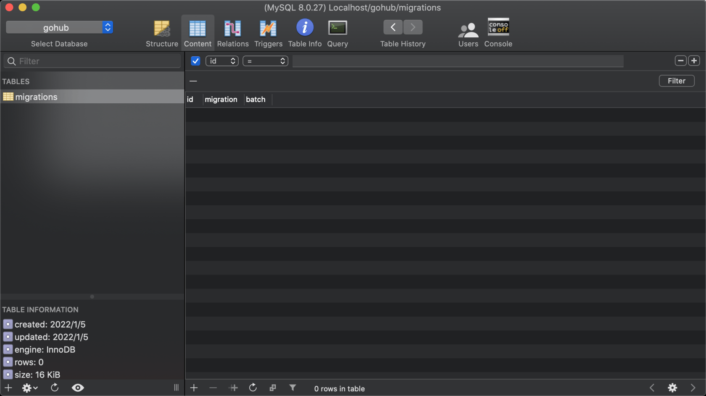

# 13.5. migrate rollback 命令

原文链接：https://learnku.com/courses/go-api/1.19/migrate-rollback-command/13551

## 说明

这一节我们来开发 migrate rollback 命令。

## 1. 新增 `migrator.Rollback()` 方法

pkg/migrate/migrator.go

```
.
.
.
// Up 执行所有未迁移过的文件
func (migrator *Migrator) Up() {
.
.
.
}

// Rollback 回滚上一个操作
func (migrator *Migrator) Rollback() {

// 获取最后一批次的迁移数据
lastMigration := Migration{}
migrator.DB.Order("id DESC").First(&lastMigration)
migrations := []Migration{}
migrator.DB.Where("batch = ?", lastMigration.Batch).Order("id DESC").Find(&migrations)

// 回滚最后一批次的迁移
if !migrator.rollbackMigrations(migrations) {
console.Success("[migrations] table is empty, nothing to rollback.")
}
}

// 回退迁移，按照倒序执行迁移的 down 方法
func (migrator *Migrator) rollbackMigrations(migrations []Migration) bool {

// 标记是否真的有执行了迁移回退的操作
runed := false

for _, _migration := range migrations {

// 友好提示
console.Warning("rollback " + _migration.Migration)

// 执行迁移文件的 down 方法
mfile := getMigrationFile(_migration.Migration)
if mfile.Down != nil {
mfile.Down(database.DB.Migrator(), database.SQLDB)
}

runed = true

// 回退成功了就删除掉这条记录
migrator.DB.Delete(&_migration)

// 打印运行状态
console.Success("finish " + mfile.FileName)
}
return runed
}

// 获取当前这个批次的值
func (migrator *Migrator) getBatch() int {
.
.
.
```

## 2. 新增命令 migrate down

app/cmd/migrate.go

```
.
.
.
var CmdMigrateRollback = &cobra.Command{
Use: "down",
// 设置别名 migrate down == migrate rollback
Aliases: []string{"rollback"},
Short:   "Reverse the up command",
Run:     runDown,
}

func runDown(cmd *cobra.Command, args []string) {
migrator().Rollback()
}
```

## 3. 注册命令

app/cmd/migrate.go

```
.
.
.
func init() {
CmdMigrate.AddCommand(
CmdMigrateUp,
CmdMigrateRollback,
)
}
.
.
.
```

## 测试

执行命令：

```
$ go run main.go migrate down
rollback 2022_01_05_200405_add_users_table
finsh 2022_01_05_200405_add_users_table
```

查看数据库， users 表已被删除，migrations 表里也没有数据：



符合预期。

我们再运行 migrate up  将 users 表还原：

```
$ go run main.go migrate up
migrating 2022_01_05_200405_add_users_table
migrated 2022_01_05_200405_add_users_table
```

## 代码版本

本节功能开发完毕。开始下一节之前，先来为代码做下版本标记：

```
$ git add .
$ git commit -m "migrate rollback 命令"
```
