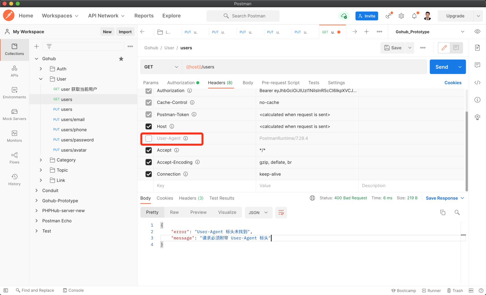

# 19.1. 强制 User Agent 中间件

原文链接：https://learnku.com/courses/go-api/1.19/force-user-agent-middleware/13596

## 说明

本节我们将开发『ForceUA 中间件』， 强制客户端在请求时，发送 User-Agent 信息。

User-Agent 信息包含两部分，客户端信息 + 版本，使用斜杆分隔：

```
User-Agent: Gohub iOS/2.1.37
User-Agent: Gohub Androd/2.1.22
```

API 后端接收到 User-Agent 数据后可以暂时不做处理，但是后续有特殊的业务需求时，可以针对某个客户端具体到版本，进行特殊的数据处理。

常见的使用场景，是废弃客户端：例如一个银行 APP，升级了交易时的加密算法，低于 5.0 版本的客户端因为安全原因，必须废弃。针对此情况，可通过后端 API 判断 User-Agent 标头，对低于 5.0 的版本的客户端请求，返回专属的数据，如 APP 首页的第一个 Banner 显示请升级客户端，安全升级无法使用的提示。

现实生产中，有些客户端用户会关闭系统的应用自动更新功能，多版本客户端是无法避免的问题。有了 User-Agent ，我们可以更加灵活的做针对性处理。

## 创建中间件

app/http/middlewares/force_ua.go

```
// Package middlewares Gin 中间件
package middlewares

import (
"errors"
"gohub/pkg/response"

"github.com/gin-gonic/gin"
)

// ForceUA 中间件，强制请求必须附带 User-Agent 标头
func ForceUA() gin.HandlerFunc {
return func(c *gin.Context) {

// 获取 User-Agent 标头信息
if len(c.Request.Header["User-Agent"]) == 0 {
response.BadRequest(c, errors.New("User-Agent 标头未找到"), "请求必须附带 User-Agent 标头")
return
}

c.Next()
}
}
```

## 注册全局中间件

bootstrap/route.go

```
.
.
.
func registerGlobalMiddleWare(router *gin.Engine) {
router.Use(
middlewares.Logger(),
middlewares.Recovery(),
middlewares.ForceUA(),
)
}
.
.
.
```

## 测试

Postman 里找一个 Gohub 请求，把 `User-Agent` 的钩去掉：



符合预期。

## 代码版本

本节功能开发完毕。开始下一节之前，先来为代码做下版本标记：

```
$ git add .
$ git commit -m "强制 User Agent 中间件"
```
