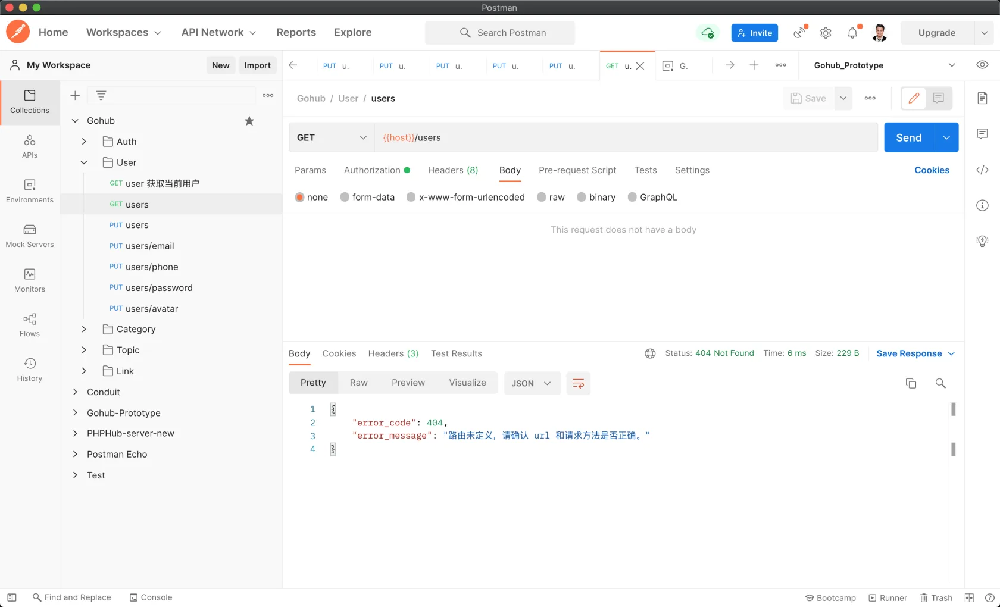
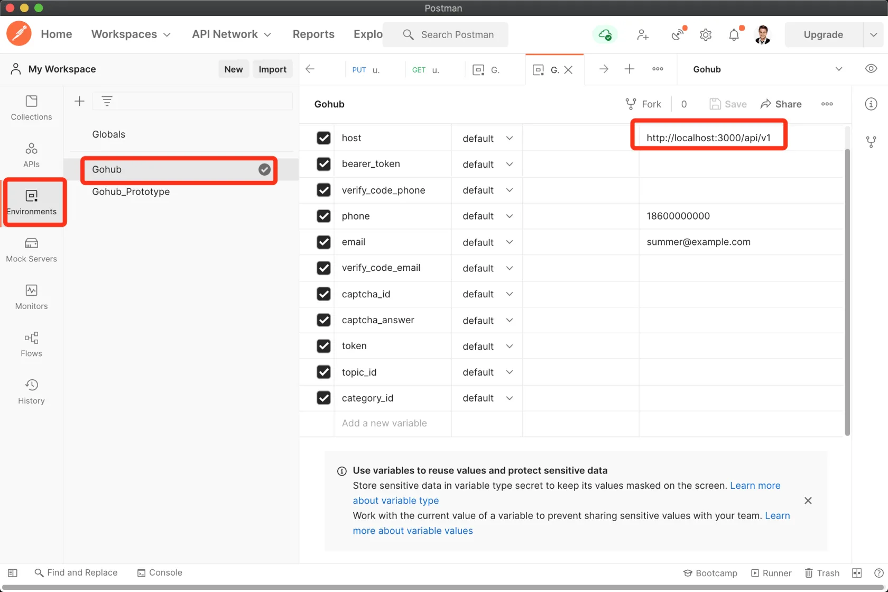
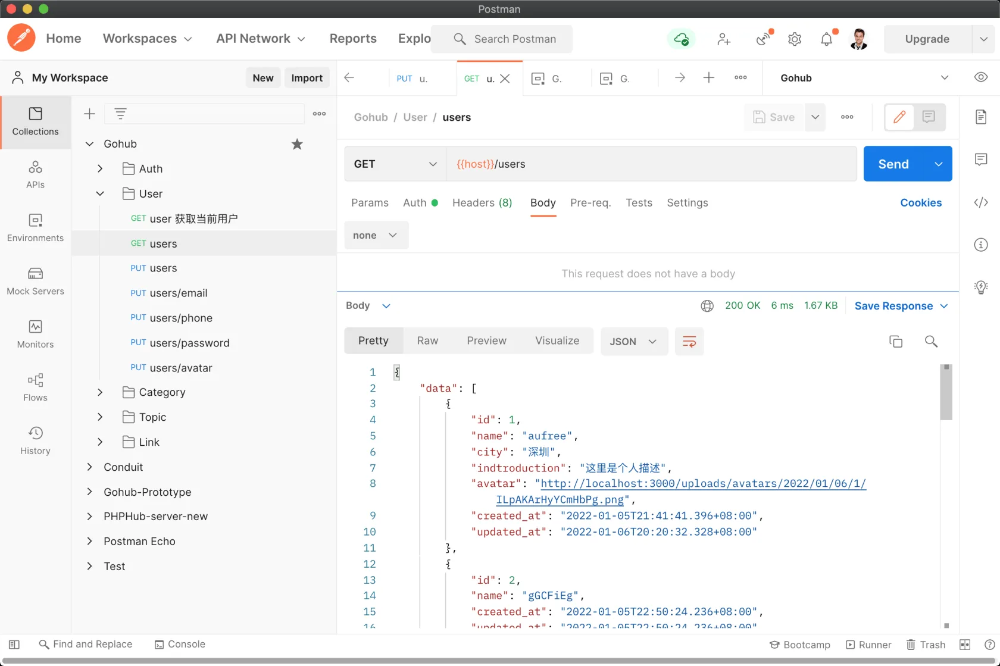

# 19.2. API 域名和前缀

原文链接：https://learnku.com/courses/go-api/1.19/api-domain-name-and-prefix/13597

## 说明

这一节我们将让我们的接口支持 api 域名。

## 逻辑讲解

我们应用程序里应该支持配置 API 域名，如果配置了 API 域名，那请求应该是：

```
https://api.domain.com/v1/users
```

如果未配置 API 域名，请求是：

```
# 域名后面加 api 路径
https://domain.com/api/v1/users
```

## 修改代码

routes/api.go

```
.
.
.
// RegisterAPIRoutes 注册 API 相关路由
func RegisterAPIRoutes(r *gin.Engine) {

// 测试一个 v1 的路由组，我们所有的 v1 版本的路由都将存放到这里
var v1 *gin.RouterGroup
if len(config.Get("app.api_domain")) == 0 {
v1 = r.Group("/api/v1")
} else {
v1 = r.Group("/v1")
}
.
.
.
```

## 配置信息

config/app.go

```
.
.
.
// API 域名，未设置的话所有 API URL 加 api 前缀，如 http://domain.com/api/v1/users
"api_domain": config.Env("API_DOMAIN"),
}
})
}
```

## 测试

在未设置域名的情况下，发送请求会返回 404：



修改环境变量：



再次发送请求：



符合预期。

## 代码版本

本节功能开发完毕。开始下一节之前，先来为代码做下版本标记：

```
$ git add .
$ git commit -m "API 域名和前缀"
```
