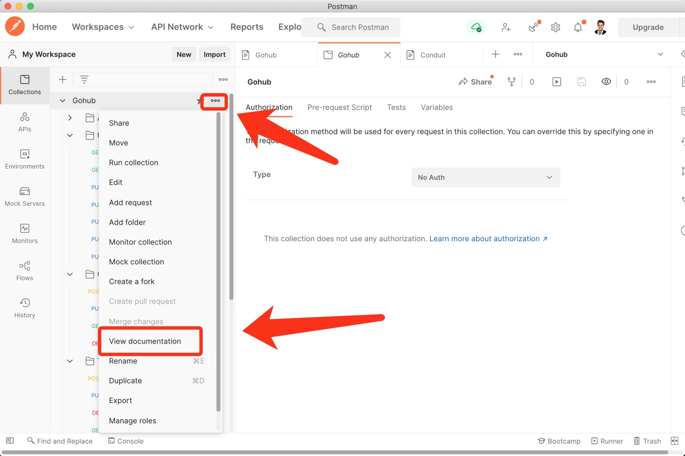
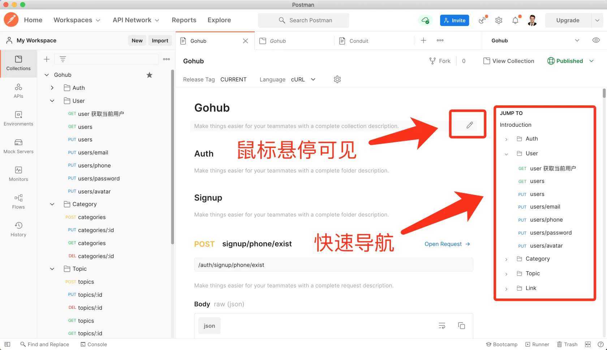
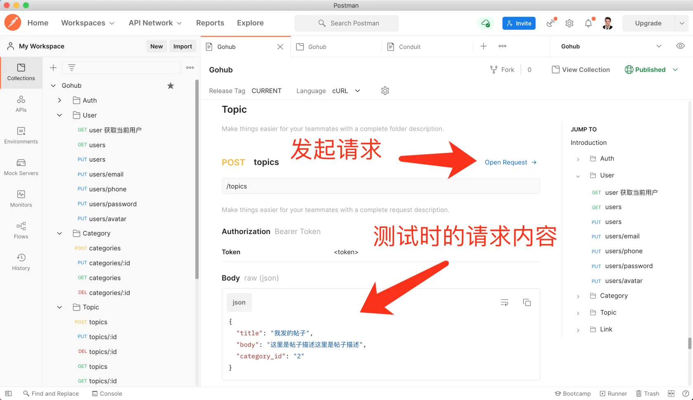
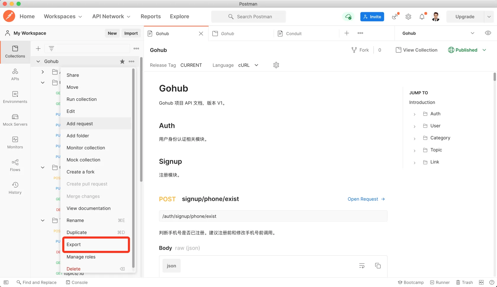
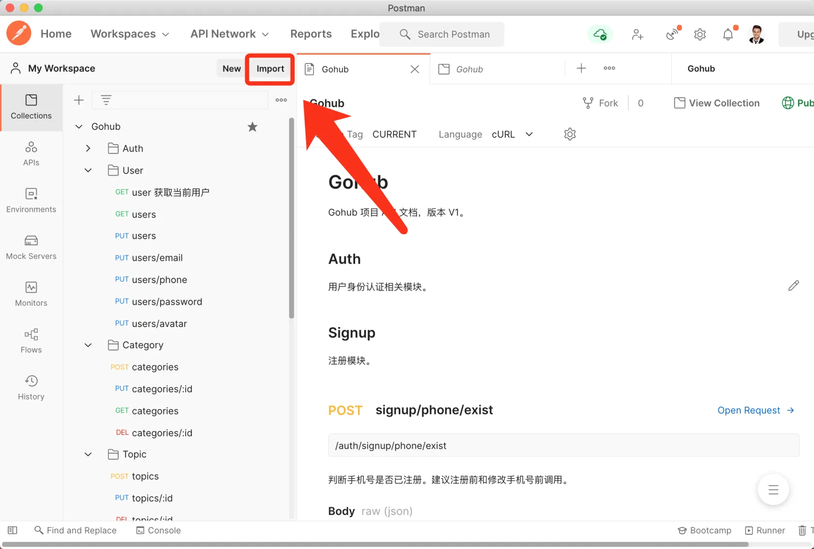
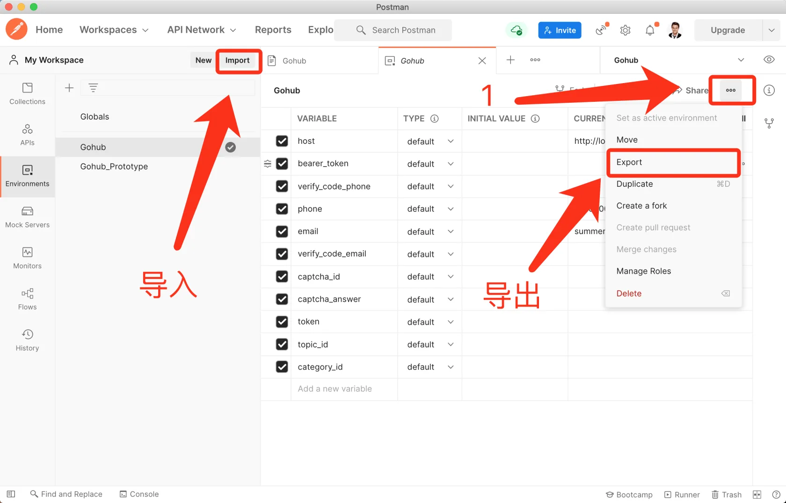
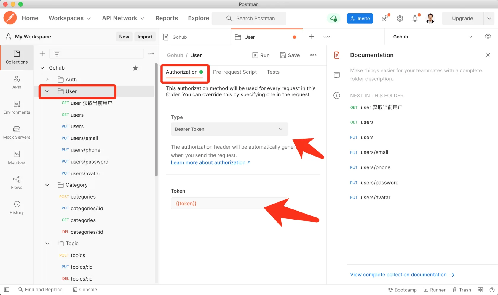

# 19.3. API 文档

原文链接：https://learnku.com/courses/go-api/1.19/api-documentation/13598

## 说明

目前为止，我们使用 Postman 进行测试工具。

然而你可能不知道，Postman 也是一款非常优秀的 API 文档工具。

Postman 作为文档载体，具备以下功能：

- 文档功能；

- 支持项目导入导出；

- 环境变量导入导出；

- 简单的 UI 视图；

- 强大的调试功能；

- 批处理操作等。

这些功能让它在使用体验上，远超其他文档工具。

接下来对这些功能进行讲解。

## 1. 文档功能

查看整个项目的文档：

在文档页面，可以对项目名称、目录、以及接口描述进行编辑：

文档里会贴心的使用我们测试时的『请求内容』，且支持快速跳转到发起请求页面：

## 2. 项目导入导出

文档撰写完成后，可以选择导出项目：

使用默认的导出方式即可。

导入的地方如下：

导入时按照指引导入即可，很容易操作。

## 3. 环境变量导入导出

环境变量是 Postman 另一个强大的功能。

环境变量也支持导入导出：

## 4. 批处理操作

Postman 允许我们对整个文件夹，甚至是整个目录设置 Auth 标头：

这是一个很便捷的功能，对于不熟悉我们 API 的客户端开发人员，为他们提前设置好 Auth 标头，可以让他们轻松上手，配合环境变量。

## 5. 视图和调试

Postman 的测试和调试功能，我们已经在本教程中做了大量演示，这里就不再赘述。

这里需要提的点是，客户端开发人员拿到 API 开发文档，免不了要调试。和我们同样使用 Postman 做调试，可以让沟通更加顺畅。

## 结语

作为后端工程师，使用 Postman 开发 API 的流程是：

- 开发时调试接口，注意规范命名，方便文档撰写和导出；

- 开发完成后，导出项目，导出环境变量；

- 将导出的文件存放于 Gohub 项目的 docs 目录下，提交到代码中；

- 或者直接将导出文件打包，发送给客户端开发人员。

在实践中，这是一套很舒服的流程。
