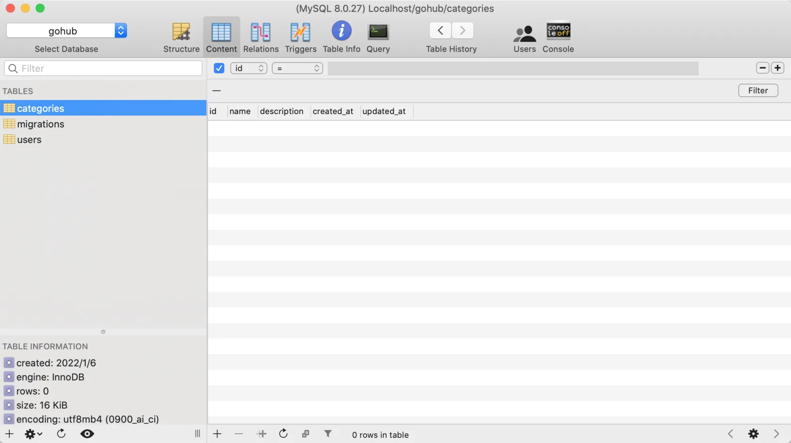

# 15.2. 分类模型和迁移

原文链接：https://learnku.com/courses/go-api/1.19/category-model/13567

## 说明

这一章我们将开发分类相关接口，开始之前先来创建分类模型。

## 1. 创建模型

现在我们使用 make model 命令来创建分类模型：

```bash
$ go run main.go make model category
[app/models/category/category_model.go] created.
[app/models/category/category_util.go] created.
[app/models/category/category_hooks.go] created.
```

修改下 category_model.go 文件里的模型定义：

app/models/category/category_model.go

```go
.
.
.
type Category struct {
    models.BaseModel

    Name        string `json:"name,omitempty"`
    Description string `json:"description,omitempty"`

    models.CommonTimestampsField
}
.
.
.
```

## 2. 创建迁移

接下来创建数据库表结构：

```bash
$ go run main.go make migration add_categories_table
[database/migrations/2022_01_06_104533_add_categories_table.go] created.
Migration file created，after modify it, use `migrate up` to migrate database.
```

打开生成的 migration 文件，定制表结构：

```go
.
.
.
func init() {

    type Category struct {
        models.BaseModel

        Name        string `gorm:"type:varchar(255);not null;index"`
        Description string `gorm:"type:varchar(255);default:null"`

        models.CommonTimestampsField
    }

    up := func(migrator gorm.Migrator, DB *sql.DB) {
        migrator.AutoMigrate(&Category{})
    }

    down := func(migrator gorm.Migrator, DB *sql.DB) {
        migrator.DropTable(&Category{})
    }
    .
    .
    .
```

>

注意： 别修改到 `migrate.Add()` 调用代码。

## 3. 执行迁移

```bash
$ go run main.go migrate up
migrating 2022_01_06_104533_add_categories_table
migrated 2022_01_06_104533_add_categories_table
```

使用数据库工具，可以看到多出来一个 categories 表：



## 结语

虽然花了前面很大功夫开发 make 命令，但是却使我们开发效率提高了很多，还是很值当的。

## 代码版本

本节功能开发完毕。开始下一节之前，先来为代码做下版本标记：

```bash
$ git add .
$ git commit -m "分类模型"
```
