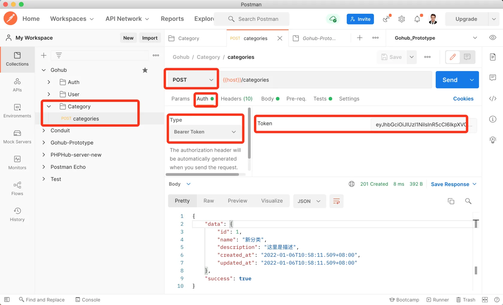

# 15.3. 创建分类

原文链接：https://learnku.com/courses/go-api/1.19/create-classification/13568

## 说明

这节课我们来开发『创建分类』接口。

## 1. make request

数据入库前都需要验证，我们先来创建 Category 的请求验证器：

```
$ go run main.go make request category
[app/requests/category_request.go] created.
```

修改生成的文件如下：

app/requests/category_request.go

```
package requests

import (
"github.com/gin-gonic/gin"
"github.com/thedevsaddam/govalidator"
)

type CategoryRequest struct {
Name        string `valid:"name" json:"name"`
Description string `valid:"description" json:"description,omitempty"`
}

func CategorySave(data interface{}, c *gin.Context) map[string][]string {

rules := govalidator.MapData{
"name":        []string{"required", "min_cn:2", "max_cn:8", "not_exists:categories,name"},
"description": []string{"min_cn:3", "max_cn:255"},
}
messages := govalidator.MapData{
"name": []string{
"required:分类名称为必填项",
"min_cn:分类名称长度需至少 2 个字",
"max_cn:分类名称长度不能超过 8 个字",
"not_exists:分类名称已存在",
},
"description": []string{
"min_cn:分类描述长度需至少 3 个字",
"max_cn:分类描述长度不能超过 255 个字",
},
}
return validate(data, rules, messages)
}
```

## 2. 自定义验证规则

我们底层使用的验证器 [govalidator](https://github.com/thedevsaddam/govalidator) 虽然支持 min 和 max 来设置字符串长度规则，但是不适用于中文字符串。

所以上面我们使用了 min_cn 和 max_cn 的自定义规则，现在来创建这两个规则：

app/requests/validators/custom_rules.go

```
.
.
.
// 此方法会在初始化时执行，注册自定义表单验证规则
func init() {
.
.
.
// max_cn:8 中文长度设定不超过 8
govalidator.AddCustomRule("max_cn", func(field string, rule string, message string, value interface{}) error {
valLength := utf8.RuneCountInString(value.(string))
l, _ := strconv.Atoi(strings.TrimPrefix(rule, "max_cn:"))
if valLength > l {
// 如果有自定义错误消息的话，使用自定义消息
if message != "" {
return errors.New(message)
}
return fmt.Errorf("长度不能超过 %d 个字", l)
}
return nil
})

// min_cn:2 中文长度设定不小于 2
govalidator.AddCustomRule("min_cn", func(field string, rule string, message string, value interface{}) error {
valLength := utf8.RuneCountInString(value.(string))
l, _ := strconv.Atoi(strings.TrimPrefix(rule, "min_cn:"))
if valLength < l {
// 如果有自定义错误消息的话，使用自定义消息
if message != "" {
return errors.New(message)
}
return fmt.Errorf("长度需大于 %d 个字", l)
}
return nil
})
}
```

## 3. 控制器

使用我们的 make apicontroller 命令：

```
$ go run main.go make apicontroller v1/category
[app/http/controllers/api/v1/categories_controller.go] created.
```

生成的 categories_controller.go 里有很多内容，我们先删除未涉及到的内容，留下 Store 方法：

app/http/controllers/api/v1/categories_controller.go

```
package v1

import (
"gohub/app/models/category"
"gohub/app/requests"
"gohub/pkg/response"

"github.com/gin-gonic/gin"
)

type CategoriesController struct {
BaseAPIController
}

func (ctrl *CategoriesController) Store(c *gin.Context) {

request := requests.CategoryRequest{}
if ok := requests.Validate(c, &request, requests.CategorySave); !ok {
return
}

categoryModel := category.Category{
Name:        request.Name,
Description: request.Description,
}
categoryModel.Create()
if categoryModel.ID > 0 {
response.Created(c, categoryModel)
} else {
response.Abort500(c, "创建失败，请稍后尝试~")
}
}
```

## 4. 注册路由

routes/api.go

```
.
.
.
cgc := new(controllers.CategoriesController)
cgcGroup := v1.Group("/categories")
{
cgcGroup.POST("", middlewares.AuthJWT(), cgc.Store)
}
}
}
```

登录用户才能创建分类，所以我们用了 `AuthJWT` 中间件。

## 5. 测试

Postman 创建新目录 Category ，目录里新建请求 POST category ，请求的内容如下：

```
{
"name": "新分类",
"description": "这里是描述"
}
```

请求时需要设定 bearer token（没有 token 的话请自行注册或登录用户，所有生成的用户默认密码都为 secret）：



符合预期。

## 代码版本

本节功能开发完毕。开始下一节之前，先来为代码做下版本标记：

```
$ git add .
$ git commit -m "创建分类"
```
