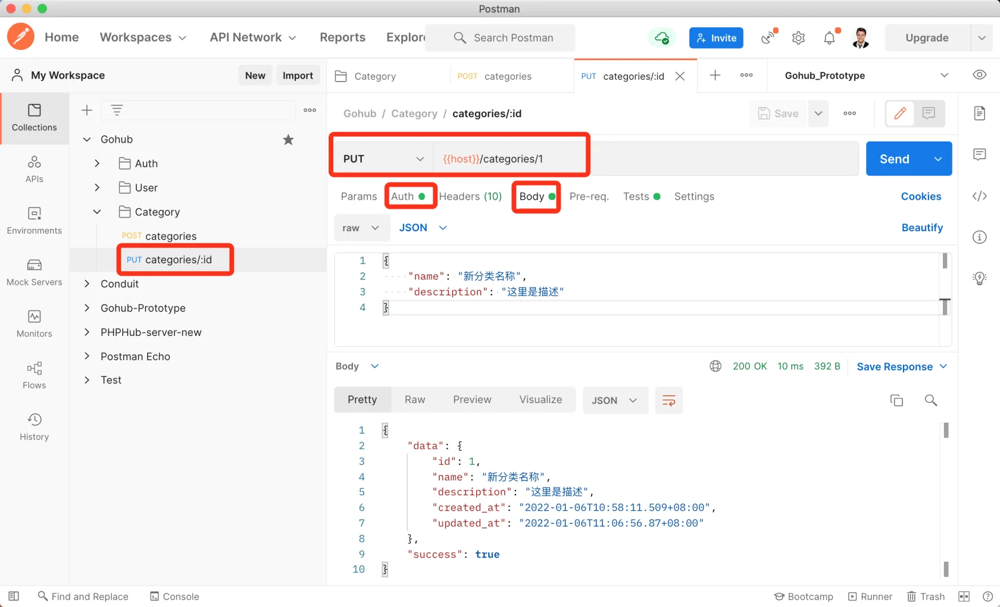

# 15.4. 更新分类

原文链接：https://learnku.com/courses/go-api/1.19/update-classification/13569

## 说明

本节将开发『更新分类』接口。

## 1. 控制器方法

app/http/controllers/api/v1/categories_controller.go

```go
.
.
.
func (ctrl *CategoriesController) Update(c *gin.Context) {

	// 验证 url 参数 id 是否正确
	categoryModel := category.Get(c.Param("id"))
	if categoryModel.ID == 0 {
		response.Abort404(c)
		return
	}

	// 表单验证
	request := requests.CategoryRequest{}
	if ok := requests.Validate(c, &request, requests.CategorySave); !ok {
		return
	}

	// 保存数据
	categoryModel.Name = request.Name
	categoryModel.Description = request.Description
	rowsAffected := categoryModel.Save()

	if rowsAffected > 0 {
		response.Data(c, categoryModel)
	} else {
		response.Abort500(c)
	}
}
```

## 2. 注册路由

routes/api.go

```go
.
.
.
cgcGroup.POST("", middlewares.AuthJWT(), cgc.Store)
cgcGroup.PUT("/:id", middlewares.AuthJWT(), cgc.Update)
}
}
}
```

## 测试

Postman 创建一条请求，请求 url 为：`{{host}}/categories/1` ，这个 1 是我们上一节最后测试创建的分类 ID。

请求方法为 `PUT`。

设置请求内容：

```json
{
    "name": "新分类名称",
    "description": "这里是描述"
}
```

最后记得设置 Auth 请求授权，确认无误后发送请求：



符合预期。

## 代码版本

本节功能开发完毕。开始下一节之前，先来为代码做下版本标记：

```bash
$ git add .
$ git commit -m "更新分类"
```
