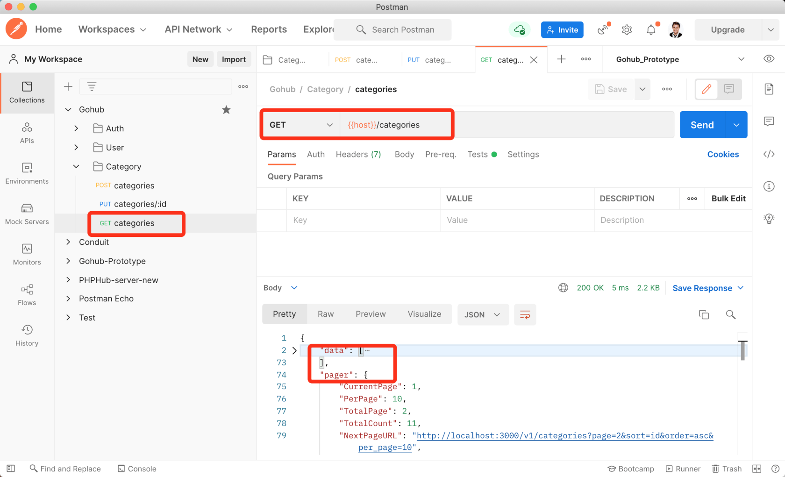

# 15.5. 分类列表

原文链接：https://learnku.com/courses/go-api/1.19/classification-list/13570

## 说明

这节课我们来开发『分类列表』接口。

## 1. 创建分类工厂

首先我们来填充一些数据，方便测试分页。

先来创建分类工厂：

```
$ go run main.go make factory category
[database/factories/category_factory.go] created.
```

修改内容如下；

database/factories/category_factory.go

```
.
.
.
func MakeCategories(count int) []category.Category {

var objs []category.Category

// 设置唯一性，如 Category 模型的某个字段需要唯一，即可取消注释
faker.SetGenerateUniqueValues(true)

for i := 0; i < count; i++ {
categoryModel := category.Category{
Name:        faker.Username(),
Description: faker.Sentence(),
}
objs = append(objs, categoryModel)
}

return objs
}
```

因为分类名称要保持唯一，所以取消了上面的 `faker.SetGenerateUniqueValues(true)` 的注释。

## 2. Seeder

接下来创建 Seeder：

```
$ go run main.go make seeder category
[database/seeders/categories_seeder.go] created.
```

categories_seeder.go 里的代码不用修改，可以自行查看其代码。

## 3. 填充数据

我们只需要填充 SeedCategoriesTable 即可：

```
$ go run main.go seed SeedCategoriesTable
Table [categories] 10 rows seeded
```

## 4. 控制器方法

app/http/controllers/api/v1/categories_controller.go

```
.
.
.

func (ctrl *CategoriesController) Index(c *gin.Context) {
request := requests.PaginationRequest{}
if ok := requests.Validate(c, &request, requests.Pagination); !ok {
return
}

data, pager := category.Paginate(c, 10)
response.JSON(c, gin.H{
"data":  data,
"pager": pager,
})
}
```

分页方法 `category.Paginate()`生成模型文件的时候已经为我们准备好，直接调用即可。

## 5. 注册路由

routes/api.go

```
.
.
.
cgcGroup := v1.Group("/categories")
{
cgcGroup.GET("", cgc.Index)
cgcGroup.POST("", middlewares.AuthJWT(), cgc.Store)
cgcGroup.PUT("/:id", middlewares.AuthJWT(), cgc.Update)
}
}
}
```

## 6. 测试

Postman 里创建一条 GET `categories` 的请求，不需要认证，也不需要 JSON 请求内容：



符合预期。

## 代码版本

本节功能开发完毕。开始下一节之前，先来为代码做下版本标记：

```
$ git add .
$ git commit -m "分类列表"
```
