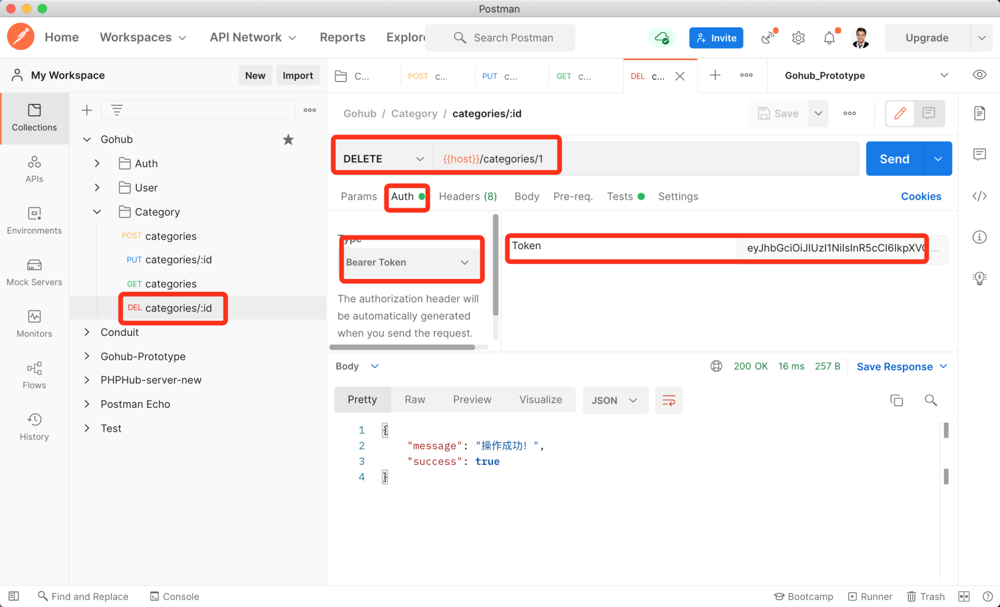
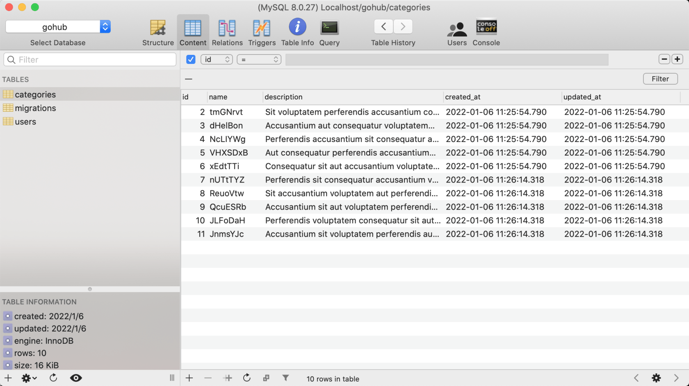

# 15.6. 删除分类

原文链接：https://learnku.com/courses/go-api/1.19/delete-classification/13571

## 说明

本节开发『删除分类』接口。

## 1. 控制器

app/http/controllers/api/v1/categories_controller.go

```
.
.
.
func (ctrl *CategoriesController) Delete(c *gin.Context) {

categoryModel := category.Get(c.Param("id"))
if categoryModel.ID == 0 {
response.Abort404(c)
return
}

rowsAffected := categoryModel.Delete()
if rowsAffected > 0 {
response.Success(c)
return
}

response.Abort500(c, "删除失败，请稍后尝试~")
}
```

## 2. 注册路由

routes/api.go

```
.
.
.
cgcGroup.PUT("/:id", middlewares.AuthJWT(), cgc.Update)
cgcGroup.DELETE("/:id", middlewares.AuthJWT(), cgc.Delete)
}
}
}
```

## 3. 测试

Postman 创建一条请求，请求 url 为：`{{host}}/categories/1` ，这个 1 是我们上一节最后测试创建的分类 ID。

请求的方法为 `DELETE`，记得加上 Auth Token：



查看数据库，ID 为 1 的分类已被删除：



符合预期。

## 代码版本

本节功能开发完毕。开始下一节之前，先来为代码做下版本标记：

```
$ git add .
$ git commit -m "删除分类"
```
