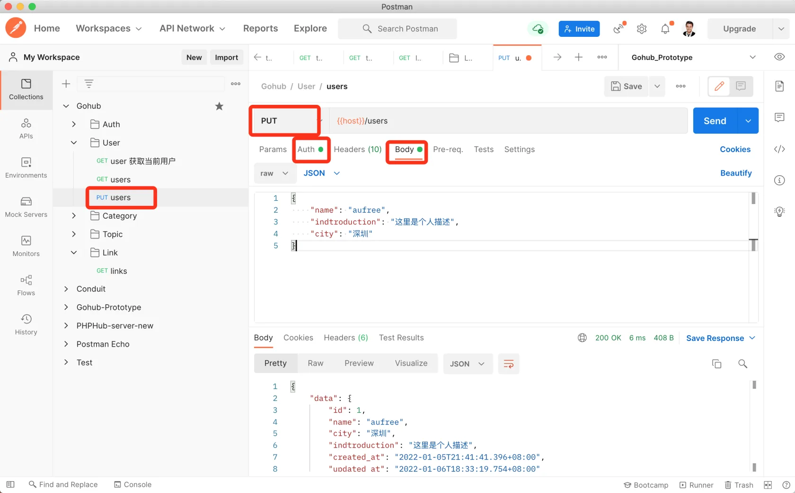

# 18.1. 编辑个人资料

原文链接：https://learnku.com/courses/go-api/1.19/edit-profile/13589

## 说明

这节课我们来创建『编辑个人资料』接口。

## 1. 添加模型字段

app/models/user/user_model.go

```go
.
.
.
// User 用户模型
type User struct {
    models.BaseModel

    Name string `json:"name,omitempty"`

    City          string `json:"city,omitempty"`
    Introduction string `json:"introduction,omitempty"`
    Avatar        string `json:"avatar,omitempty"`

    Email    string `json:"-"`
    Phone    string `json:"-"`
    Password string `json:"-"`

    models.CommonTimestampsField
}
.
.
.
```

## 2. 添加数据表字段

创建 migration：

```bash
$ go run main.go make migration add_fields_to_users

[database/migrations/2022_01_06_182339_add_fields_to_user.go] created.
Migration file created，after modify it, use `migrate up` to migrate database.
```

修改迁移文件如下：

```go
package migrations

import (
    "database/sql"
    "gohub/pkg/migrate"

    "gorm.io/gorm"
)

func init() {

    type User struct {
        City          string `gorm:"type:varchar(10);"`
        Introduction string `gorm:"type:varchar(255);"`
        Avatar        string `gorm:"type:varchar(255);default:null"`
    }

    up := func(migrator gorm.Migrator, DB *sql.DB) {
        migrator.AutoMigrate(&User{})

    }

    down := func(migrator gorm.Migrator, DB *sql.DB) {
        migrator.DropColumn(&User{}, "City")
        migrator.DropColumn(&User{}, "Introduction")
        migrator.DropColumn(&User{}, "Avatar")
    }
    .
    .
    .
```

运行迁移：

```bash
$ go run main.go migrate up
```

## 3. 验证请求

用户提交的数据需要验证以后才能入库，我们来创建验证器：

```bash
$ go run main.go make request user
[app/requests/user_request.go] created.
```

修改如下：

app/requests/user_request.go

```go
package requests

import (
	"gohub/pkg/auth"

	"github.com/gin-gonic/gin"
	"github.com/thedevsaddam/govalidator"
)

type UserUpdateProfileRequest struct {
	Name         string `valid:"name" json:"name"`
	City         string `valid:"city" json:"city"`
	Introduction string `valid:"introduction" json:"introduction"`
}

func UserUpdateProfile(data interface{}, c *gin.Context) map[string][]string {

	// 查询用户名重复时，过滤掉当前用户 ID
	uid := auth.CurrentUID(c)
	rules := govalidator.MapData{
		"name":         []string{"required", "alpha_num", "between:3,20", "not_exists:users,name," + uid},
		"introduction": []string{"min_cn:4", "max_cn:240"},
		"city":         []string{"min_cn:2", "max_cn:20"},
	}

	messages := govalidator.MapData{
		"name": []string{
			"required:用户名为必填项",
			"alpha_num:用户名格式错误，只允许数字和英文",
			"between:用户名长度需在 3~20 之间",
			"not_exists:用户名已被占用",
		},
		"introduction": []string{
			"min_cn:描述长度需至少 4 个字",
			"max_cn:描述长度不能超过 240 个字",
		},
		"city": []string{
			"min_cn:城市需至少 2 个字",
			"max_cn:城市不能超过 20 个字",
		},
	}
	return validate(data, rules, messages)
}
```

注意上面 `not_exists` 规则的使用。

## 4. 控制器添加方法

app/http/controllers/api/v1/users_controller.go

```go
.
.
.
func (ctrl *UsersController) UpdateProfile(c *gin.Context) {

	request := requests.UserUpdateProfileRequest{}
	if ok := requests.Validate(c, &request, requests.UserUpdateProfile); !ok {
		return
	}

	currentUser := auth.CurrentUser(c)
	currentUser.Name = request.Name
	currentUser.City = request.City
	currentUser.Introduction = request.Introduction
	rowsAffected := currentUser.Save()
	if rowsAffected > 0 {
		response.Data(c, currentUser)
	} else {
		response.Abort500(c, "更新失败，请稍后尝试~")
	}
}
```

## 5. 注册路由

routes/api.go

```go
.
.
.
usersGroup := v1.Group("/users")
{
    usersGroup.GET("", uc.Index)
    usersGroup.PUT("", middlewares.AuthJWT(), uc.UpdateProfile)
}
.
.
.
```

## 6. 测试

Postman 里创建一条 PUT 方法的请求 `{{host}}/users`，请求内容如下：

```json
{
    "name": "aufree",
    "introduction": "这里是个人描述",
    "city": "深圳"
}
```

使用 Token ，发送请求：



符合预期。

## 代码版本

本节功能开发完毕。开始下一节之前，先来为代码做下版本标记：

```bash
$ git add .
$ git commit -m "编辑个人资料"
```
