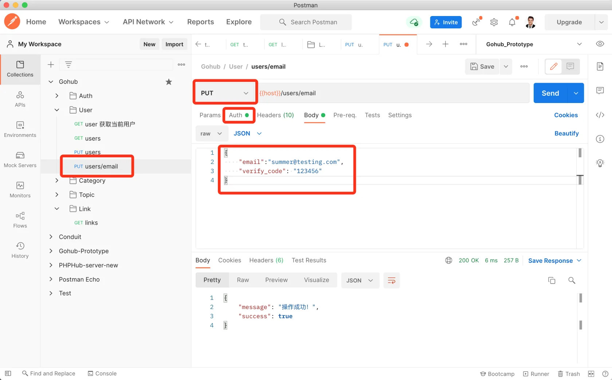

# 18.2. 修改邮箱

原文链接：https://learnku.com/courses/go-api/1.19/modify-mailbox/13590

## 说明

修改邮箱需要调用 API  :

- POST `auth/verify-codes/email` 发送邮箱验证码，以证明拥有邮箱的所有权；

- PUT `users/email` 凭着新邮箱验证码更新邮箱。

第一个 API 我们已经在前面开发，这节课开发第二个接口。

## 1. 验证器

app/requests/user_request.go

```
.
.
.
type UserUpdateEmailRequest struct {
Email      string `json:"email,omitempty" valid:"email"`
VerifyCode string `json:"verify_code,omitempty" valid:"verify_code"`
}

func UserUpdateEmail(data interface{}, c *gin.Context) map[string][]string {

currentUser := auth.CurrentUser(c)
rules := govalidator.MapData{
"email": []string{
"required", "min:4",
"max:30",
"email",
"not_exists:users,email," + currentUser.GetStringID(),
"not_in:" + currentUser.Email,
},
"verify_code": []string{"required", "digits:6"},
}
messages := govalidator.MapData{
"email": []string{
"required:Email 为必填项",
"min:Email 长度需大于 4",
"max:Email 长度需小于 30",
"email:Email 格式不正确，请提供有效的邮箱地址",
"not_exists:Email 已被占用",
"not_in:新的 Email 与老 Email 一致",
},
"verify_code": []string{
"required:验证码答案必填",
"digits:验证码长度必须为 6 位的数字",
},
}

errs := validate(data, rules, messages)
_data := data.(*UserUpdateEmailRequest)
errs = validators.ValidateVerifyCode(_data.Email, _data.VerifyCode, errs)

return errs
}
```

注意上面 not_exists 和 not_in 的使用。

## 2. 控制器

app/http/controllers/api/v1/users_controller.go

```
.
.
.
func (ctrl *UsersController) UpdateEmail(c *gin.Context) {

request := requests.UserUpdateEmailRequest{}
if ok := requests.Validate(c, &request, requests.UserUpdateEmail); !ok {
return
}

currentUser := auth.CurrentUser(c)
currentUser.Email = request.Email
rowsAffected := currentUser.Save()

if rowsAffected > 0 {
response.Success(c)
} else {
// 失败，显示错误提示
response.Abort500(c, "更新失败，请稍后尝试~")
}
}
```

## 3. 注册路由

routes/api.go

```
.
.
.
usersGroup.PUT("", middlewares.AuthJWT(), uc.UpdateProfile)
usersGroup.PUT("/email", middlewares.AuthJWT(), uc.UpdateEmail)
}
.
.
.
```

## 4. 测试

Postman 创建一条 PUT 方法的请求，URL 为 `{{host}}/users/email`，请求内容：

```
{
"email":"summer@testing.com",
"verify_code": "123456"
}
```

注意使用 `@testing.com` 后缀会跳过 verify_code 验证。

设置 Auth 认证，发送请求：



符合预期。

## 代码版本

本节功能开发完毕。开始下一节之前，先来为代码做下版本标记：

```
$ git add .
$ git commit -m "修改邮箱"
```
