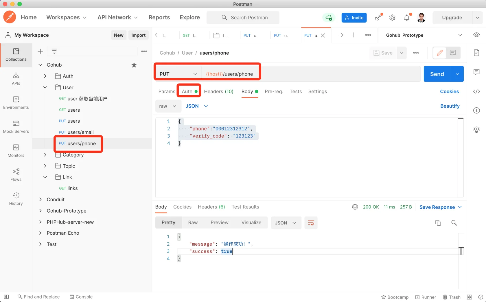
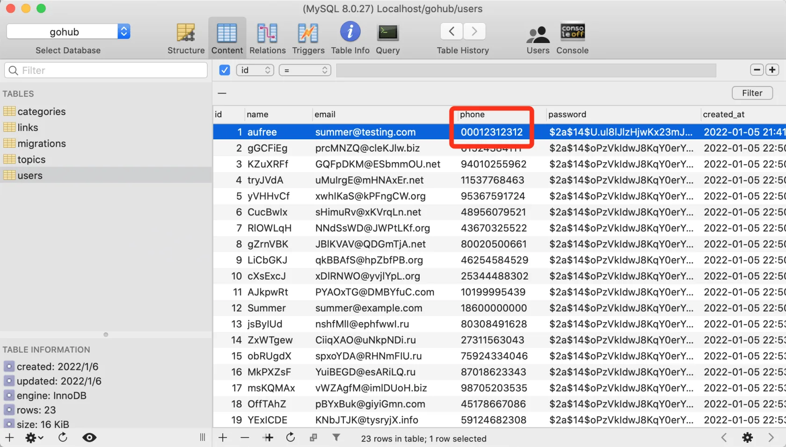

# 18.3. 修改手机号

原文链接：https://learnku.com/courses/go-api/1.19/modify-mobile-phone/13591

## 说明

修改手机号的需要调用以下 API :

- POST `auth/verify-codes/phone` 发送短信验证码，以证明拥有新手机号的所有权；

- PUT `users/phone` 凭着短信验证码更新手机号。

第一个 API 我们已经在前面开发，这节课开发第二个接口。

## 1. 验证器

app/requests/user_request.go

```
.
.
.
type UserUpdatePhoneRequest struct {
Phone      string `json:"phone,omitempty" valid:"phone"`
VerifyCode string `json:"verify_code,omitempty" valid:"verify_code"`
}

func UserUpdatePhone(data interface{}, c *gin.Context) map[string][]string {

currentUser := auth.CurrentUser(c)

rules := govalidator.MapData{
"phone": []string{
"required",
"digits:11",
"not_exists:users,phone," + currentUser.GetStringID(),
"not_in:" + currentUser.Phone,
},
"verify_code": []string{"required", "digits:6"},
}
messages := govalidator.MapData{
"phone": []string{
"required:手机号为必填项，参数名称 phone",
"digits:手机号长度必须为 11 位的数字",
"not_exists:手机号已被占用",
"not_in:新的手机与老手机号一致",
},
"verify_code": []string{
"required:验证码答案必填",
"digits:验证码长度必须为 6 位的数字",
},
}

errs := validate(data, rules, messages)
_data := data.(*UserUpdatePhoneRequest)
errs = validators.ValidateVerifyCode(_data.Phone, _data.VerifyCode, errs)

return errs
}
```

## 2. 控制器方法

app/http/controllers/api/v1/users_controller.go

```
.
.
.
func (ctrl *UsersController) UpdatePhone(c *gin.Context) {

request := requests.UserUpdatePhoneRequest{}
if ok := requests.Validate(c, &request, requests.UserUpdatePhone); !ok {
return
}

currentUser := auth.CurrentUser(c)
currentUser.Phone = request.Phone
rowsAffected := currentUser.Save()

if rowsAffected > 0 {
response.Success(c)
} else {
response.Abort500(c, "更新失败，请稍后尝试~")
}
}
```

## 3. 注册路由

routes/api.go

```
.
.
.
usersGroup.PUT("/email", middlewares.AuthJWT(), uc.UpdateEmail)
usersGroup.PUT("/phone", middlewares.AuthJWT(), uc.UpdatePhone)
}
.
.
.
```

## 4. 测试

Postman 创建一条 PUT 方法的请求，URL 为 `{{host}}/users/phone`，请求内容：

```
{
"phone":"00012312312",
"verify_code": "123123"
}
```

注意 phone 使用 `000` 前缀会跳过 verify_code 验证。

设置 Auth 认证，发送请求：



修改后查看数据库：



符合预期。

## 代码版本

本节功能开发完毕。开始下一节之前，先来为代码做下版本标记：

```
$ git add .
$ git commit -m "修改手机号"
```
