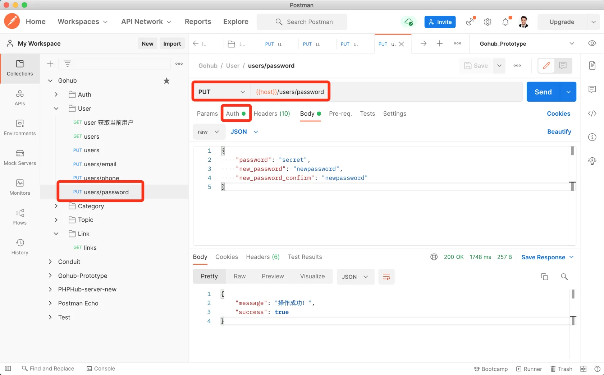

# 18.4. 修改密码

原文链接：https://learnku.com/courses/go-api/1.19/change-password/13592

## 说明

这节课我们来创建『修改密码』接口。

修改密码需要用户输入原来的密码，进行登录验证，原来的密码正确的话，才能执行更新操作。

## 1. 创建验证器

app/requests/user_request.go

```
.
.
.
type UserUpdatePasswordRequest struct {
Password           string `valid:"password" json:"password,omitempty"`
NewPassword        string `valid:"new_password" json:"new_password,omitempty"`
NewPasswordConfirm string `valid:"new_password_confirm" json:"new_password_confirm,omitempty"`
}

func UserUpdatePassword(data interface{}, c *gin.Context) map[string][]string {
rules := govalidator.MapData{
"password":             []string{"required", "min:6"},
"new_password":         []string{"required", "min:6"},
"new_password_confirm": []string{"required", "min:6"},
}
messages := govalidator.MapData{
"password": []string{
"required:密码为必填项",
"min:密码长度需大于 6",
},
"new_password": []string{
"required:密码为必填项",
"min:密码长度需大于 6",
},
"new_password_confirm": []string{
"required:确认密码框为必填项",
"min:确认密码长度需大于 6",
},
}

// 确保 comfirm 密码正确
errs := validate(data, rules, messages)
_data := data.(*UserUpdatePasswordRequest)
errs = validators.ValidatePasswordConfirm(_data.NewPassword, _data.NewPasswordConfirm, errs)

return errs
}
```

## 2. 控制器方法

app/http/controllers/api/v1/users_controller.go

```
.
.
.

func (ctrl *UsersController) UpdatePassword(c *gin.Context) {

request := requests.UserUpdatePasswordRequest{}
if ok := requests.Validate(c, &request, requests.UserUpdatePassword); !ok {
return
}

currentUser := auth.CurrentUser(c)
// 验证原始密码是否正确
_, err := auth.Attempt(currentUser.Name, request.Password)
if err != nil {
// 失败，显示错误提示
response.Unauthorized(c, "原密码不正确")
} else {
// 更新密码为新密码
currentUser.Password = request.NewPassword
currentUser.Save()

response.Success(c)
}
}
```

注意上面会先验证原来的密码，再执行新密码变更。

## 3. 注册路由

routes/api.go

```
.
.
.
usersGroup.PUT("/phone", middlewares.AuthJWT(), uc.UpdatePhone)
usersGroup.PUT("/password", middlewares.AuthJWT(), uc.UpdatePassword)
}
.
.
.
```

## 4. 测试

Postman 创建一条 PUT 方法的请求，URL 为 `{{host}}/users/password`，请求内容：

```
{
"password": "secret",
"new_password": "newpassword",
"new_password_confirm": "newpassword"
}
```

注意所有用户默认密码是 secret 。

设置 Auth 认证，发送请求：



请自行调用登录接口，使用新密码进行登录验证。

## 代码版本

本节功能开发完毕。开始下一节之前，先来为代码做下版本标记：

```
$ git add .
$ git commit -m "修改密码"
```
