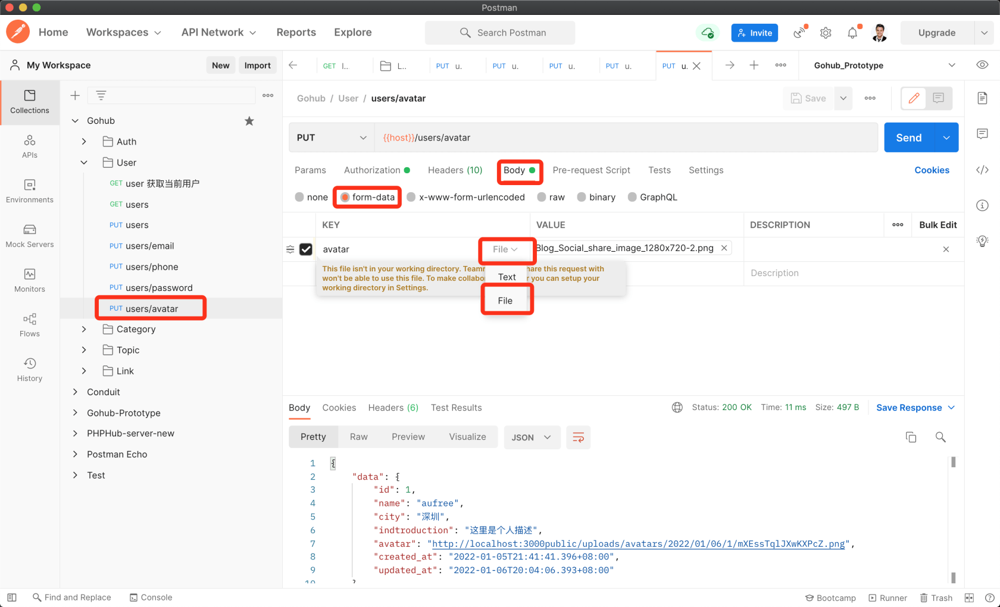
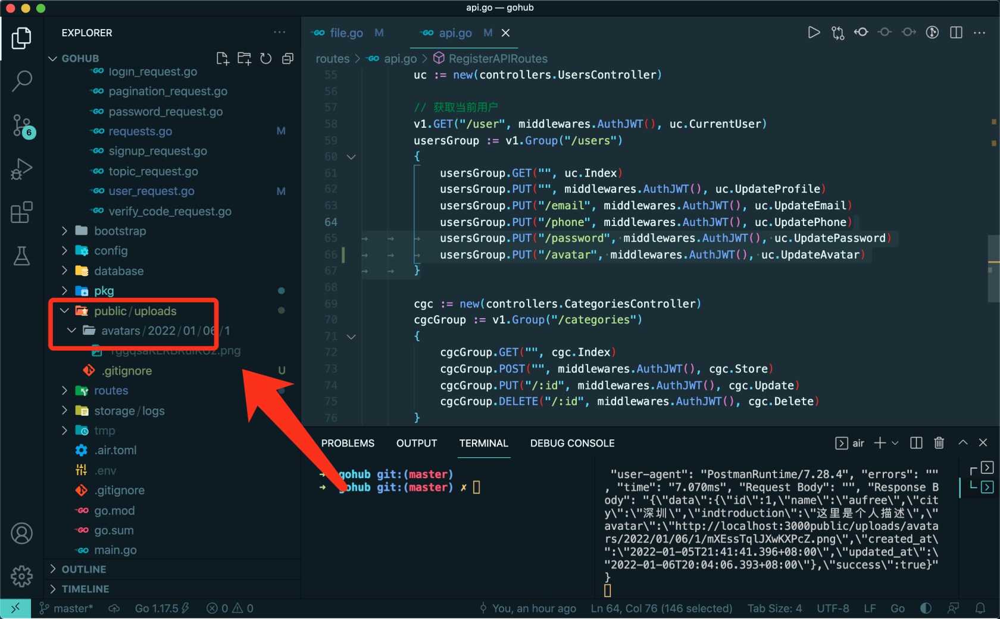

# 18.5. 上传用户头像

原文链接：https://learnku.com/courses/go-api/1.19/modify-avatar/13593

## 说明

这节课我们来开发『上传用户头像』接口。

## 1. 验证请求

app/requests/user_request.go

```
.
.
.
type UserUpdateAvatarRequest struct {
Avatar *multipart.FileHeader `valid:"avatar" form:"avatar"`
}

func UserUpdateAvatar(data interface{}, c *gin.Context) map[string][]string {

rules := govalidator.MapData{
// size 的单位为 bytes
// - 1024 bytes 为 1kb
// - 1048576 bytes 为 1mb
// - 20971520 bytes 为 20mb
"file:avatar": []string{"ext:png,jpg,jpeg", "size:20971520", "required"},
}
messages := govalidator.MapData{
"file:avatar": []string{
"ext:ext头像只能上传 png, jpg, jpeg 任意一种的图片",
"size:头像文件最大不能超过 20MB",
"required:必须上传图片",
},
}

return validateFile(c, data, rules, messages)
}
```

请求属性：

```
Avatar *multipart.FileHeader `valid:"avatar" form:"avatar"`
```

`*multipart.FileHeader` 是 Govalidator 验证文件必须使用的类型。

`form:"avatar"` 是指示 gin 在调用 `c.ShouldBind()` 时，从表单请求中读取。

另外验证规则里，`file:avatar` ，是 Govalidator 规定了，验证文件必须在字段前方加 `file:` 前缀。

## 2. 验证文件

上面的验证器我们使用了一个新的方法 `validateFile()` 用以验证文件请求，下面创建：

app/requests/requests.go

```
.
.
.
func validateFile(c *gin.Context, data interface{}, rules govalidator.MapData, messages govalidator.MapData) map[string][]string {
opts := govalidator.Options{
Request:       c.Request,
Rules:         rules,
Messages:      messages,
TagIdentifier: "valid",
}
// 调用 govalidator 的 Validate 方法来验证文件
return govalidator.New(opts).Validate()
}
```

这个方法跟 `validate()` 类似，只不过在最后使用 `.Validate()` 而不是 `.ValidateStruct()`。

## 3. 添加控制器方法

app/http/controllers/api/v1/users_controller.go

```
.
.
.
func (ctrl *UsersController) UpdateAvatar(c *gin.Context) {

request := requests.UserUpdateAvatarRequest{}
if ok := requests.Validate(c, &request, requests.UserUpdateAvatar); !ok {
return
}

avatar, err := file.SaveUploadAvatar(c, request.Avatar)
if err != nil {
response.Abort500(c, "上传头像失败，请稍后尝试~")
return
}

currentUser := auth.CurrentUser(c)
currentUser.Avatar = config.GetString("app.url") + avatar
currentUser.Save()

response.Data(c, currentUser)
}
```

## 4. 创建存储文件的方法

控制器里处理上传文件的逻辑我们封装在 file.SaveUploadAvatar 方法里，接下来创建此方法：

pkg/file/file.go

```
.
.
.
func SaveUploadAvatar(c *gin.Context, file *multipart.FileHeader) (string, error) {

var avatar string
// 确保目录存在，不存在创建
publicPath := "public"
dirName := fmt.Sprintf("/uploads/avatars/%s/%s/", app.TimenowInTimezone().Format("2006/01/02"), auth.CurrentUID(c))
os.MkdirAll(publicPath+dirName, 0755)

// 保存文件
fileName := randomNameFromUploadFile(file)
// public/uploads/avatars/2021/12/22/1/nFDacgaWKpWWOmOt.png
avatarPath := publicPath + dirName + fileName
if err := c.SaveUploadedFile(file, avatarPath); err != nil {
return avatar, err
}

return avatarPath, nil
}

func randomNameFromUploadFile(file *multipart.FileHeader) string {
return helpers.RandomString(16) + filepath.Ext(file.Filename)
}
```

这里我们使用的 gin 提供的 `c.SaveUploadedFile` 方法来保存文件。

## 5. 注册路由

routes/api.go

```
.
.
.
usersGroup.PUT("/password", middlewares.AuthJWT(), uc.UpdatePassword)
usersGroup.PUT("/avatar", middlewares.AuthJWT(), uc.UpdateAvatar)
}
.
.
.
```

## 6. 测试

Postman 创建一个 PUT `{{host}}/users/avatar` 的请求，请求内容选择 `form-data`，参数的 key 那里选择 file，然后选择文件。

最后加上 Auth Token ，发送请求：



查看目录里是否有该文件：



符合预期。

## 代码版本

用户上传的图片我们不需要假如版本控制，因此需创建 .gitignore 文件来排除：

public/uploads/.gitignore

```
*
!.gitignore
```

本节功能开发完毕。开始下一节之前，先来为代码做下版本标记：

```
$ git add .
$ git commit -m "上传用户头像"
```
