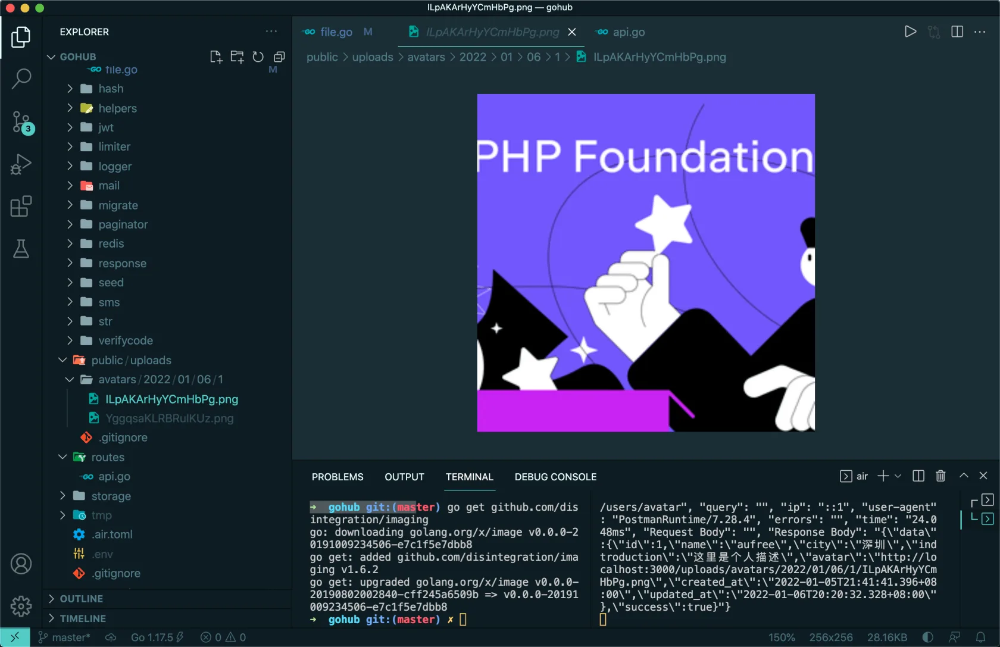

# 18.6. 图片裁切

原文链接：https://learnku.com/courses/go-api/1.19/picture-cutting/13594

## 说明

现在用户可以上传头像，但是用户上传的头像规则不一，如何将上传的图片裁切成合规的尺寸呢？这节课我们来实现此功能。

## 安装依赖

图片处理是很常见的功能，Go 生态圈很多现成的解决方案，无需重复发明轮子。

Gohub 项目我们将使用 [github.com/disintegration/imaging](https://github.com/disintegration/imaging) 包来做图片裁切的工作：

安装:

```bash
$ go get github.com/disintegration/imaging
```

## 修改 SaveUploadAvatar

图片处理我们封装在 pkg/file/file.go 的 SaveUploadAvatar 方法里，接下来修改此方法如下：

```go
func SaveUploadAvatar(c *gin.Context, file *multipart.FileHeader) (string, error) {

	var avatar string
	// 确保目录存在，不存在创建
	publicPath := "public"
	dirName := fmt.Sprintf("/uploads/avatars/%s/%s/", app.TimenowInTimezone().Format("2006/01/02"), auth.CurrentUID(c))
	os.MkdirAll(publicPath+dirName, 0755)

	// 保存文件
	fileName := randomNameFromUploadFile(file)
	// public/uploads/avatars/2021/12/22/1/nFDacgaWKpWWOmOt.png
	avatarPath := publicPath + dirName + fileName
	if err := c.SaveUploadedFile(file, avatarPath); err != nil {
		return avatar, err
	}

	// 裁切图片
	img, err := imaging.Open(avatarPath, imaging.AutoOrientation(true))
	if err != nil {
		return avatar, err
	}
	resizeAvatar := imaging.Thumbnail(img, 256, 256, imaging.Lanczos)
	resizeAvatarName := randomNameFromUploadFile(file)
	resizeAvatarPath := publicPath + dirName + resizeAvatarName
	err = imaging.Save(resizeAvatar, resizeAvatarPath)
	if err != nil {
		return avatar, err
	}

	// 删除老文件
	err = os.Remove(avatarPath)
	if err != nil {
		return avatar, err
	}

	return dirName + resizeAvatarName, nil
}
```

## 测试

Postman 里使用上节课的上次图片接口，发起请求，然后查看上传的图片：



可以看到一张不规则的图片已经被裁剪为四方形图片。

## go mod tidy

上面加载了第三方库，现在使用 mod tidy 命令来整理一下 go.mod 文件：

```bash
$ go mod tidy
```

## 代码版本

本节功能开发完毕。开始下一节之前，先来为代码做下版本标记：

```bash
$ git add .
$ git commit -m "图片裁切"
```
