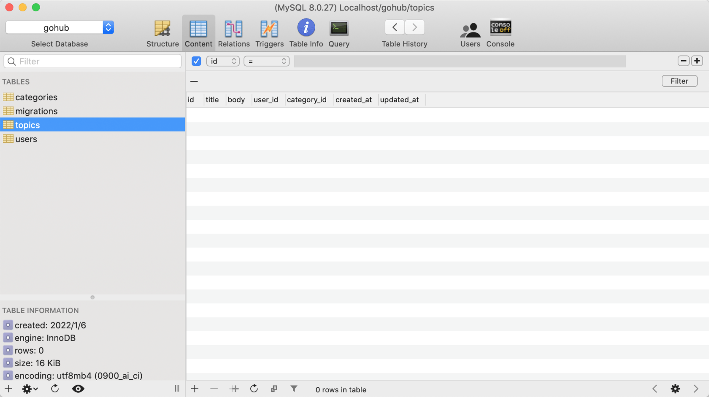

# 16.1. 话题模型和迁移

原文链接：https://learnku.com/courses/go-api/1.19/topic-model/13573

## 说明

这节开始我们来开发话题模块。

本节先来创建话题模型 Topic 和数据表 topics。

## 1. 创建模型

现在我们使用 make model 命令来创建话题模型：

```
$ go run main.go make model topic

[app/models/topic/topic_model.go] created.
[app/models/topic/topic_util.go] created.
[app/models/topic/topic_hooks.go] created.
```

修改下 topic_model.go 文件里的模型定义：

app/models/topic/topic_model.go

```
//Package topic 模型
package topic

import (
"gohub/app/models"
"gohub/app/models/category"
"gohub/app/models/user"
"gohub/pkg/database"
)

type Topic struct {
models.BaseModel

Title      string `json:"title,omitempty" `
Body       string `json:"body,omitempty" `
UserID     string `json:"user_id,omitempty"`
CategoryID string `json:"category_id,omitempty"`

// 通过 user_id 关联用户
User user.User `json:"user"`

// 通过 category_id 关联分类
Category category.Category `json:"category"`

models.CommonTimestampsField
}
.
.
.
```

确保顶部使用的是 `"gohub/app/models/user"`。

## 2. 创建迁移

接下来创建数据库表结构：

```
$ go run main.go make migration add_topics_table

[database/migrations/2022_01_06_115115_add_topics_table.go] created.
Migration file created，after modify it, use `migrate up` to migrate database.
```

打开生成的 migration 文件，定制表结构：

```
.
.
.
func init() {

type User struct {
models.BaseModel
}
type Category struct {
models.BaseModel
}

type Topic struct {
models.BaseModel

Title      string `gorm:"type:varchar(255);not null;index"`
Body       string `gorm:"type:longtext;not null"`
UserID     string `gorm:"type:bigint;not null;index"`
CategoryID string `gorm:"type:bigint;not null;index"`

// 会创建 user_id 和 category_id 外键的约束
User     User
Category Category

models.CommonTimestampsField
}

up := func(migrator gorm.Migrator, DB *sql.DB) {
migrator.AutoMigrate(&Topic{})
}

down := func(migrator gorm.Migrator, DB *sql.DB) {
migrator.DropTable(&Topic{})
}
.
.
.
```

>

注意： 别修改到 `migrate.Add()` 调用代码。

## 3. 执行迁移

```
$ go run main.go migrate up

migrating 2022_01_06_115115_add_topics_table
migrated 2022_01_06_115115_add_topics_table
```

使用数据库工具，可以看到多出来一个 topics 表：



符合预期。

## 代码版本

本节功能开发完毕。开始下一节之前，先来为代码做下版本标记：

```
$ git add .
$ git commit -m "话题模型和迁移"
```
