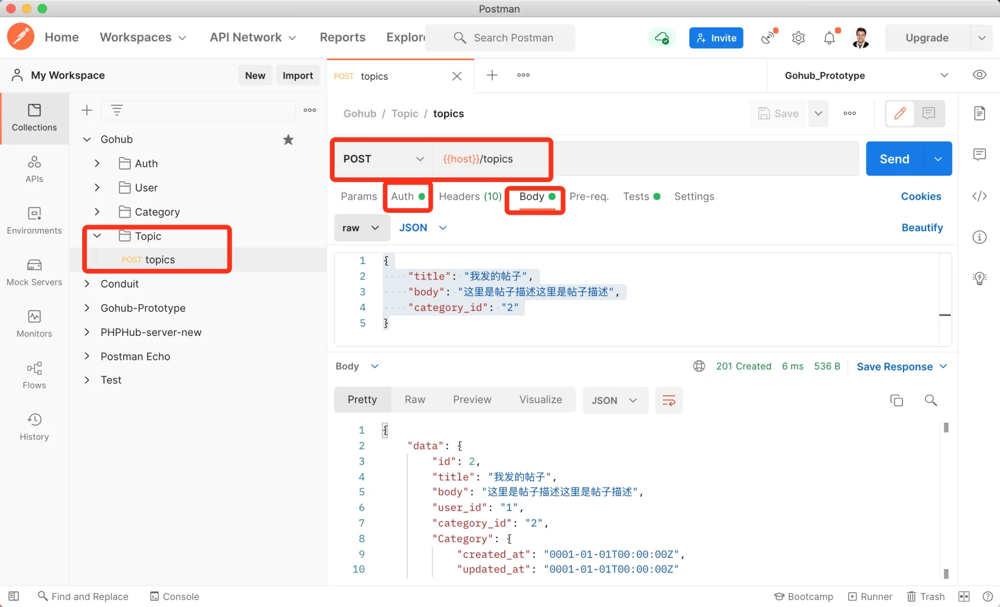

# 16.2. 创建话题

原文链接：https://learnku.com/courses/go-api/1.19/create-topic/13574

## 说明

这节课我们来开发『创建话题』接口。

## 1. make request

数据入库前都需要验证，我们先来创建话题的请求验证器：

```
$ go run main.go make request topic
[app/requests/topic_request.go] created.
```

修改生成的文件如下：

app/requests/topic_request.go

```
package requests

import (
"github.com/gin-gonic/gin"
"github.com/thedevsaddam/govalidator"
)

type TopicRequest struct {
Title      string `json:"title,omitempty" valid:"title"`
Body       string `json:"body,omitempty" valid:"body"`
CategoryID string `json:"category_id,omitempty" valid:"category_id"`
}

func TopicSave(data interface{}, c *gin.Context) map[string][]string {

rules := govalidator.MapData{
"title":       []string{"required", "min_cn:3", "max_cn:40"},
"body":        []string{"required", "min_cn:10", "max_cn:50000"},
"category_id": []string{"required", "exists:categories,id"},
}
messages := govalidator.MapData{
"title": []string{
"required:帖子标题为必填项",
"min_cn:标题长度需大于 3",
"max_cn:标题长度需小于 40",
},
"body": []string{
"required:帖子内容为必填项",
"min_cn:长度需大于 10",
},
"category_id": []string{
"required:帖子分类为必填项",
"exists:帖子分类未找到",
},
}
return validate(data, rules, messages)
}
```

## 2. 自定义验证规则

发帖需要三个参数，标题内容和分类 ID。

category_id 在入库前需要验证存在数据库中，我们使用了新建的 `exists` 自定义规则，现在来创建这个规则：

app/requests/validators/custom_rules.go

```
.
.
.
// 此方法会在初始化时执行，注册自定义表单验证规则
func init() {
.
.
.
// 自定义规则 exists，确保数据库存在某条数据
// 一个使用场景是创建话题时需要附带 category_id 分类 ID 为参数，此时需要保证
// category_id 的值在数据库中存在，即可使用：
// exists:categories,id
govalidator.AddCustomRule("exists", func(field string, rule string, message string, value interface{}) error {
rng := strings.Split(strings.TrimPrefix(rule, "exists:"), ",")

// 第一个参数，表名称，如 categories
tableName := rng[0]
// 第二个参数，字段名称，如 id
dbFiled := rng[1]

// 用户请求过来的数据
requestValue := value.(string)

// 查询数据库
var count int64
database.DB.Table(tableName).Where(dbFiled+" = ?", requestValue).Count(&count)
// 验证不通过，数据不存在
if count == 0 {
// 如果有自定义错误消息的话，使用自定义消息
if message != "" {
return errors.New(message)
}
return fmt.Errorf("%v 不存在", requestValue)
}
return nil
})

}
```

## 3. 控制器

使用我们的 make apicontroller 命令：

```
$ go run main.go make apicontroller v1/topic
[app/http/controllers/api/v1/topics_controller.go] created.
```

生成的 topics_controller.go 里有很多内容，我们先删除未涉及到的内容，留下 Store 方法：

app/http/controllers/api/v1/topics_controller.go

```
package v1

import (
"gohub/app/models/topic"
"gohub/app/requests"
"gohub/pkg/auth"
"gohub/pkg/response"

"github.com/gin-gonic/gin"
)

type TopicsController struct {
BaseAPIController
}

func (ctrl *TopicsController) Store(c *gin.Context) {

request := requests.TopicRequest{}
if ok := requests.Validate(c, &request, requests.TopicSave); !ok {
return
}

topicModel := topic.Topic{
Title:      request.Title,
Body:       request.Body,
CategoryID: request.CategoryID,
UserID:     auth.CurrentUID(c),
}
topicModel.Create()
if topicModel.ID > 0 {
response.Created(c, topicModel)
} else {
response.Abort500(c, "创建失败，请稍后尝试~")
}
}
```

## 4. 注册路由

routes/api.go

```
.
.
.
tpc := new(controllers.TopicsController)
tpcGroup := v1.Group("/topics")
{
tpcGroup.POST("", middlewares.AuthJWT(), tpc.Store)
}
}
}
```

登录用户才能创建话题，所以我们用了 `AuthJWT` 中间件。

## 5. 测试

Postman 创建新目录 Topic ，目录里新建请求 POST topic ，请求的内容如下：

```
{
"title": "我发的帖子",
"body": "这里是帖子描述这里是帖子描述",
"category_id": "2"
}
```

请求时需要设定 bearer token（没有 token 的话请自行注册或登录用户，所有生成的用户默认密码都为 secret）：



符合预期。

## 代码版本

本节功能开发完毕。开始下一节之前，先来为代码做下版本标记：

```
$ git add .
$ git commit -m "创建话题"
```
