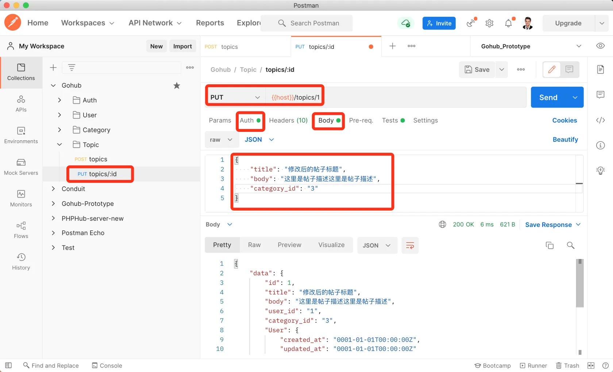

# 16.3. 话题更新

原文链接：https://learnku.com/courses/go-api/1.19/topic-update/13575

## 说明

本节将开发『更新话题』接口。

## 1. 控制器方法

app/http/controllers/api/v1/topics_controller.go

```go
.
.
.
func (ctrl *TopicsController) Update(c *gin.Context) {

	topicModel := topic.Get(c.Param("id"))
	if topicModel.ID == 0 {
		response.Abort404(c)
		return
	}

	request := requests.TopicRequest{}
	if ok := requests.Validate(c, &request, requests.TopicSave); !ok {
		return
	}

	topicModel.Title = request.Title
	topicModel.Body = request.Body
	topicModel.CategoryID = request.CategoryID
	rowsAffected := topicModel.Save()
	if rowsAffected > 0 {
		response.Data(c, topicModel)
	} else {
		response.Abort500(c, "更新失败，请稍后尝试~")
	}
}
```

## 2. 注册路由

routes/api.go

```go
.
.
.
tpcGroup.POST("", middlewares.AuthJWT(), tpc.Store)
tpcGroup.PUT("/:id", middlewares.AuthJWT(), tpc.Update)
}
}
}
```

## 测试

Postman 创建一条请求，请求 url 为：`{{host}}/topics/1` ，这个 1 是我们上一节最后测试创建的话题 ID。

请求方法为 `PUT`。

设置请求内容：

```json
{
    "title": "修改后的帖子标题",
    "body": "这里是帖子描述这里是帖子描述",
    "category_id": "3"
}
```

最后记得设置 Auth 请求授权，确认无误后发送请求：



符合预期。

## 代码版本

本节功能开发完毕。开始下一节之前，先来为代码做下版本标记：

```bash
$ git add .
$ git commit -m "话题更新"
```
