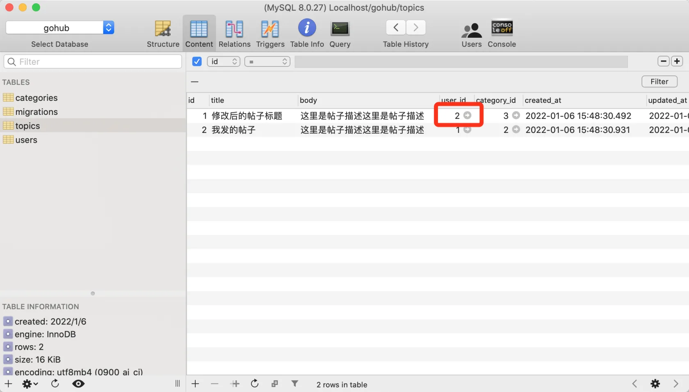
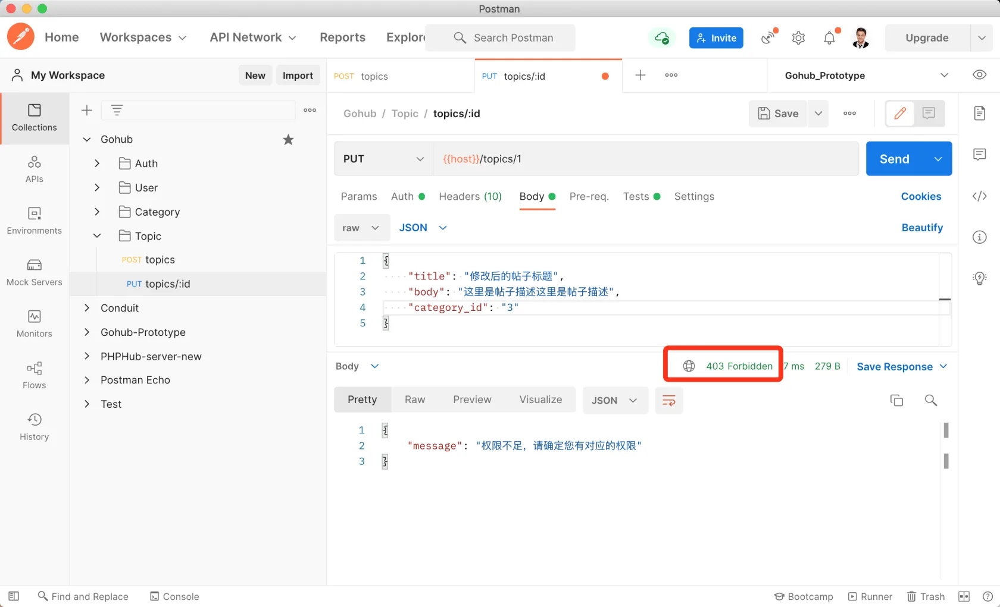

# 16.4. 授权策略

原文链接：https://learnku.com/courses/go-api/1.19/authorization-policy/13576

## 说明

我们的话题是有归属性的，举个例子 A  创建了 1 话题，不应该被 B 用户或者其他用户进行更新。所以我们需要对更新话题的接口添加授权逻辑，只允许话题的作者对话题进行编辑。

## 1. 授权策略

授权判断的代码都写在控制器里，不方便维护，故本项目将使用授权策略来实现。

创建授权文件：

app/policies/topic_policy.go

```go
// Package policies 用户授权
package policies

import (
	"gohub/app/models/topic"
	"gohub/pkg/auth"

	"github.com/gin-gonic/gin"
)

func CanModifyTopic(c *gin.Context, _topic topic.Topic) bool {
	return auth.CurrentUID(c) == _topic.UserID
}
```

## 2. 控制器里调用

app/http/controllers/api/v1/topics_controller.go

```go
.
.
.
func (ctrl *TopicsController) Update(c *gin.Context) {

    topicModel := topic.Get(c.Param("id"))
    if topicModel.ID == 0 {
        response.Abort404(c)
        return
    }

    if ok := policies.CanModifyTopic(c, topicModel); !ok {
        response.Abort403(c)
        return
    }
    .
    .
    .
```

## 3. 测试

使用数据库工具，将话题 ID 为 1 的 user_id 字段改为 2：



再次发送更新话题的请求，可以看到返回 403 权限不足：



符合预期。

## 代码版本

本节功能开发完毕。开始下一节之前，先来为代码做下版本标记：

```bash
$ git add .
$ git commit -m "授权策略"
```
